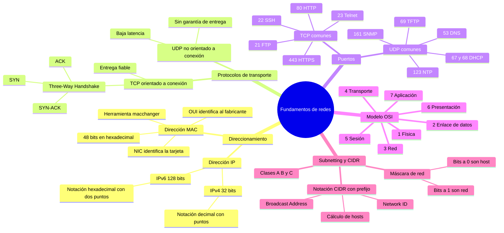
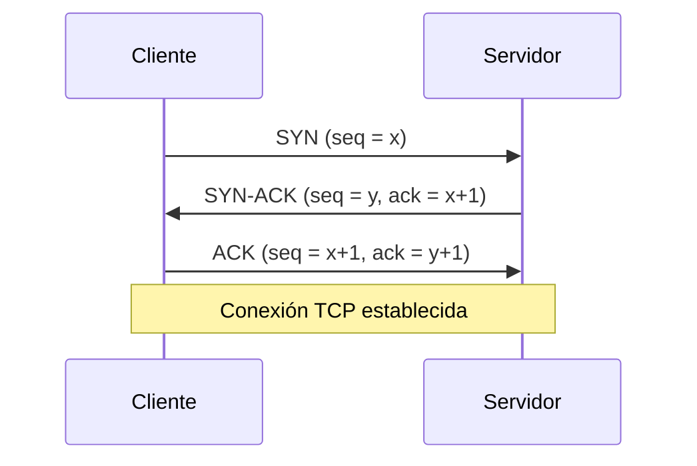

# 00 Conceptos básicos de redes

## Mapa conceptual

El siguiente mapa conceptual resume los fundamentos de redes que se desarrollan en este documento. Agrupa los cuatro grandes bloques (direccionamiento físico y lógico, protocolos de transporte, el modelo de referencia OSI y el direccionamiento con subnetting/CIDR) que todo analista de seguridad debe dominar antes de abordar el reconocimiento y la explotación de redes.

> **Nota:** Los diagramas `mindmap` de Mermaid no se renderizan en la vista previa de GitHub. Para verlos correctamente utiliza un editor compatible como VS Code (con la extensión *Markdown Preview Mermaid Support*), Obsidian o el editor en vivo de [mermaid.live](https://mermaid.live).



---

## Glosario

| Término | Definición |
|---------|------------|
| **Dirección IP** | Identificador numérico único que permite localizar un dispositivo dentro de una red. Existen dos versiones: IPv4 (32 bits) e IPv6 (128 bits). |
| **IPv4** | Versión del protocolo IP que usa direcciones de 32 bits, representadas como cuatro octetos decimales separados por puntos (ej: `192.168.0.1`). |
| **IPv6** | Versión del protocolo IP que usa direcciones de 128 bits, representadas en notación hexadecimal separada por dos puntos (ej: `2001:0db8:85a3::8a2e:0370:7334`). Nace para resolver la escasez de direcciones IPv4. |
| **Octeto** | Cada uno de los cuatro grupos de 8 bits que componen una dirección IPv4. Su valor decimal va de 0 a 255. |
| **Dirección MAC** | Identificador físico de 48 bits (12 dígitos hexadecimales) grabado en la tarjeta de red. Identifica de forma única una interfaz en la capa de enlace. |
| **OUI** | *Organizationally Unique Identifier*. Los primeros 3 bytes (24 bits) de la MAC que identifican al fabricante. Los asigna el IEEE. |
| **NIC** | *Network Interface Controller*. Los últimos 3 bytes (24 bits) de la MAC que identifican la tarjeta concreta dentro de las de ese fabricante. |
| **macchanger** | Herramienta de GNU/Linux para visualizar y modificar (falsear) la dirección MAC de una interfaz de red. |
| **TCP** | *Transmission Control Protocol*. Protocolo de transporte orientado a la conexión que garantiza la entrega fiable y ordenada de los datos. |
| **UDP** | *User Datagram Protocol*. Protocolo de transporte no orientado a conexión, sin garantía de entrega, pero con menor latencia y sobrecarga. |
| **Three-Way Handshake** | Procedimiento de tres pasos (SYN, SYN-ACK, ACK) con el que TCP establece una conexión fiable entre dos dispositivos, sincronizando los números de secuencia. |
| **Puerto** | Número de 16 bits (0–65535) que identifica un servicio o proceso concreto dentro de un host, permitiendo multiplexar varias conexiones. |
| **Modelo OSI** | *Open Systems Interconnection*. Modelo de referencia de siete capas que describe el proceso de comunicación entre dispositivos en una red. |
| **Subnetting** | Técnica de división de una red IP en subredes más pequeñas y manejables mediante máscaras de red. |
| **Máscara de red** | Valor de 32 bits que separa la porción de red (bits a `1`) de la porción de host (bits a `0`) de una dirección IP. |
| **CIDR** | *Classless Inter-Domain Routing*. Método flexible de asignación de direcciones que representa una IP junto a su prefijo de red (ej: `192.168.1.0/24`). |
| **Prefijo** | Número que sigue a la `/` en notación CIDR e indica cuántos bits de la máscara de red están a `1`. |
| **Network ID** | Dirección que identifica a la subred. Se obtiene aplicando un `AND` lógico entre la dirección IP y la máscara de red. |
| **Broadcast Address** | Dirección usada para enviar paquetes a todos los hosts de la subred. Resulta de poner a `1` todos los bits de host. |
| **Clase A / B / C** | Rangos históricos de direcciones IP con máscara por defecto (`/8`, `/16`, `/24`) determinada por el valor del primer octeto. |

---

## Índice

- [Mapa conceptual](#mapa-conceptual)
- [Glosario](#glosario)

1. [Direcciones IP](#1-direcciones-ip)
   - [IPv4 e IPv6](#ipv4-e-ipv6)
2. [Direcciones MAC](#2-direcciones-mac)
   - [Estructura de una dirección MAC](#estructura-de-una-direccin-mac)
   - [La herramienta macchanger](#la-herramienta-macchanger)
3. [Protocolos TCP y UDP](#3-protocolos-tcp-y-udp)
   - [El Three-Way Handshake](#el-three-way-handshake)
4. [Puertos comunes](#4-puertos-comunes)
   - [Puertos TCP comunes](#puertos-tcp-comunes)
   - [Puertos UDP comunes](#puertos-udp-comunes)
5. [El modelo OSI](#5-el-modelo-osi)
6. [Subnetting y máscaras de red](#6-subnetting-y-mscaras-de-red)
7. [CIDR (Classless Inter-Domain Routing)](#7-cidr-classless-inter-domain-routing)
   - [Cálculo de hosts disponibles](#clculo-de-hosts-disponibles)
   - [Ejemplos prácticos de CIDR](#ejemplos-prcticos-de-cidr)
8. [Clases de direcciones IP](#8-clases-de-direcciones-ip)
9. [Cálculo práctico de una subred](#9-clculo-prctico-de-una-subred)
   - [Ejemplo: 192.168.1.0/26](#ejemplo-19216810-26)
   - [Caso particular: 13.13.13.13/13](#caso-particular-131313-1313)
10. [Referencias](#10-referencias)

---

## 1. Direcciones IP

Las **direcciones IP** son identificadores numéricos únicos que se utilizan para identificar dispositivos en una red, como ordenadores, routers, servidores y otros dispositivos conectados a Internet. Funcionan como el "domicilio lógico" de cada dispositivo: permiten que los paquetes de datos sepan a dónde deben dirigirse y desde dónde han sido enviados.

### IPv4 e IPv6

Existen dos versiones de direcciones IP: **IPv4** e **IPv6**. La versión IPv4 utiliza un formato de dirección de 32 bits y se utiliza actualmente en la mayoría de las redes. La versión IPv6 utiliza un formato de dirección de 128 bits y se está implementando gradualmente en todo el mundo para hacer frente a la escasez de direcciones IPv4.

Las direcciones IPv4 se representan como cuatro números separados por puntos, como `192.168.0.1`, mientras que las direcciones IPv6 se representan en notación hexadecimal y se separan por dos puntos, como `2001:0db8:85a3:0000:0000:8a2e:0370:7334`.

| Característica | IPv4 | IPv6 |
|---------------|------|------|
| Tamaño | 32 bits | 128 bits |
| Notación | Decimal separada por puntos | Hexadecimal separada por dos puntos |
| Ejemplo | `192.168.0.1` | `2001:0db8:85a3::8a2e:0370:7334` |
| Nº de direcciones | ~4.300 millones (2³²) | ~3,4 × 10³⁸ (2¹²⁸) |
| Motivación | Estándar histórico | Resolver la escasez de IPv4 |

> **Nota:** La escasez de direcciones IPv4 se mitiga también con técnicas como NAT (traducción de direcciones de red) y el uso de rangos privados, pero IPv6 es la solución definitiva a largo plazo.

---

## 2. Direcciones MAC

La **dirección MAC** es un número hexadecimal de 12 dígitos (número binario de 6 bytes, es decir, 48 bits), que está representado principalmente por notación hexadecimal separada por dos puntos (ej: `00:40:96:AB:CD:EF`). A diferencia de la IP, que es una dirección lógica y puede cambiar, la MAC es una dirección física asociada a la interfaz de red.

### Estructura de una dirección MAC

Los primeros 6 dígitos (digamos `00:40:96`) de la dirección MAC identifican al fabricante, lo que se conoce como **OUI** (Identificador Único Organizacional). El Comité de la Autoridad de Registro del IEEE asigna estos prefijos MAC a sus proveedores registrados.

Los seis dígitos más a la derecha representan el controlador de interfaz de red (**NIC**), que es asignado por el fabricante.

Es decir, los primeros 3 bytes (24 bits) representan el fabricante de la tarjeta, y los últimos 3 bytes (24 bits) identifican la tarjeta particular de ese fabricante. Cada grupo de 3 bytes se puede representar con 6 dígitos hexadecimales, formando un número hexadecimal de 12 dígitos que representa la MAC completa.

```
00:40:96 : AB:CD:EF
└──────┘   └──────┘
  OUI         NIC
(fabricante) (tarjeta)
 24 bits     24 bits
```

Para una búsqueda de fabricante utilizando direcciones MAC, se requieren al menos los primeros 3 bytes (6 caracteres) de la dirección MAC.

### La herramienta macchanger

Una de las herramientas que utilizamos para visualizar y manipular direcciones MAC es `macchanger`, una utilidad de GNU/Linux. Cambiar la MAC (*MAC spoofing*) resulta útil para preservar el anonimato, evadir filtros de acceso basados en MAC o realizar pruebas de seguridad.

```bash
macchanger -s eth0        # Mostrar la MAC actual
macchanger -r eth0        # Asignar una MAC totalmente aleatoria
macchanger -m 00:11:22:33:44:55 eth0   # Establecer una MAC concreta
macchanger -p eth0        # Restaurar la MAC original de fábrica
```

| Parámetro | Descripción |
|-----------|-------------|
| `-s`, `--show` | Muestra la dirección MAC actual de la interfaz. |
| `-r`, `--random` | Asigna una dirección MAC completamente aleatoria. |
| `-m`, `--mac` | Establece una dirección MAC concreta indicada por el usuario. |
| `-p`, `--permanent` | Restaura la MAC física original de la tarjeta. |
| `-e`, `--ending` | Cambia solo la parte NIC (últimos 3 bytes), conservando el OUI del fabricante. |

> **Importante:** Para cambiar la MAC, la interfaz debe estar previamente desactivada con `ifconfig eth0 down` (o `ip link set eth0 down`) y reactivarse después. En caso contrario, `macchanger` fallará al aplicar el cambio.

---

## 3. Protocolos TCP y UDP

Los protocolos **TCP** (*Transmission Control Protocol*) y **UDP** (*User Datagram Protocol*) son dos de los protocolos de red más comunes utilizados en la transferencia de datos a través de redes de ordenadores. Ambos operan en la **capa de transporte** del modelo OSI.

El protocolo TCP es un protocolo orientado a la conexión que proporciona una entrega de datos confiable, mientras que el protocolo UDP es un protocolo no orientado a conexión que no garantiza la entrega de datos.

| Característica | TCP | UDP |
|---------------|-----|-----|
| Orientación | Orientado a conexión | No orientado a conexión |
| Fiabilidad | Entrega garantizada y ordenada | Sin garantía de entrega |
| Control de flujo/errores | Sí | No |
| Sobrecarga y latencia | Mayor | Menor |
| Casos de uso típicos | Web, correo, transferencia de archivos | Streaming, VoIP, DNS, juegos online |

### El Three-Way Handshake

Una parte crucial del protocolo TCP es el **Three-Way Handshake**, un procedimiento utilizado para establecer una conexión entre dos dispositivos. Este procedimiento consta de tres pasos: **SYN**, **SYN-ACK** y **ACK**, en los que se sincronizan los números de secuencia y de reconocimiento de los paquetes entre los dispositivos. El Three-Way Handshake es fundamental para establecer una conexión confiable y segura a través de TCP.



Los tres pasos del proceso son:

1. **SYN:** el cliente envía un paquete con el flag SYN activado y un número de secuencia inicial (`x`) para solicitar la apertura de la conexión.
2. **SYN-ACK:** el servidor responde con los flags SYN y ACK, confirmando la recepción (`ack = x+1`) y proponiendo su propio número de secuencia (`y`).
3. **ACK:** el cliente confirma la respuesta del servidor (`ack = y+1`), quedando la conexión establecida y lista para el intercambio de datos.

> **Nota:** El conocimiento del Three-Way Handshake es esencial en seguridad ofensiva. Ataques como el **SYN Flood** abusan de este mecanismo enviando multitud de paquetes SYN sin completar el último ACK, agotando los recursos del servidor.

---

## 4. Puertos comunes

Un **puerto** es un número de 16 bits que identifica un servicio concreto dentro de un host. Junto con la dirección IP forma un *socket* (ej: `192.168.0.1:80`), que identifica de forma única un extremo de la comunicación. Conocer los puertos y protocolos habituales es imprescindible en la fase de reconocimiento, ya que revelan qué servicios expone un objetivo.

### Puertos TCP comunes

| Puerto | Servicio | Descripción |
|--------|----------|-------------|
| 21 | FTP | *File Transfer Protocol*. Permite la transferencia de archivos entre sistemas. |
| 22 | SSH | *Secure Shell*. Protocolo de red seguro para conectarse y administrar sistemas de forma remota. |
| 23 | Telnet | Protocolo utilizado para la conexión remota a dispositivos de red (sin cifrado). |
| 80 | HTTP | *Hypertext Transfer Protocol*. Protocolo de transferencia de datos en la World Wide Web. |
| 443 | HTTPS | Versión segura de HTTP; utiliza cifrado SSL/TLS para proteger las comunicaciones web. |

### Puertos UDP comunes

| Puerto | Servicio | Descripción |
|--------|----------|-------------|
| 53 | DNS | *Domain Name System*. Traduce nombres de dominio en direcciones IP. |
| 67/68 | DHCP | *Dynamic Host Configuration Protocol*. Asigna direcciones IP y parámetros de configuración a los dispositivos de una red. |
| 69 | TFTP | *Trivial File Transfer Protocol*. Protocolo simple para transferir archivos entre dispositivos. |
| 123 | NTP | *Network Time Protocol*. Sincroniza los relojes de los dispositivos en una red. |
| 161 | SNMP | *Simple Network Management Protocol*. Administra y supervisa dispositivos en una red. |

Cabe destacar que estos son solo algunos de los más comunes. Existen muchos más puertos que operan tanto por TCP como por UDP. A medida que avancemos en el curso, tendremos la oportunidad de ver muchos otros puertos y protocolos utilizados en redes de ordenadores, así como técnicas para analizar y explotar vulnerabilidades en su implementación.

> **Recuerda:** Los puertos del 0 al 1023 se denominan *puertos bien conocidos* (*well-known ports*) y están reservados a servicios estándar. Del 1024 al 49151 son *registrados*, y del 49152 al 65535 son *dinámicos o efímeros*.

---

## 5. El modelo OSI

En redes de ordenadores, el **modelo OSI** (*Open Systems Interconnection*) es una estructura de siete capas que se utiliza para describir el proceso de comunicación entre dispositivos. Cada capa proporciona servicios y funciones específicas, que permiten a los dispositivos comunicarse a través de la red. Cada capa se apoya en la inferior y ofrece servicios a la superior.

A continuación, se describen las siete capas del modelo OSI (de la más baja a la más alta):

| Nº | Capa | Función principal | Ejemplos |
|----|------|-------------------|----------|
| 1 | **Física** | Transmisión de bits a través del medio físico de la red. | Cables de cobre, fibra óptica, señales eléctricas |
| 2 | **Enlace de datos** | Transferencia fiable de datos entre dispositivos de la misma red; detección y corrección de errores. | MAC, switches, Ethernet |
| 3 | **Red** | Enrutamiento de paquetes a través de múltiples redes usando direcciones lógicas. | IP, routers |
| 4 | **Transporte** | Entrega fiable de datos entre extremos; control de flujo y corrección de errores. | TCP, UDP |
| 5 | **Sesión** | Establecimiento y mantenimiento de las sesiones de comunicación; autenticación y autorización. | Sesiones, RPC |
| 6 | **Presentación** | Representación de datos: codificación/decodificación, compresión y cifrado. | SSL/TLS, cifrado, formatos |
| 7 | **Aplicación** | Servicios para las aplicaciones de usuario final. | HTTP, DNS, correo, navegadores |

Comprender la estructura en capas del modelo OSI es esencial para cualquier analista de seguridad, ya que permite tener una visión completa del funcionamiento de la red y de las posibles vulnerabilidades que puedan existir en cada una de las capas. Esto nos permite identificar de manera efectiva los puntos débiles de la red y aplicar medidas de seguridad adecuadas para protegerla de posibles ataques.

> **Nota:** Cada capa es susceptible a ataques distintos: *sniffing* y *MAC spoofing* en la capa 2, *IP spoofing* y escaneo en la capa 3, *SYN Flood* en la capa 4, o inyecciones y XSS en la capa 7. Situar cada amenaza en su capa ayuda a diseñar defensas específicas.

---

## 6. Subnetting y máscaras de red

El **subnetting** es una técnica utilizada para dividir una red IP en subredes más pequeñas y manejables. Esto se logra mediante el uso de **máscaras de red**, que permiten definir qué bits de la dirección IP corresponden a la red y cuáles a los hosts. Dividir una red grande en subredes mejora la eficiencia, la seguridad (aislamiento de segmentos) y la administración del tráfico.

Para interpretar una máscara de red, se deben identificar los bits que están en `1`. Estos bits representan la porción de la dirección IP que corresponde a la red. Por ejemplo, una máscara de red de `255.255.255.0` indica que los primeros tres octetos de la dirección IP corresponden a la red, mientras que el último octeto se utiliza para identificar los hosts.

> **Recuerda:** En una máscara de red, los bits a `1` siempre son contiguos y ocupan las posiciones más significativas (izquierda), y los bits a `0` ocupan las posiciones de host (derecha). No pueden intercalarse.

---

## 7. CIDR (Classless Inter-Domain Routing)

Cuando hablamos de **CIDR** (acrónimo de *Classless Inter-Domain Routing*), nos referimos a un método de asignación de direcciones IP más eficiente y flexible que el uso de clases de redes IP fijas. Con CIDR, una dirección IP se representa mediante una dirección IP base y una máscara de red, que se escriben juntas separadas por una barra (`/`).

Por ejemplo, la dirección IP `192.168.1.1` con una máscara de red de `255.255.255.0` se escribiría como `192.168.1.1/24`.

La máscara de red se representa en **notación de prefijo**, que indica el número de bits que están en `1` en la máscara. En este caso, la máscara de red `255.255.255.0` tiene 24 bits en `1` (los primeros tres octetos), por lo que su notación de prefijo es `/24`.

Para calcular la máscara de red a partir de una notación de prefijo, se deben escribir los bits `1` en los primeros bits de una dirección IP de 32 bits y los bits `0` en los bits restantes. Por ejemplo, la máscara de red `/24` se calcularía como `11111111.11111111.11111111.00000000` en binario, lo que equivale a `255.255.255.0` en decimal.

Con CIDR, se pueden asignar direcciones IP de forma más precisa, lo que reduce la cantidad de direcciones IP desperdiciadas y facilita la administración de la red. El número que sigue a la dirección IP base en la notación CIDR se llama **prefijo** o **longitud de prefijo**, y representa el número de bits en la máscara de red que están en `1`.

### Cálculo de hosts disponibles

Para calcular la cantidad de hosts disponibles en una red CIDR, se deben contar el número de bits `0` en la máscara de red y elevar 2 a la potencia de ese número. Esto se debe a que cada bit `0` en la máscara de red representa un bit que se puede utilizar para identificar un host.

Por ejemplo, una máscara de red de `255.255.255.0` (`/24`) tiene 8 bits en `0`, lo que significa que hay 2⁸ = 256 direcciones IP disponibles en esa red.

> **Importante:** De las direcciones totales de una subred, dos no son asignables a hosts: la primera es el **Network ID** y la última es la **Broadcast Address**. Por eso el número real de hosts utilizables es 2ⁿ − 2, donde `n` es el número de bits de host.

### Ejemplos prácticos de CIDR

- Una dirección IP con un prefijo de `/28` (`255.255.255.240`) permite hasta 16 direcciones IP (2⁴), ya que los primeros 28 bits corresponden a la red.
- Una dirección IP con un prefijo de `/26` (`255.255.255.192`) permite hasta 64 direcciones IP (2⁶), ya que los primeros 26 bits corresponden a la red.
- Una dirección IP con un prefijo de `/22` (`255.255.252.0`) permite hasta 1024 direcciones IP (2¹⁰), ya que los primeros 22 bits corresponden a la red.

---

## 8. Clases de direcciones IP

En cuanto a clases de direcciones IP, existen tres tipos principales de máscaras de red: **Clase A**, **Clase B** y **Clase C**. La clase se determina a partir del valor del primer octeto de la dirección.

| Clase | Rango del primer octeto | Máscara por defecto | Prefijo | Ejemplo |
|-------|-------------------------|---------------------|---------|---------|
| A | 1 – 126 | `255.0.0.0` | `/8` | `10.52.36.11` |
| B | 128 – 191 | `255.255.0.0` | `/16` | `172.16.52.63` |
| C | 192 – 223 | `255.255.255.0` | `/24` | `192.168.123.132` |

- Las redes de **clase A** usan una máscara de subred predeterminada de `255.0.0.0` y tienen de 0 a 127 como su primer octeto. La dirección `10.52.36.11`, por ejemplo, es una dirección de clase A, ya que su primer octeto (10) está entre 1 y 126.
- Las redes de **clase B** usan una máscara de subred predeterminada de `255.255.0.0` y tienen de 128 a 191 como su primer octeto. La dirección `172.16.52.63`, por ejemplo, es de clase B, ya que su primer octeto (172) está entre 128 y 191.
- Las redes de **clase C** usan una máscara de subred predeterminada de `255.255.255.0` y tienen de 192 a 223 como su primer octeto. La dirección `192.168.123.132`, por ejemplo, es de clase C, ya que su primer octeto (192) está entre 192 y 223.

Es importante tener en cuenta que, además de estos tres tipos de máscaras de red, también existen **máscaras de red personalizadas** que se pueden utilizar para crear subredes de diferentes tamaños dentro de una red. CIDR precisamente rompe con la rigidez de estas clases, permitiendo prefijos de cualquier longitud.

> **Nota:** El rango 127.x.x.x está reservado para *loopback* (la dirección local `127.0.0.1`) y no se usa para direccionamiento de red. Las clases D (224–239) y E (240–255) se reservan para multicast y usos experimentales, respectivamente.

---

## 9. Cálculo práctico de una subred

En esta sección aplicamos todo lo anterior para calcular, a partir de una dirección IP y su prefijo CIDR, la **máscara de red**, el **número total de hosts**, el **Network ID** y la **Broadcast Address**.

### Ejemplo: 192.168.1.0/26

La dirección IP que se nos da es `192.168.1.0/26`, lo que significa que los primeros 26 bits corresponden a la red y los últimos 6 bits corresponden a los hosts.

**1. Cálculo de la máscara de red**

Para calcular la máscara de red, colocamos los primeros 26 bits en `1` y los últimos 6 bits en `0`. En binario:

```
11111111.11111111.11111111.11000000
```

Cada octeto se compone de 8 bits, y su valor decimal se obtiene convirtiendo esos 8 bits. Los primeros 24 bits son todos `1`, por lo que cada uno de esos tres octetos vale 255. El último octeto tiene los primeros 2 bits a `1` y los últimos 6 a `0`, lo que da un valor decimal de 192. Por lo tanto, la máscara de red es:

```
255.255.255.192
```

**2. Cálculo del total de hosts a repartir**

Quedan 6 bits disponibles para la parte de host. El número máximo de hosts se calcula como 2ⁿ − 2, donde `n` es la cantidad de bits de host:

```
2^6 - 2 = 64 - 2 = 62 hosts disponibles
```

Se restan 2 porque una dirección se reserva para el Network ID y otra para la Broadcast Address.

**3. Cálculo del Network ID**

Para calcular el Network ID aplicamos la máscara de red a la dirección IP mediante una operación `AND` lógica bit a bit. El `AND` devuelve `1` solo cuando ambos bits son `1`:

```
IP:       11000000.10101000.00000001.00000000   (192.168.1.0)
Máscara:  11111111.11111111.11111111.11000000   (255.255.255.192)
AND:      11000000.10101000.00000001.00000000   (192.168.1.0)
```

El resultado es el **Network ID: `192.168.1.0`**, identificador único de la subred.

**4. Cálculo de la Broadcast Address**

La Broadcast Address se obtiene poniendo a `1` todos los bits de la parte de host. Partiendo del Network ID, llenamos con unos los últimos 6 bits:

```
11000000.10101000.00000001.00111111
```

Convirtiendo de nuevo a decimal, la **Broadcast Address es `192.168.1.63`**, dirección a la que se envían los paquetes destinados a todos los hosts de la subred.

Resumen del ejemplo:

| Componente | Valor |
|------------|-------|
| Notación CIDR | `192.168.1.0/26` |
| Máscara de red | `255.255.255.192` |
| Hosts disponibles | 62 |
| Network ID | `192.168.1.0` |
| Broadcast Address | `192.168.1.63` |
| Rango de hosts útiles | `192.168.1.1` – `192.168.1.62` |

### Caso particular: 13.13.13.13/13

Un caso de "red extraña" muy ilustrativo es la notación `13.13.13.13/13`, donde el límite de subred cae **en mitad de un octeto** (el segundo), lo que obliga a razonar a nivel de bits.

Con un prefijo `/13`, la máscara tiene 13 bits a `1`: los 8 del primer octeto y 5 del segundo.

**1. Máscara de red**

```
11111111.11111000.00000000.00000000  =  255.248.0.0
```

El segundo octeto (`11111000`) equivale a 128 + 64 + 32 + 16 + 8 = 248.

**2. Total de hosts**

Quedan 19 bits de host (32 − 13):

```
2^19 - 2 = 524.288 - 2 = 524.286 hosts disponibles
```

**3. Network ID**

Aplicamos el `AND` entre la IP y la máscara. La clave está en el segundo octeto: `13 = 00001101` en binario. Al hacer `AND` con `11111000`, se conservan solo los 5 bits altos:

```
IP 2º octeto:      00001101   (13)
Máscara 2º octeto: 11111000   (248)
AND:               00001000   (8)
```

Por tanto, el **Network ID es `13.8.0.0`**.

**4. Broadcast Address**

Ponemos a `1` los 19 bits de host. El segundo octeto pasa de `00001000` a `00001111` (los 3 bits bajos a `1`), lo que da 15; el tercer y cuarto octeto se llenan a 255:

```
00001111.11111111.11111111  →  15.255.255
```

La **Broadcast Address es `13.15.255.255`**.

Resumen del caso:

| Componente | Valor |
|------------|-------|
| Notación CIDR | `13.13.13.13/13` |
| Máscara de red | `255.248.0.0` |
| Hosts disponibles | 524.286 |
| Network ID | `13.8.0.0` |
| Broadcast Address | `13.15.255.255` |

> **Recuerda:** Cuando el prefijo no cae en un límite de octeto (`/8`, `/16`, `/24`), el cálculo debe hacerse siempre a nivel de bits sobre el octeto donde "cae" la frontera de la máscara. Practicar con muchos ejemplos es la única forma de interiorizar estos conceptos.

---

## 10. Referencias

Recursos en línea útiles para practicar el cálculo de subredes y la conversión entre notación CIDR e IPv4:

- Conversor de CIDR a IPv4: <https://www.ipaddressguide.com/cidr>
- IP Calculator (jodies.de): <https://blog.jodies.de/ipcalc>
