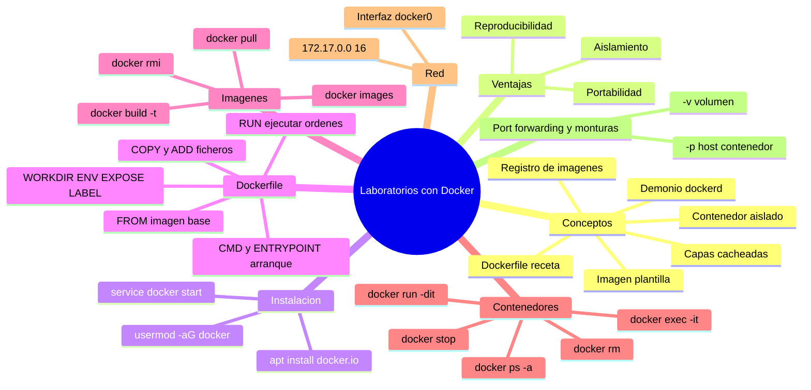

# 02 Configuración de laboratorios con Docker

## Mapa conceptual

El siguiente mapa conceptual resume el uso de Docker para montar laboratorios de hacking: desde los conceptos base y la instalación, pasando por la creación de imágenes con un `Dockerfile`, hasta el despliegue y la gestión de contenedores y su red.

> **Nota:** Los diagramas `mindmap` de Mermaid no se renderizan en la vista previa de GitHub. Para verlos correctamente utiliza un editor compatible como VS Code (con la extensión *Markdown Preview Mermaid Support*), Obsidian o el editor en vivo de [mermaid.live](https://mermaid.live).



---

## Glosario

| Término | Definición |
|---------|------------|
| **Docker** | Plataforma de contenedores que permite empaquetar aplicaciones con sus dependencias y ejecutarlas en entornos aislados y portables. |
| **Contenedor** | Instancia en ejecución de una imagen; un entorno aislado y ligero que comparte el kernel del host. |
| **Imagen** | Plantilla de solo lectura (con la aplicación y sus dependencias) a partir de la cual se crean los contenedores. |
| **Dockerfile** | Fichero de texto con las instrucciones (receta) para construir una imagen de forma reproducible. |
| **Capa (*layer*)** | Cada instrucción del Dockerfile genera una capa; Docker las cachea para acelerar reconstrucciones posteriores. |
| **Demonio (*dockerd*)** | Servicio en segundo plano que gestiona imágenes, contenedores y redes. Debe estar en ejecución para usar Docker. |
| **Registro (*registry*)** | Repositorio de imágenes (por defecto Docker Hub) desde el que se descargan con `docker pull`. |
| **Etiqueta (*tag*)** | Versión o variante de una imagen, indicada tras `:` (p. ej. `ubuntu:latest`, `mi_imagen:v2`). |
| **docker0** | Interfaz de red virtual (bridge) que Docker crea en el host (`172.17.0.1/16`) para comunicarse con los contenedores. |
| **Port forwarding** | Redirección de un puerto del host a un puerto del contenedor (`-p host:contenedor`) para acceder desde el exterior a un servicio interno. |
| **Montura / Volumen** | Mecanismo (`-v`) para compartir un directorio o archivo entre host y contenedor y persistir datos entre ejecuciones. |
| **Bind mount** | Montura que enlaza un directorio **concreto del host** dentro del contenedor. Se indica con una ruta absoluta: `-v /home/usuario/datos:/datos`. |
| **Volumen nombrado** | Almacenamiento gestionado por Docker, identificado por un nombre en lugar de una ruta: `-v datos_db:/var/lib/mysql`. |
| **Capa de escritura** | Capa temporal que Docker añade sobre la imagen al arrancar un contenedor. Todo lo que se escribe ahí **se pierde al eliminar el contenedor**. |
| **Docker Compose** | Herramienta de orquestación que define varios contenedores y su configuración en un fichero YAML, para levantarlos y gestionarlos con un solo comando. |
| **YAML** | Formato de fichero de texto basado en indentación que emplea Docker Compose para describir los servicios. |

---

## Índice

- [Mapa conceptual](#mapa-conceptual)
- [Glosario](#glosario)

1. [Introducción a Docker](#1-introducción-a-docker)
2. [Instalación de Docker en Linux](#2-instalación-de-docker-en-linux)
3. [Estructura básica de un Dockerfile](#3-estructura-básica-de-un-dockerfile)
   - [Instrucciones principales](#instrucciones-principales)
   - [RUN vs CMD vs ENTRYPOINT](#run-vs-cmd-vs-entrypoint)
   - [Construcción de imágenes](#construcción-de-imágenes)
4. [Despliegue de contenedores](#4-despliegue-de-contenedores)
   - [Red de Docker: la interfaz docker0](#red-de-docker-la-interfaz-docker0)
   - [Personalizar la imagen con nuevas dependencias](#personalizar-la-imagen-con-nuevas-dependencias)
5. [Comandos comunes para la gestión de contenedores](#5-comandos-comunes-para-la-gestión-de-contenedores)
6. [Port Forwarding en Docker y uso de monturas](#6-port-forwarding-en-docker-y-uso-de-monturas)
   - [Un contenedor ejecuta un solo proceso en primer plano](#un-contenedor-ejecuta-un-solo-proceso-en-primer-plano)
   - [Acceder al contenedor: sobrescribir el CMD o usar docker exec](#acceder-al-contenedor-sobrescribir-el-cmd-o-usar-docker-exec)
   - [Publicar puertos: EXPOSE frente a -p](#publicar-puertos-expose-frente-a--p)
   - [Otras formas de publicar puertos](#otras-formas-de-publicar-puertos)
   - [Ejemplo de uso](#ejemplo-de-uso)
   - [Monturas (volúmenes)](#monturas-volúmenes)
   - [Bind mounts: montar un directorio del host](#bind-mounts-montar-un-directorio-del-host)
   - [Volúmenes nombrados: que Docker gestione el almacenamiento](#volúmenes-nombrados-que-docker-gestione-el-almacenamiento)
   - [Ejemplo de uso: servir la web desde el host](#ejemplo-de-uso-servir-la-web-desde-el-host)
7. [Despliegue de laboratorios con Docker Compose](#7-despliegue-de-laboratorios-con-docker-compose)
   - [Qué aporta frente a docker run](#qué-aporta-frente-a-docker-run)
   - [Estructura del fichero compose.yaml](#estructura-del-fichero-composeyaml)
   - [Comandos de Docker Compose](#comandos-de-docker-compose)
   - [Ejemplo: laboratorio vulnerable con web y base de datos](#ejemplo-laboratorio-vulnerable-con-web-y-base-de-datos)
   - [Laboratorio 1: RCE en ImageMagick (CVE-2016-3714, ImageTragick)](#laboratorio-1-rce-en-imagemagick-cve-2016-3714-imagetragick)
   - [Laboratorio 2: inyección de comandos en una app Node.js](#laboratorio-2-inyección-de-comandos-en-una-app-nodejs)
8. [Cuestionario](#8-cuestionario)

---

## 1. Introducción a Docker

Docker es una plataforma de contenedores de software que permite crear, distribuir y ejecutar aplicaciones en entornos aislados. Esto significa que se pueden empaquetar las aplicaciones con todas sus dependencias y configuraciones en un contenedor que se puede mover fácilmente de una máquina a otra, independientemente de la configuración del sistema operativo o del hardware.

Algunas de las ventajas que presenta Docker a la hora de practicar hacking son:

- **Aislamiento:** los contenedores están aislados entre sí, de modo que si una aplicación dentro de un contenedor es comprometida, el resto del sistema no se ve afectado.
- **Portabilidad:** los contenedores se mueven fácilmente de un sistema a otro, lo que los hace ideales para desplegar entornos vulnerables de práctica.
- **Reproducibilidad:** los contenedores se configuran de forma precisa y reproducible, algo clave para poder recrear escenarios de ataque de manera idéntica.

> **Nota:** Un contenedor no es una máquina virtual. La VM virtualiza hardware completo y arranca su propio kernel; el contenedor comparte el kernel del host y solo aísla el espacio de usuario, por lo que es mucho más ligero y rápido de arrancar.

---

## 2. Instalación de Docker en Linux

Para instalar Docker en Linux se utiliza el gestor de paquetes de la distribución. En Debian/Ubuntu/Kali el paquete es `docker.io` (`apt install docker.io`), mientras que en distribuciones como CentOS o RHEL sería `yum install docker`.

Una vez instalado, hay que iniciar el **demonio de Docker** (el servicio responsable de gestionar los contenedores) con `service docker start`. Conviene además añadir el usuario al grupo `docker` para poder usarlo sin `sudo`.

```bash
┌──(root㉿kali)-[~]
└─# apt update && apt install -y docker.io
...
┌──(root㉿kali)-[~]
└─# service docker start 
...           
┌──(root㉿kali)-[~]
└─# service docker status

┌──(root㉿kali)-[~]
└─# usermod -aG docker kali

┌──(root㉿kali)-[~]
└─# reboot
```

| Comando | Descripción |
|---------|-------------|
| `apt install -y docker.io` | Instala Docker desde el repositorio de la distribución. |
| `service docker start` | Arranca el demonio de Docker. |
| `service docker status` | Comprueba que el demonio está en ejecución. |
| `usermod -aG docker kali` | Añade el usuario `kali` al grupo `docker` para usarlo sin `sudo`. |
| `reboot` | Reinicia para que el cambio de grupo tenga efecto. |

> **Nota:** El cambio de grupo con `usermod -aG docker` solo se aplica tras cerrar sesión y volver a entrar (o reiniciar). Hasta entonces, seguirá haciendo falta `sudo` para ejecutar `docker`.

---

## 3. Estructura básica de un Dockerfile

Un `Dockerfile` es un fichero de texto que define, paso a paso, cómo construir una imagen. Cada instrucción comienza con una palabra clave en mayúsculas seguida de uno o más argumentos, y **cada instrucción genera una capa** de la imagen.

### Instrucciones principales

| Instrucción | Descripción | Notas |
|-------------|-------------|-------|
| `FROM` | Define la imagen base de la que se parte. | Es la primera instrucción obligatoria del Dockerfile. |
| `WORKDIR` | Define el directorio de trabajo. | Las instrucciones siguientes (`RUN`, `COPY`, `CMD`…) se ejecutan desde ahí. |
| `RUN` | Ejecuta órdenes durante la construcción y crea una nueva capa. | Ej.: `RUN apt-get update && apt-get install -y ...`. |
| `CMD` | Define el comando/parámetros por defecto al arrancar el contenedor. | Se puede sobrescribir al lanzar `docker run`. |
| `COPY` | Copia ficheros del equipo host a la imagen. | Recomendado para ficheros locales del proyecto. |
| `ADD` | Similar a `COPY`, pero con más funciones. | Permite descargar ficheros desde URL y descomprimir *tar* automáticamente. |
| `LABEL` | Añade metadatos a la imagen. | Sustituye a la antigua instrucción `MAINTAINER`, ya obsoleta. |
| `EXPOSE` | Indica los puertos que abre el contenedor. | Es principalmente documental; no publica el puerto por sí sola. |
| `ENV` | Define variables de entorno. | Persisten dentro del contenedor. |
| `ENTRYPOINT` | Define el ejecutable principal del contenedor. | No se sobrescribe fácilmente; suele combinarse con `CMD`. |

### RUN vs CMD vs ENTRYPOINT

Estas tres instrucciones se confunden con frecuencia porque parece que las tres "ejecutan comandos". La clave para distinguirlas es **en qué momento se ejecutan**: `RUN` actúa al *construir la imagen*, mientras que `CMD` y `ENTRYPOINT` definen qué pasa al *arrancar el contenedor*.

| Instrucción | ¿Cuándo se ejecuta? | ¿Para qué sirve? |
|-------------|---------------------|------------------|
| `RUN` | Al **construir** la imagen (`docker build`) | Preparar la imagen: instalar paquetes, crear archivos, configurar. El resultado queda "horneado" en la imagen. |
| `CMD` | Al **arrancar** el contenedor (`docker run`) | Definir el comando **por defecto**, que se puede sobrescribir fácilmente. |
| `ENTRYPOINT` | Al **arrancar** el contenedor (`docker run`) | Definir el ejecutable **principal**, que no se sobrescribe salvo a propósito. |

**`RUN` se ejecuta una sola vez, al montar la imagen.** Cada `RUN` corre durante el `docker build` y crea una capa con el resultado. Cuando el contenedor arranca, `RUN` no vuelve a ejecutarse: su efecto (por ejemplo, `nano` instalado) ya forma parte de la imagen.

```dockerfile
RUN apt update && apt install -y nano   # BUILD: se ejecuta al construir; nano queda instalado en la imagen
```

**`CMD` y `ENTRYPOINT` se ejecutan al arrancar cada contenedor.** No preparan la imagen, sino que indican **qué proceso lanzar** al hacer `docker run`. Solo cuenta el último `CMD` y el último `ENTRYPOINT` del Dockerfile.

Para diferenciarlos, piensa en un restaurante: el **`ENTRYPOINT`** es el plato que siempre se sirve (fijo) y el **`CMD`** es la guarnición por defecto, que el cliente puede cambiar. Ambos se **combinan**: `ENTRYPOINT` es la parte fija y `CMD` aporta los argumentos por defecto (reemplazables por el usuario).

```dockerfile
FROM ubuntu:latest
RUN apt update && apt install -y iputils-ping   # BUILD: instala ping en la imagen
ENTRYPOINT ["ping"]                              # arranque: siempre ejecuta ping
CMD ["8.8.8.8"]                                  # arranque: argumento por defecto
```

Comportamiento al lanzarlo:

| Comando | Qué ejecuta | Por qué |
|---------|-------------|---------|
| `docker run imagen` | `ping 8.8.8.8` | usa el `CMD` por defecto |
| `docker run imagen 1.1.1.1` | `ping 1.1.1.1` | el argumento sobrescribe el `CMD`, pero el `ENTRYPOINT` (`ping`) se mantiene |
| `docker run --entrypoint bash imagen` | `bash` | solo con `--entrypoint` se cambia el `ENTRYPOINT` |

Si usas **solo `CMD`** (sin `ENTRYPOINT`), lo que indiques en `docker run` sustituye al comando entero. Por ejemplo, con `CMD ["ping", "8.8.8.8"]`: `docker run imagen` ejecuta `ping 8.8.8.8`, pero `docker run imagen bash` lanza `bash` (se reemplaza el comando completo).

Regla práctica para decidir cuál usar:

- ¿Quieres **instalar o preparar algo dentro de la imagen**? → `RUN`.
- ¿Quieres fijar el **programa principal** del contenedor (que sea "un contenedor de ping", "de nginx"…)? → `ENTRYPOINT`.
- ¿Quieres dar un **comando o argumentos por defecto fáciles de cambiar**? → `CMD`.

> **Nota:** El `Dockerfile` de este documento no tiene `CMD` ni `ENTRYPOINT`, así que hereda el de la imagen base `ubuntu` (que es `bash`). Por eso, al hacer `docker run -dit … primera_imagen`, el contenedor arranca ejecutando `/bin/bash` (se ve en la columna `COMMAND` como `"/bin/bash"`).

### Construcción de imágenes

Con el `Dockerfile` preparado, la imagen se construye con `docker build`. Los comandos básicos para trabajar con imágenes son:

- **`docker build`** — construye una imagen a partir de un `Dockerfile`:

  ```
  docker build [opciones] ruta_al_Dockerfile
  ```

  El parámetro `-t` etiqueta la imagen con un nombre y una etiqueta (`nombre:etiqueta`), y el `.` final indica que el `Dockerfile` está en el directorio actual:

  ```
  docker build -t mi_imagen:v1 .
  ```

  Si el `Dockerfile` está en otra ruta, se indica esa ruta en lugar del punto (p. ej. `docker build -t mi_imagen:v1 /home/usuario/proyecto/`).

- **`docker pull`** — descarga una imagen desde un registro (por defecto Docker Hub):

  ```
  docker pull ubuntu:latest
  ```

- **`docker images`** — lista las imágenes disponibles en el sistema.

| Parámetro | Descripción |
|-----------|-------------|
| `-t nombre:etiqueta` | Asigna nombre y etiqueta a la imagen construida. |
| `.` | Contexto de construcción: busca el `Dockerfile` en el directorio actual. |

> **Nota:** Durante la construcción, Docker descarga y **almacena en caché las capas** ya construidas, de modo que las reconstrucciones posteriores son mucho más rápidas si las instrucciones anteriores no han cambiado.

El siguiente ejemplo crea un directorio de trabajo, un `Dockerfile` mínimo y construye la primera imagen:

```bash
┌──(kali㉿kali)-[~]
└─$ mkdir docker && cd docker

┌──(kali㉿kali)-[~/docker]
└─$ cat Dockerfile
FROM ubuntu:latest

MAINTAINER Martín Gil Blanco example@gmail.com

┌──(kali㉿kali)-[~/docker]
└─$ sudo docker build -t primera_imagen .

┌──(kali㉿kali)-[~]
└─$ docker images
REPOSITORY       TAG       IMAGE ID       CREATED      SIZE
primera_imagen   latest    77663a418a7a   8 days ago   100MB
```

> **Advertencia:** La instrucción `MAINTAINER` está **obsoleta**; Docker mostrará un aviso al construir. Se recomienda sustituirla por una etiqueta, p. ej. `LABEL maintainer="Martín Gil Blanco example@gmail.com"`.

---

## 4. Despliegue de contenedores

Con la imagen ya construida, podemos desplegar contenedores. El comando `docker run` crea y arranca un contenedor a partir de una imagen:

```
docker run [opciones] nombre_de_la_imagen
```

| Parámetro | Descripción |
|-----------|-------------|
| `-d`, `--detach` | Arranca el contenedor en segundo plano. |
| `-i`, `--interactive` | Permite la entrada interactiva al contenedor. |
| `-t`, `--tty` | Asigna un seudoterminal al contenedor. |
| `--name` | Asigna un nombre al contenedor. |

Las opciones suelen combinarse; por ejemplo, `docker run -dit mi_imagen` arranca el contenedor en segundo plano y con seudoterminal.

Para **listar contenedores** se usa `docker ps` (con `-a` para incluir los detenidos y `-q` para mostrar solo los identificadores). Para **ejecutar un comando en un contenedor en marcha** se usa `docker exec` (con `-i` y `-t` para una sesión interactiva).

| Comando | Descripción |
|---------|-------------|
| `docker ps` | Lista los contenedores en ejecución. |
| `docker ps -a` | Lista todos los contenedores, incluidos los detenidos. |
| `docker ps -q` | Muestra solo los identificadores de los contenedores. |
| `docker exec -it <id> bash` | Abre una shell `bash` interactiva dentro del contenedor. |

```bash
┌──(kali㉿kali)-[~]
└─$ docker run -dit --name primer_contenedor primera_imagen
456f6eae1c48c2a2643f77a7478048b1b7e2a583643a48177a7e341349708e1a

┌──(kali㉿kali)-[~]
└─$ docker ps
CONTAINER ID   IMAGE            COMMAND       CREATED         STATUS         PORTS     NAMES
456f6eae1c48   primera_imagen   "/bin/bash"   3 seconds ago   Up 2 seconds             primer_contenedor

┌──(kali㉿kali)-[~]
└─$ docker exec -it primer_contenedor bash
root@456f6eae1c48:/# hostname
456f6eae1c48
root@456f6eae1c48:/# hostname -I
172.17.0.2
```

> **Nota:** Con `Ctrl + D` terminas ese proceso `bash` en particular (sales de la shell), pero el contenedor sigue en ejecución. Para volver a interactuar con él basta con lanzar de nuevo `docker exec -it <contenedor> bash`.

### Red de Docker: la interfaz docker0

Al instalar Docker aparece una interfaz de red virtual llamada `docker0` (`172.17.0.1/16`), que actúa como puerta de enlace de los contenedores. Gracias a ella, el host puede comunicarse con los contenedores (por ejemplo, hacerles `ping`).

```bash
┌──(kali㉿kali)-[~]
└─$ ip -c a
3: docker0: <BROADCAST,MULTICAST,UP,LOWER_UP> mtu 1500 qdisc noqueue state UP group default
    link/ether 16:9b:41:61:ab:4f brd ff:ff:ff:ff:ff:ff
    inet 172.17.0.1/16 brd 172.17.255.255 scope global docker0
       valid_lft forever preferred_lft forever
    inet6 fe80::149b:41ff:fe61:ab4f/64 scope link proto kernel_ll
       valid_lft forever preferred_lft forever
```

```bash
┌──(kali㉿kali)-[~]
└─$ ping 172.17.0.2
PING 172.17.0.2 (172.17.0.2) 56(84) bytes of data.
64 bytes from 172.17.0.2: icmp_seq=1 ttl=64 time=0.156 ms
64 bytes from 172.17.0.2: icmp_seq=2 ttl=64 time=0.055 ms
64 bytes from 172.17.0.2: icmp_seq=3 ttl=64 time=0.082 ms
^C
--- 172.17.0.2 ping statistics ---
3 packets transmitted, 3 received, 0% packet loss, time 2051ms
rtt min/avg/max/mdev = 0.055/0.097/0.156/0.042 ms
```

### Personalizar la imagen con nuevas dependencias

Al entrar en un contenedor recién creado, lo habitual es actualizar el sistema e instalar las dependencias que necesitemos. Podemos hacerlo manualmente dentro del contenedor para probar, pero lo recomendable es **añadir esas acciones al `Dockerfile`** para que la imagen ya las incluya al arrancar.

Primero comprobamos, entrando en el contenedor, qué queremos instalar:

```bash
┌──(kali㉿kali)-[~]
└─$ docker exec -it primer_contenedor bash
root@456f6eae1c48:/# apt update
...
root@456f6eae1c48:/# apt install -y net-tools iputils-ping
...
root@456f6eae1c48:/# ifconfig
eth0: flags=4163<UP,BROADCAST,RUNNING,MULTICAST>  mtu 1500
        inet 172.17.0.2  netmask 255.255.0.0  broadcast 172.17.255.255
        ether 2a:6f:0f:2e:2c:c0  txqueuelen 0  (Ethernet)
        RX packets 11641  bytes 27532550 (27.5 MB)
        RX errors 0  dropped 0  overruns 0  frame 0
        TX packets 6921  bytes 378944 (378.9 KB)
        TX errors 0  dropped 0 overruns 0  carrier 0  collisions 0

lo: flags=73<UP,LOOPBACK,RUNNING>  mtu 65536
        inet 127.0.0.1  netmask 255.0.0.0
        inet6 ::1  prefixlen 128  scopeid 0x10<host>
        loop  txqueuelen 1000  (Local Loopback)
        RX packets 0  bytes 0 (0.0 B)
        RX errors 0  dropped 0  overruns 0  frame 0
        TX packets 0  bytes 0 (0.0 B)
        TX errors 0  dropped 0 overruns 0  carrier 0  collisions 0

root@456f6eae1c48:/# ping -c 3 172.17.0.1
PING 172.17.0.1 (172.17.0.1) 56(84) bytes of data.
64 bytes from 172.17.0.1: icmp_seq=1 ttl=64 time=0.312 ms
64 bytes from 172.17.0.1: icmp_seq=2 ttl=64 time=0.075 ms
64 bytes from 172.17.0.1: icmp_seq=3 ttl=64 time=0.050 ms

--- 172.17.0.1 ping statistics ---
3 packets transmitted, 3 received, 0% packet loss, time 2030ms
rtt min/avg/max/mdev = 0.050/0.145/0.312/0.118 ms
```

A continuación editamos el `Dockerfile` para incluir esas instalaciones con una instrucción `RUN` y reconstruimos la imagen con una nueva etiqueta (`v2`):

```bash
┌──(kali㉿kali)-[~/docker]
└─$ cat Dockerfile
FROM ubuntu:latest

MAINTAINER Martín Gil Blanco example@gmail.com

RUN apt update && apt install -y net-tools \
                  iputils-ping \
                  nano

┌──(kali㉿kali)-[~/docker]
└─$ docker build -t primera_imagen:v2 .
```

> **Nota:** La barra invertida (`\`) al final de línea permite dividir un mismo comando `RUN` en varias líneas para que sea más legible, sin crear capas adicionales.

Comprobamos que se ha creado la nueva imagen etiquetada como `v2`, que convive con la `latest` anterior:

```bash
┌──(kali㉿kali)-[~/docker]
└─$ docker images
REPOSITORY       TAG       IMAGE ID       CREATED         SIZE
primera_imagen   v2        84db32caaf63   6 seconds ago   147MB
primera_imagen   latest    77663a418a7a   8 days ago      100MB
```

Lanzamos un contenedor a partir de la nueva imagen:

```bash
┌──(kali㉿kali)-[~/docker]
└─$ docker run -dit --name segundo_contenedor primera_imagen:v2
3759f21e618a0aab8734a9819eef2e48a3baf20ff1b80765e0165e72aa53ae1a

┌──(kali㉿kali)-[~/docker]
└─$ docker ps
CONTAINER ID   IMAGE               COMMAND       CREATED          STATUS          PORTS     NAMES
3759f21e618a   primera_imagen:v2   "/bin/bash"   3 seconds ago    Up 2 seconds              segundo_contenedor
456f6eae1c48   primera_imagen      "/bin/bash"   27 minutes ago   Up 27 minutes             primer_contenedor
```

Al entrar, vemos que las herramientas ya están instaladas de serie (por ejemplo, `ifconfig` de `net-tools` funciona directamente):

```bash
┌──(kali㉿kali)-[~/docker]
└─$ docker exec -it segundo_contenedor bash

root@3759f21e618a:/# ifconfig
eth0: flags=4163<UP,BROADCAST,RUNNING,MULTICAST>  mtu 1500
        inet 172.17.0.3  netmask 255.255.0.0  broadcast 172.17.255.255
        ether ae:74:22:78:1b:fe  txqueuelen 0  (Ethernet)
        RX packets 10  bytes 796 (796.0 B)
        RX errors 0  dropped 0  overruns 0  frame 0
        TX packets 3  bytes 126 (126.0 B)
        TX errors 0  dropped 0 overruns 0  carrier 0  collisions 0

lo: flags=73<UP,LOOPBACK,RUNNING>  mtu 65536
        inet 127.0.0.1  netmask 255.0.0.0
        inet6 ::1  prefixlen 128  scopeid 0x10<host>
        loop  txqueuelen 1000  (Local Loopback)
        RX packets 0  bytes 0 (0.0 B)
        RX errors 0  dropped 0  overruns 0  frame 0
        TX packets 0  bytes 0 (0.0 B)
        TX errors 0  dropped 0 overruns 0  carrier 0  collisions 0
```

---

## 5. Comandos comunes para la gestión de contenedores

A continuación se detallan los comandos habituales para eliminar contenedores e imágenes:

| Comando | Descripción |
|---------|-------------|
| `docker rm <id_contenedor>` | Elimina un contenedor concreto por su identificador o nombre. |
| `docker rm $(docker ps -a -q) --force` | Elimina **todos** los contenedores (incluidos los detenidos y en ejecución). |
| `docker rmi <id_imagen>` | Elimina una imagen concreta. |
| `docker rmi $(docker images -q)` | Elimina **todas** las imágenes del sistema. |
| `docker stop <id_contenedor>` | Detiene un contenedor en ejecución. |

> **Advertencia:** Los comandos con `$(docker ps -a -q)` / `$(docker images -q)` y `--force` borran **todo** de golpe. Úsalos con precaución: pueden eliminar accidentalmente contenedores, imágenes o datos importantes.

> **Importante:** Al eliminar un contenedor se pierde cualquier cambio realizado dentro de él (paquetes instalados, ficheros modificados…) que no se haya guardado en la imagen o en una montura. Del mismo modo, no se puede eliminar una imagen mientras exista un contenedor que la use: primero hay que detener y eliminar esos contenedores.

En el siguiente ejemplo detenemos un contenedor, comprobamos su estado `Exited` y lo eliminamos:

```bash
┌──(kali㉿kali)-[~/docker]
└─$ docker ps
CONTAINER ID   IMAGE               COMMAND       CREATED          STATUS          PORTS     NAMES
3759f21e618a   primera_imagen:v2   "/bin/bash"   4 minutes ago    Up 4 minutes              segundo_contenedor
456f6eae1c48   primera_imagen      "/bin/bash"   32 minutes ago   Up 32 minutes             primer_contenedor

┌──(kali㉿kali)-[~/docker]
└─$ docker stop primer_contenedor
primer_contenedor

┌──(kali㉿kali)-[~/docker]
└─$ docker ps
CONTAINER ID   IMAGE               COMMAND       CREATED         STATUS         PORTS     NAMES
3759f21e618a   primera_imagen:v2   "/bin/bash"   4 minutes ago   Up 4 minutes             segundo_contenedor

┌──(kali㉿kali)-[~/docker]
└─$ docker ps -a
CONTAINER ID   IMAGE               COMMAND       CREATED          STATUS                        PORTS     NAMES
3759f21e618a   primera_imagen:v2   "/bin/bash"   4 minutes ago    Up 4 minutes                            segundo_contenedor
456f6eae1c48   primera_imagen      "/bin/bash"   32 minutes ago   Exited (137) 10 seconds ago             primer_contenedor

┌──(kali㉿kali)-[~/docker]
└─$ docker rm primer_contenedor
primer_contenedor

┌──(kali㉿kali)-[~/docker]
└─$ docker ps -a
CONTAINER ID   IMAGE               COMMAND       CREATED         STATUS         PORTS     NAMES
3759f21e618a   primera_imagen:v2   "/bin/bash"   5 minutes ago   Up 5 minutes             segundo_contenedor
```

Creamos varios contenedores y los eliminamos todos a la vez con `$(docker ps -a -q)`:

```bash
┌──(kali㉿kali)-[~/docker]
└─$ docker run -dit --name tercer_contenedor primera_imagen:v2
43efea7de7bf02b0d16a83fe48cba59d2bffe7421e6f0eb3ee6cd43f119b27f9                                   
┌──(kali㉿kali)-[~/docker]
└─$ docker run -dit --name cuarto_contenedor primera_imagen:v2
ec04db6ed8e2dc6def0b823b816c2804ee9436a92d1746024c67bef3844bbff4

┌──(kali㉿kali)-[~/docker]
└─$ docker ps -a -q
ec04db6ed8e2
43efea7de7bf
3759f21e618a
```

```bash
┌──(kali㉿kali)-[~/docker]
└─$ docker rm $(docker ps -a -q) --force
ec04db6ed8e2
43efea7de7bf
3759f21e618a

┌──(kali㉿kali)-[~/docker]
└─$ docker ps -a
CONTAINER ID   IMAGE     COMMAND   CREATED   STATUS    PORTS     NAMES
```

Como se ha dicho, **no se puede eliminar una imagen si un contenedor la está usando**. El siguiente bloque reconstruye la imagen, la usa en un contenedor, elimina el contenedor y, finalmente, ya puede borrar la imagen:

```bash
┌──(kali㉿kali)-[~/docker]
└─$ docker build -t primera_imagen .
[+] Building 1.7s (6/6) FINISHED                                                                                       docker:default
 => [internal] load build definition from Dockerfile                                                                             0.1s
 => => transferring dockerfile: 182B                                                                                             0.0s
 => WARN: MaintainerDeprecated: Maintainer instruction is deprecated in favor of using label (line 3)                            0.1s
 => [internal] load metadata for docker.io/library/ubuntu:latest                                                                 1.4s
 => [internal] load .dockerignore                                                                                                0.1s
 => => transferring context: 2B                                                                                                  0.0s
 => [1/2] FROM docker.io/library/ubuntu:latest@sha256:513c074113a871b51a8d16ab445c88779d6452d937a164fb5cc479f32668a41d           0.0s
 => CACHED [2/2] RUN apt update && apt install -y net-tools     iputils-ping     nano                                            0.0s
 => exporting to image                                                                                                           0.1s
 => => exporting layers                                                                                                          0.0s
 => => writing image sha256:84db32caaf63e52eb48b3a80ca2c22740c755c415cda9c2d67391915b9142ef8                                     0.0s
 => => naming to docker.io/library/primera_imagen                                                                                0.0s

 1 warning found (use docker --debug to expand):
 - MaintainerDeprecated: Maintainer instruction is deprecated in favor of using label (line 3)

┌──(kali㉿kali)-[~/docker]
└─$ docker images
REPOSITORY       TAG       IMAGE ID       CREATED          SIZE
primera_imagen   latest    84db32caaf63   18 minutes ago   147MB

┌──(kali㉿kali)-[~/docker]
└─$ docker ps -a
CONTAINER ID   IMAGE     COMMAND   CREATED   STATUS    PORTS     NAMES

┌──(kali㉿kali)-[~/docker]
└─$ docker run -dit --name quinto_contenedor primera_imagen
1868a851be4956ba35fe06530f4ce9fb76d3528bf339e864d902ed749b7d6554

┌──(kali㉿kali)-[~/docker]
└─$ docker ps
CONTAINER ID   IMAGE            COMMAND       CREATED         STATUS         PORTS     NAMES
1868a851be49   primera_imagen   "/bin/bash"   4 seconds ago   Up 3 seconds             quinto_contenedor

┌──(kali㉿kali)-[~/docker]
└─$ docker ps
CONTAINER ID   IMAGE            COMMAND       CREATED              STATUS              PORTS     NAMES
1868a851be49   primera_imagen   "/bin/bash"   About a minute ago   Up About a minute             quinto_contenedor

┌──(kali㉿kali)-[~/docker]
└─$ docker rm $(docker ps -a -q) --force
1868a851be49

┌──(kali㉿kali)-[~/docker]
└─$ docker ps -a
CONTAINER ID   IMAGE     COMMAND   CREATED   STATUS    PORTS     NAMES

┌──(kali㉿kali)-[~/docker]
└─$ docker images
REPOSITORY       TAG       IMAGE ID       CREATED          SIZE
primera_imagen   latest    84db32caaf63   20 minutes ago   147MB

┌──(kali㉿kali)-[~/docker]
└─$ docker rmi $(docker images -q) --force
Untagged: primera_imagen:latest
Deleted: sha256:84db32caaf63e52eb48b3a80ca2c22740c755c415cda9c2d67391915b9142ef8

┌──(kali㉿kali)-[~/docker]
└─$ docker images
REPOSITORY   TAG       IMAGE ID   CREATED   SIZE
```

---

## 6. Port Forwarding en Docker y uso de monturas

El *port forwarding* (redirección de puertos) permite **acceder desde el host a un servicio que se ejecuta dentro del contenedor**, redirigiendo un puerto del host a un puerto del contenedor. Antes de verlo, hay que entender un detalle clave sobre cómo arranca un servicio dentro de un contenedor.

### Un contenedor ejecuta un solo proceso en primer plano

Un contenedor **no es una máquina virtual con systemd/init**. Arranca **un único proceso principal (PID 1)** y, en cuanto ese proceso termina, el contenedor se detiene. Esto tiene dos consecuencias muy importantes al desplegar un servicio (por ejemplo, un servidor web Apache):

- **`systemctl start apache2` no funciona.** No hay systemd corriendo como PID 1, así que dará un error del tipo *"System has not been booted with systemd as init system (PID 1)... Failed to connect to bus"*.
- **El servicio debe ejecutarse en primer plano (*foreground*).** Comandos como `service apache2 start` arrancan Apache en segundo plano y **terminan**; al terminar el comando, muere el PID 1 y el contenedor se para de inmediato.

La forma correcta es lanzar el servicio en primer plano, de modo que sea él mismo el PID 1 y mantenga vivo el contenedor. En el caso de Apache:

```dockerfile
CMD ["apache2ctl", "-D", "FOREGROUND"]
```

Un `Dockerfile` completo para un laboratorio web con Apache y PHP quedaría así:

```dockerfile
FROM ubuntu:latest

LABEL maintainer="Martín Gil Blanco example@gmail.com"

RUN apt update && apt install -y net-tools \
                  iputils-ping \
                  nano \
                  apache2 \
                  php

EXPOSE 80

CMD ["apache2ctl", "-D", "FOREGROUND"]
```

> **Advertencia:** Dentro de un contenedor **no pienses en "arrancar un servicio"** como harías en una VM (`systemctl`/`service`), sino en **ejecutar un único programa en primer plano** que sea el corazón del contenedor. Por eso se usa `apache2ctl -D FOREGROUND` y no `systemctl start apache2`.

> **Nota:** Aquí se usa `CMD` (no `ENTRYPOINT`) para que el contenedor arranque Apache por defecto **pero se pueda sobrescribir** para depurar, p. ej. `docker run -it imagen bash`. Si quisieras que el contenedor fuese **siempre** Apache, usarías `ENTRYPOINT` (ver [RUN vs CMD vs ENTRYPOINT](#run-vs-cmd-vs-entrypoint)).

El **PID 1** es precisamente el proceso que lanza el `CMD`/`ENTRYPOINT` (o el que indiques al arrancar). No es "apache2" por ser el paquete que instalaste, sino **el comando que arranca el contenedor**, y por tanto varía según el caso:

| Arranque | Proceso PID 1 |
|----------|---------------|
| `CMD ["apache2ctl","-D","FOREGROUND"]` | Apache en primer plano |
| `docker run -it imagen bash` (sobrescribiendo) | `bash` |
| Sin `CMD`/`ENTRYPOINT` (imagen `ubuntu` de estos apuntes) | `/bin/bash` heredado de la base |

Se puede comprobar dentro del contenedor con `ps -ef` (el proceso principal aparece con `PID` 1):

```bash
root@...:/# ps -ef
UID   PID  PPID  ... CMD
root    1     0  ... apache2ctl -D FOREGROUND
```

### Acceder al contenedor: sobrescribir el CMD o usar docker exec

Al usar `CMD`, se puede **sobrescribir** el proceso principal escribiendo otro comando **tras el nombre de la imagen** en `docker run`. Conviene distinguir dos escenarios distintos:

**a) Reemplazar Apache por una shell (para depurar).** El comando indicado sustituye al `CMD`, de modo que Apache **no llega a arrancar**:

```bash
docker run -it primera_imagen:v2 bash
```

`bash` reemplaza al `CMD`; `-i` (interactivo) y `-t` (seudoterminal) son necesarios para poder teclear en la shell.

**b) Mantener Apache corriendo y abrir una shell aparte.** No se sobrescribe el `CMD`: se arranca el contenedor normal (Apache como PID 1) y se entra con `docker exec`, que abre un proceso adicional sin tocar a Apache:

```bash
docker run -d -p 8080:80 --name web primera_imagen:v2
docker exec -it web bash
```

Al salir de esa shell con `Ctrl + D`, Apache sigue vivo porque su proceso (el PID 1) no se ha tocado.

| Objetivo | Comando |
|----------|---------|
| Cambiar el proceso principal (Apache → shell, para depurar) | `docker run -it imagen bash` |
| Ejecutar otro comando puntual en vez de Apache | `docker run imagen <comando>` |
| Mantener Apache y abrir una shell aparte | `docker run -d -p 8080:80 --name web imagen` + `docker exec -it web bash` |

> **Recuerda:** sobrescribir el `CMD` (escenario *a*) es fácil precisamente porque se usó `CMD`. Con `ENTRYPOINT`, ese `bash` se pasaría como **argumento** a Apache en lugar de reemplazarlo, y para obtener una shell necesitarías `docker run -it --entrypoint bash imagen`.

### Publicar puertos: EXPOSE frente a -p

Es habitual confundir `EXPOSE` con la publicación real de un puerto:

- **`EXPOSE 80`** (en el `Dockerfile`) es **solo documental**: indica que el contenedor usa el puerto 80, pero **no lo hace accesible** desde el host.
- **`-p <host>:<contenedor>`** (en `docker run`) es lo que **realmente publica** el puerto, redirigiendo un puerto del host al del contenedor.

```bash
docker run -d -p 8080:80 --name web primera_imagen:v2
```

| Parámetro | Descripción |
|-----------|-------------|
| `-d` | Arranca el contenedor en segundo plano. |
| `-p 8080:80` | Redirige el puerto **8080 del host** al puerto **80 del contenedor** (formato `host:contenedor`). |
| `--name web` | Nombre del contenedor. |

Con ese contenedor en marcha, el servicio web interno (puerto 80) es accesible desde el host en `http://localhost:8080`. Si usaras `-p 80:80`, sería directamente `http://localhost`.

> **Nota:** El puerto del host y el del contenedor no tienen por qué coincidir. `-p 8080:80` es útil cuando el puerto 80 del host ya está ocupado, o para exponer varios contenedores web en puertos distintos del host (`-p 8080:80`, `-p 8081:80`, …).

### Otras formas de publicar puertos

La opción `-p` (o `--publish`) admite varios formatos, y conviene conocerlos porque cambian de forma importante quién puede acceder al servicio:

| Sintaxis | Efecto |
|-----------|-------------|
| `-p 8080:80` | Publica el puerto 80 del contenedor en el 8080 **de todas las interfaces del host** (`0.0.0.0`), es decir, accesible desde toda la red. |
| `-p 127.0.0.1:8080:80` | Lo publica **solo en `localhost`**: ningún otro equipo de la red puede alcanzarlo. |
| `-p 53:53/udp` | Publica el puerto empleando **UDP** en lugar de TCP, que es el protocolo por defecto. Necesario para servicios como DNS. |
| `-p 8080:80 -p 8443:443` | Publica **varios puertos** repitiendo la opción. |
| `-p 80` | Publica el puerto 80 del contenedor en un **puerto aleatorio** del host. |
| `-P` | Publica **todos** los puertos declarados con `EXPOSE` en el `Dockerfile`, cada uno en un puerto aleatorio del host. |

Para consultar qué redirecciones tiene activas un contenedor:

```bash
┌──(kali㉿kali)-[~/docker]
└─$ docker port apache2
80/tcp -> 0.0.0.0:8080
80/tcp -> [::]:8080
```

> **Advertencia de seguridad:** `-p 8080:80` publica el servicio en **`0.0.0.0`**, es decir, en todas las interfaces del host. Cualquier equipo de la red puede acceder a él. Además, **Docker escribe sus propias reglas en `iptables`** y estas se evalúan **antes** que las de `ufw`, de modo que un puerto publicado sigue siendo accesible aunque el cortafuegos lo tenga bloqueado. En un laboratorio con máquinas deliberadamente vulnerables esto es especialmente grave: publica siempre en `127.0.0.1:` salvo que necesites atacar desde otro equipo, y en ese caso hazlo en una red aislada.

### Ejemplo de uso

Reunimos todo lo anterior en un ejemplo completo: partimos del `Dockerfile` de Apache, construimos la imagen, lanzamos el contenedor con *port forwarding* y comprobamos que el servicio funciona.

**Paso 1 — El `Dockerfile`.** Instala Apache y PHP (más utilidades de red), documenta el puerto 80 con `EXPOSE` y arranca Apache en primer plano con `CMD`, de modo que sea el PID 1 y mantenga vivo el contenedor:

```bash
┌──(kali㉿kali)-[~/docker]
└─$ cat Dockerfile
FROM ubuntu:latest

LABEL maintainer="Martín Gil Blanco example@gmail.com"

RUN apt update && apt install -y net-tools \
                  iputils-ping \
                  nano \
                  apache2 \
                  php

EXPOSE 80

CMD ["apache2ctl", "-D", "FOREGROUND"]
```

**Paso 2 — Construir la imagen.** `docker build -t apache_imagen .` construye la imagen y la etiqueta como `apache_imagen` (al no indicar `:etiqueta`, será `latest`); el `.` indica que el `Dockerfile` está en el directorio actual. La capa `FROM ubuntu` aparece como `CACHED` (reutilizada), mientras que el `RUN` de instalación tarda unos 75 s por descargar los paquetes:

```bash
┌──(kali㉿kali)-[~/docker]
└─$ docker build -t apache_imagen .
[+] Building 78.9s (6/6) FINISHED                                                                                      docker:default
 => [internal] load build definition from Dockerfile                                                                             0.1s
 => => transferring dockerfile: 320B                                                                                             0.0s
 => [internal] load metadata for docker.io/library/ubuntu:latest                                                                 1.2s
 => [internal] load .dockerignore                                                                                                0.0s
 => => transferring context: 2B                                                                                                  0.0s
 => CACHED [1/2] FROM docker.io/library/ubuntu:latest@sha256:513c074113a871b51a8d16ab445c88779d6452d937a164fb5cc479f32668a41d    0.0s
 => [2/2] RUN apt update && apt install -y net-tools                   iputils-ping                   nano                   a  74.8s
 => exporting to image                                                                                                           2.6s
 => => exporting layers                                                                                                          2.5s
 => => writing image sha256:6d082ab16b1e0cc70d176bad1a64252ebb76962ecaafcb000c08c7bc33e9cce3                                     0.0s
 => => naming to docker.io/library/apache_imagen                                                                                 0.0s
```

**Paso 3 — Verificar la imagen.** Comprobamos que la imagen se ha creado. Ocupa 287 MB (bastante más que la `ubuntu` base de ~100 MB, por Apache, PHP y sus dependencias):

```bash
┌──(kali㉿kali)-[~/docker]
└─$ docker images
REPOSITORY      TAG       IMAGE ID       CREATED          SIZE
apache_imagen   latest    6d082ab16b1e   10 seconds ago   287MB
```

**Paso 4 — Lanzar el contenedor con port forwarding.** Arrancamos el contenedor en segundo plano (`-d`), publicando el puerto 80 del contenedor en el 8080 del host (`-p 8080:80`) y con el nombre `apache2`. Docker devuelve el identificador largo del contenedor:

```bash
┌──(kali㉿kali)-[~/docker]
└─$ docker run -d -p 8080:80 --name apache2 apache_imagen
326215b3ed2c803d6572dad419c090a875a73c670152f7ae32bf1174beda9b20
```

**Paso 5 — Comprobar que está en marcha.** En `docker ps -a` fíjate en tres columnas clave:

```bash
┌──(kali㉿kali)-[~/docker]
└─$ docker ps -a
CONTAINER ID   IMAGE           COMMAND                  CREATED              STATUS              PORTS                                     NAMES
326215b3ed2c   apache_imagen   "apache2ctl -D FOREG…"   About a minute ago   Up About a minute   0.0.0.0:8080->80/tcp, [::]:8080->80/tcp   apache2
```

- **`COMMAND`** = `"apache2ctl -D FOREG…"`: confirma que el PID 1 es Apache en primer plano (viene del `CMD`).
- **`STATUS`** = `Up About a minute`: el contenedor sigue vivo, precisamente porque ese proceso no termina.
- **`PORTS`** = `0.0.0.0:8080->80/tcp`: la redirección está activa; el servicio es accesible desde el host en `http://localhost:8080`.

**Paso 6 — Entrar al contenedor y comprobar Apache.** Abrimos una shell con `docker exec` y verificamos el estado del servicio:

```bash
┌──(kali㉿kali)-[~/docker]
└─$ docker exec -it apache2 bash

root@326215b3ed2c:/# service apache2 status
 * apache2 is running

root@326215b3ed2c:/# pwd
/

root@326215b3ed2c:/#
exit
```

- `docker exec -it apache2 bash` abre una shell **secundaria** dentro del contenedor (el prompt cambia a `root@326215b3ed2c:/#`, el ID del contenedor).
- `service apache2 status` informa de que Apache está corriendo. Funciona porque Apache ya fue arrancado por el `CMD`; aquí solo consultamos su **estado**. Recuerda que `service apache2 start` sí serviría para arrancarlo, pero no como proceso principal de un contenedor (ver [Un contenedor ejecuta un solo proceso en primer plano](#un-contenedor-ejecuta-un-solo-proceso-en-primer-plano)).
- `exit` cierra **solo esa shell**; como no es el PID 1, el contenedor sigue en ejecución. Para volver a entrar basta con repetir `docker exec -it apache2 bash`.

> **Comprobación final:** con el contenedor en marcha, abre `http://localhost:8080` en el navegador del host: deberías ver la página por defecto de Apache servida desde dentro del contenedor.

### Monturas (volúmenes)

Las **monturas** permiten compartir un directorio o un fichero entre el host y el contenedor. Resuelven dos necesidades distintas: **persistir información** más allá de la vida del contenedor y **compartir datos** entre el host y el contenedor, o entre varios contenedores.

#### El problema: la capa de escritura es efímera

Al arrancar un contenedor, Docker añade sobre la imagen —que es de solo lectura— una **capa de escritura** propia de ese contenedor. Todo lo que se cree o modifique se guarda ahí, y **desaparece cuando el contenedor se elimina**:

```bash
┌──(kali㉿kali)-[~/docker]
└─$ docker run -it --name prueba ubuntu bash

root@a1b2c3d4e5f6:/# echo "datos importantes" > /datos.txt
root@a1b2c3d4e5f6:/# exit

┌──(kali㉿kali)-[~/docker]
└─$ docker rm prueba
prueba
```

El fichero `/datos.txt` se ha ido con el contenedor. Para un laboratorio esto significa que **cada vez que recreas el contenedor pierdes el trabajo**: la web que estabas modificando, la base de datos con la que practicabas o las configuraciones que habías tocado.

> **Recuerda:** Esta es una diferencia esencial con una máquina virtual. Una VM conserva su disco entre arranques; un contenedor está pensado para ser **desechable**, y todo lo que deba sobrevivirle tiene que estar en una montura.

#### Bind mounts: montar un directorio del host

Es la forma más directa: se enlaza un directorio **concreto del host** dentro del contenedor, con la opción `-v` (o `--volume`) y el formato `host:contenedor`.

```bash
┌──(kali㉿kali)-[~/docker]
└─$ docker run -v /home/kali/datos:/datos mi_imagen
```

Esto monta `/home/kali/datos` del host en `/datos` del contenedor. Lo que se escriba en cualquiera de los dos lados es **inmediatamente visible en el otro**, porque no hay copia: es el mismo directorio visto desde dos sitios.

| Sintaxis | Efecto |
|-----------|-------------|
| `-v /home/kali/datos:/datos` | Montura de lectura y escritura (comportamiento por defecto). |
| `-v /home/kali/datos:/datos:ro` | Montura de **solo lectura**: el contenedor puede leer pero no modificar. |
| `-v /home/kali/config.conf:/etc/app.conf` | Se puede montar **un fichero suelto**, no solo directorios. |

> **Importante:** La ruta del host debe ser **absoluta**. `-v datos:/datos` no crea un bind mount de un directorio llamado `datos`: al no empezar por `/`, Docker lo interpreta como el **nombre de un volumen**, que es lo que se explica a continuación. Es una confusión muy habitual.

> **Nota:** El modificador `:ro` es especialmente útil en laboratorios: permite dar al contenedor los datos o herramientas que necesita **sin riesgo de que los altere**, algo interesante cuando el contenedor ejecuta software vulnerable o de origen desconocido.

#### Volúmenes nombrados: que Docker gestione el almacenamiento

En lugar de indicar una ruta del host, se indica un **nombre**. Docker crea y administra el almacenamiento por su cuenta, dentro de `/var/lib/docker/volumes/`:

```bash
┌──(kali㉿kali)-[~/docker]
└─$ docker run -d -v datos_db:/var/lib/mysql --name basedatos mysql:8
```

Los volúmenes se gestionan con su propio grupo de comandos:

| Comando | Descripción |
|-----------|-------------|
| `docker volume create datos_db` | Crea un volumen de forma explícita. |
| `docker volume ls` | Lista los volúmenes existentes. |
| `docker volume inspect datos_db` | Muestra sus detalles, incluida la ruta real en el host. |
| `docker volume rm datos_db` | Elimina un volumen. Falla si algún contenedor lo está usando. |
| `docker volume prune` | Elimina **todos** los volúmenes que no esté usando ningún contenedor. |

> **Advertencia:** `docker volume prune` borra datos de forma irreversible. Los volúmenes que Docker crea automáticamente —los llamados *anónimos*— se acumulan sin que te des cuenta y ocupan espacio, pero antes de limpiarlos conviene comprobar con `docker volume ls` que no hay nada que quieras conservar.

#### Cuál de los dos usar

| | **Bind mount** | **Volumen nombrado** |
|---|---|---|
| Dónde viven los datos | En una ruta que tú eliges del host | En `/var/lib/docker/volumes/`, gestionado por Docker |
| Acceso desde el host | Directo: editas los ficheros con tu editor habitual | Indirecto: hay que consultar la ruta con `inspect` |
| Portabilidad | Depende de que exista esa ruta en el host | Independiente de la estructura de directorios del host |
| Cuándo conviene | **Desarrollo y laboratorios**: editar código o configuraciones desde el host | **Datos de servicios**: bases de datos, ficheros que solo maneja el contenedor |

> **Recuerda:** En estos apuntes se usarán sobre todo **bind mounts**, porque el objetivo es poder editar cómodamente desde el host los ficheros del laboratorio. En un despliegue real de un servicio, los **volúmenes nombrados** son la opción recomendada.

#### Ejemplo de uso: servir la web desde el host

Retomamos el contenedor de Apache del apartado anterior. Hasta ahora servía la página por defecto que venía dentro de la imagen; ahora vamos a servir **contenido que editamos desde el host**, montando un directorio propio sobre el `DocumentRoot` de Apache (`/var/www/html`).

**Paso 1 — Preparar el contenido en el host:**

```bash
┌──(kali㉿kali)-[~/docker]
└─$ mkdir -p ~/docker/web

┌──(kali㉿kali)-[~/docker]
└─$ echo "<h1>Laboratorio web</h1>" > ~/docker/web/index.html
```

**Paso 2 — Lanzar el contenedor con la montura:**

```bash
┌──(kali㉿kali)-[~/docker]
└─$ docker run -d -p 127.0.0.1:8080:80 -v ~/docker/web:/var/www/html --name apache2 apache_imagen
7f3a9c1b4e2d8a6f5c0b3e7d9a1f4c2b8e6d0a3f7c5b9e1d4a8f2c6b0e3d7a9f
```

| Parámetro | Descripción |
|-----------|-------------|
| `-d` | Arranca el contenedor en segundo plano. |
| `-p 127.0.0.1:8080:80` | Publica el puerto 80 del contenedor en el 8080 del host, **solo accesible desde el propio host**. |
| `-v ~/docker/web:/var/www/html` | Monta el directorio local sobre el `DocumentRoot` de Apache. |
| `--name apache2` | Nombre del contenedor. |

**Paso 3 — Comprobar el resultado.** Al abrir `http://localhost:8080` aparece la página propia en lugar de la de Apache. Y lo interesante:

```bash
┌──(kali㉿kali)-[~/docker]
└─$ echo "<h1>Contenido modificado</h1>" > ~/docker/web/index.html
```

Basta con **recargar el navegador** para ver el cambio. No hay que reconstruir la imagen ni reiniciar el contenedor, porque el fichero es el mismo en los dos lados.

> **Comprobación:** Detén y elimina el contenedor con `docker rm -f apache2` y vuelve a lanzarlo con el mismo comando del paso 2. El contenido sigue ahí, porque nunca estuvo dentro del contenedor: está en el host. Esa es exactamente la persistencia que aportan las monturas.

#### Permisos: el problema del UID

Un bind mount conserva el **propietario y los permisos del host**, y dentro del contenedor los usuarios se identifican por su **UID numérico**, no por su nombre. Si el proceso del contenedor se ejecuta con un UID distinto al del propietario en el host, aparecerán errores de permiso denegado que desconciertan bastante:

```bash
┌──(kali㉿kali)-[~/docker]
└─$ ls -ln ~/docker/web
total 4
-rw-r--r-- 1 1000 1000 26 sep 10 09:15 index.html
```

Si Apache dentro del contenedor corre como `www-data` (UID 33) y necesita **escribir** en ese directorio, no podrá. Las salidas habituales son ajustar los permisos en el host (`chmod`/`chown` al UID que use el contenedor) o montar en solo lectura si el contenedor no necesita escribir.

> **Recuerda:** Es el mismo concepto que se estudia al compartir directorios por NFS: **lo que viaja es el número, no el nombre**. Un usuario con UID 1000 en el host es el usuario con UID 1000 dentro del contenedor, se llame como se llame.

#### La sintaxis --mount

Además de `-v`, Docker admite `--mount`, más larga pero **explícita**, que es la que recomienda la documentación oficial para scripts y despliegues:

```bash
┌──(kali㉿kali)-[~/docker]
└─$ docker run -d --mount type=bind,source=/home/kali/docker/web,target=/var/www/html,readonly --name apache2 apache_imagen
```

| Formato | Ventaja |
|-----------|-------------|
| `-v origen:destino:opciones` | Más corto y el más extendido en documentación y tutoriales. |
| `--mount type=...,source=...,target=...` | Cada campo se nombra, no hay que recordar el orden, y da error claro si la ruta de origen no existe en lugar de crearla vacía. |

> **Nota:** Una diferencia práctica importante: si la ruta de origen no existe, `-v` **la crea como un directorio vacío** —y lo que se ve en el contenedor es ese directorio vacío, lo que despista mucho al depurar—, mientras que `--mount` **falla con un error explícito**.

---

## 7. Despliegue de laboratorios con Docker Compose

**Docker Compose** es una herramienta de **orquestación de contenedores** que permite definir y ejecutar aplicaciones formadas por varios contenedores de manera sencilla. En lugar de lanzar cada contenedor a mano con su `docker run` y sus opciones, se describen todos los servicios en un **fichero YAML** y se levantan con un único comando.

Esto resulta especialmente útil en los laboratorios de seguridad, donde una máquina vulnerable rara vez es un solo contenedor: lo habitual es una aplicación web, su base de datos y a veces algún servicio auxiliar, que además deben **comunicarse entre sí**.

### Qué aporta frente a docker run

| | **`docker run`** | **Docker Compose** |
|---|---|---|
| Configuración | En la línea de comandos, hay que recordarla o guardarla aparte | En un fichero de texto **versionable** junto al proyecto |
| Varios contenedores | Un comando por contenedor, lanzados en el orden correcto a mano | Todos a la vez, con sus dependencias declaradas |
| Comunicación entre ellos | Hay que crear la red y conectarlos manualmente | Se crea una red propia y **se resuelven por nombre** automáticamente |
| Reproducibilidad | Depende de que se escriban las mismas opciones | Garantizada: el fichero es la definición del entorno |
| Desmontar el entorno | Parar y eliminar cada contenedor | `docker compose down` |

> **Recuerda:** La ventaja de fondo es que el laboratorio deja de ser una secuencia de comandos que hay que reproducir y pasa a ser **un fichero que se comparte**. Para el alumnado, montar el escenario se reduce a descargar el `compose.yaml` y ejecutar un comando.

> **Nota sobre el nombre del comando:** Existen dos versiones. La antigua, `docker-compose` (con guion), era un programa independiente escrito en Python. La actual, **`docker compose`** (sin guion), es un complemento integrado en Docker y es la que debe usarse. Muchos tutoriales siguen mostrando la sintaxis antigua.

### Estructura del fichero compose.yaml

El fichero se llama `compose.yaml` —o `docker-compose.yml`, por compatibilidad— y se coloca en el directorio del proyecto. Su elemento principal es `services`: cada servicio es un contenedor.

```yaml
services:
  web:
    build: .
    container_name: laboratorio_web
    ports:
      - "127.0.0.1:8080:80"
    volumes:
      - ./web:/var/www/html
    restart: unless-stopped
```

| Clave | Cometido |
|-----------|-------------|
| `services` | Bloque que contiene todos los contenedores del entorno. |
| `web` | Nombre del servicio. Es también el **nombre por el que lo encuentran los demás contenedores** en la red interna. |
| `build: .` | Construye la imagen a partir del `Dockerfile` del directorio actual. |
| `image: ubuntu:latest` | Alternativa a `build`: usa una imagen ya existente en lugar de construirla. |
| `container_name` | Nombre fijo del contenedor. Si se omite, Compose genera uno a partir del proyecto y el servicio. |
| `ports` | Equivale a `-p`. Se recomienda **entrecomillar** el valor para evitar que YAML interprete `80:8080` como un número en base 60. |
| `volumes` | Equivale a `-v`. Admite rutas relativas al fichero, como `./web`. |
| `environment` | Variables de entorno del contenedor, equivalentes a `-e`. |
| `depends_on` | Indica que este servicio debe arrancar **después** de otro. |
| `restart` | Política de reinicio: `no`, `always`, `on-failure` o `unless-stopped`. |

> **Advertencia:** YAML es sensible a la **indentación** y **no admite tabuladores**: hay que usar espacios. Un error de sangrado es la causa más frecuente de que Compose se niegue a arrancar, y el mensaje de error no siempre señala la línea correcta.

> **Nota:** Los ficheros antiguos empiezan con una línea `version: "3.8"`. **Ya no es necesaria** y las versiones actuales de Compose muestran un aviso si la encuentran; puede eliminarse sin más.

### Comandos de Docker Compose

Todos se ejecutan desde el directorio donde está el fichero:

| Comando | Descripción |
|-----------|-------------|
| `docker compose up -d` | Construye lo necesario y levanta todos los servicios en segundo plano. |
| `docker compose up --build -d` | Fuerza la reconstrucción de las imágenes antes de levantar. |
| `docker compose ps` | Muestra el estado de los contenedores del proyecto. |
| `docker compose logs -f` | Muestra los registros de todos los servicios y sigue mostrándolos en vivo. |
| `docker compose logs -f web` | Los registros de un único servicio. |
| `docker compose exec web bash` | Abre una shell dentro del servicio indicado, igual que `docker exec`. |
| `docker compose stop` | Detiene los contenedores sin eliminarlos. |
| `docker compose down` | Detiene y **elimina** los contenedores y la red del proyecto. |
| `docker compose down -v` | Igual, pero **eliminando también los volúmenes**. |

> **Advertencia:** `docker compose down -v` borra los volúmenes del proyecto, es decir, **los datos**. Es justo lo que interesa para dejar un laboratorio limpio y volver a empezar desde cero, pero conviene tener claro que no hay vuelta atrás.

### Ejemplo: laboratorio vulnerable con web y base de datos

Un escenario típico: una aplicación web que se quiere auditar y la base de datos que utiliza. La aplicación llega a la base de datos **por el nombre del servicio**, sin necesidad de conocer ninguna dirección IP.

```yaml
services:
  web:
    build: .
    container_name: lab_web
    ports:
      - "127.0.0.1:8080:80"
    volumes:
      - ./web:/var/www/html
    depends_on:
      - db
    restart: unless-stopped

  db:
    image: mysql:8
    container_name: lab_db
    environment:
      MYSQL_ROOT_PASSWORD: laboratorio
      MYSQL_DATABASE: vulnerable
    volumes:
      - datos_db:/var/lib/mysql
    restart: unless-stopped

volumes:
  datos_db:
```

Fíjate en las decisiones tomadas:

- **La base de datos no publica ningún puerto.** No aparece en `ports`, así que **no es accesible desde el host**: solo el contenedor `web` puede alcanzarla, a través de la red interna del proyecto. Es exactamente lo que debe ocurrir en un despliegue real.
- **El servicio web sí publica**, pero limitado a `127.0.0.1`, de modo que el laboratorio vulnerable no queda expuesto a la red.
- **La web usa un bind mount** (`./web`) para poder editar el código desde el host, mientras que **la base de datos usa un volumen nombrado** (`datos_db`), porque son datos que solo maneja el contenedor.

Levantar todo el escenario:

```bash
┌──(kali㉿kali)-[~/docker/laboratorio]
└─$ docker compose up -d
[+] Running 3/3
 ✔ Network laboratorio_default  Created
 ✔ Container lab_db             Started
 ✔ Container lab_web            Started
```

Comprobar que ambos están en marcha:

```bash
┌──(kali㉿kali)-[~/docker/laboratorio]
└─$ docker compose ps
NAME      IMAGE                COMMAND                  SERVICE   STATUS         PORTS
lab_db    mysql:8              "docker-entrypoint.s…"   db        Up 2 minutes   3306/tcp, 33060/tcp
lab_web   laboratorio-web      "apache2ctl -D FOREG…"   web       Up 2 minutes   127.0.0.1:8080->80/tcp
```

Y comprobar la **resolución por nombre**, que es lo que hace innecesario configurar direcciones IP:

```bash
┌──(kali㉿kali)-[~/docker/laboratorio]
└─$ docker compose exec web bash

root@lab_web:/# ping -c 2 db
PING db (172.18.0.2) 56(84) bytes of data.
64 bytes from lab_db.laboratorio_default (172.18.0.2): icmp_seq=1 ttl=64 time=0.087 ms
```

> **Recuerda:** Compose crea una **red propia para el proyecto** y da de alta en ella cada servicio con su nombre. Por eso `db` se resuelve a la dirección del contenedor de la base de datos. Si la dirección cambiara al recrear el contenedor, el nombre seguiría funcionando: es la razón por la que en un `compose.yaml` nunca se escriben direcciones IP.

Para desmontar el laboratorio por completo, incluidos los datos de la base:

```bash
┌──(kali㉿kali)-[~/docker/laboratorio]
└─$ docker compose down -v
```


### Laboratorio 1: RCE en ImageMagick (CVE-2016-3714, ImageTragick)

Este es un laboratorio real del proyecto [Vulhub](https://github.com/vulhub/vulhub), una colección de entornos vulnerables preparados con Docker Compose. Reproduce **CVE-2016-3714**, conocida como *ImageTragick*: una vulnerabilidad de **ejecución remota de comandos** en las versiones de ImageMagick anteriores a la 6.9.3-9.

**En qué consiste la vulnerabilidad.** ImageMagick delega el tratamiento de ciertos formatos en programas externos (los *delegates*), y construye la orden que los invoca **sin sanear el nombre del fichero**. Un atacante que suba una imagen especialmente manipulada puede inyectar comandos de shell dentro de esa orden, que ImageMagick ejecutará en el servidor al procesar la imagen. Es un caso de manual de **inyección de comandos** a través del tratamiento de ficheros subidos.

El `compose.yaml` del laboratorio es deliberadamente mínimo:

```yaml
services:
  web:
    image: vulhub/imagemagick:6.9.2-10-php
    command: php -t /var/www/html -S 0.0.0.0:8080
    volumes:
      - ./index.php:/var/www/html/index.php
    ports:
      - "127.0.0.1:8080:8080"
```

> **Nota:** El fichero original de Vulhub publica el puerto como `"8080:8080"`, es decir, en todas las interfaces. Aquí se ha limitado a `127.0.0.1:8080:8080` por la razón vista antes: un laboratorio que ejecuta código vulnerable **no debe quedar expuesto a la red**. Solo conviene abrirlo a `0.0.0.0` si el ataque se lanza desde otra máquina, y en ese caso, en una red aislada.

Analicemos cada clave, porque introduce dos elementos nuevos respecto al ejemplo anterior:

| Clave | Cometido |
|-----------|-------------|
| `image` | Usa una imagen **ya construida** con la versión vulnerable de ImageMagick, en vez de `build`. Vulhub la publica en Docker Hub. |
| `command` | **Sobrescribe el `CMD`** de la imagen: en lugar de lo que trajera por defecto, arranca el servidor web de PHP sirviendo `/var/www/html` en el puerto 8080. Equivale a poner un comando tras el nombre de la imagen en `docker run`. |
| `volumes` | Monta el `index.php` del laboratorio —el formulario de subida vulnerable— dentro del contenedor. |
| `ports` | Publica el 8080. |

Puesta en marcha:

```bash
┌──(kali㉿kali)-[~/vulhub/imagemagick/CVE-2016-3714]
└─$ docker compose up -d
[+] Running 2/2
 ✔ Network cve-2016-3714_default  Created
 ✔ Container cve-2016-3714-web-1  Started
```

**Idea del ataque.** El atacante sube un fichero con extensión de imagen que, en lugar de datos gráficos, contiene una directiva de dibujo con el comando incrustado. Un payload de demostración tiene esta forma:

```text
push graphic-context
viewbox 0 0 640 480
fill 'url(https://ejemplo.com/imagen.jpg"|curl 127.0.0.1:8080)'
pop graphic-context
```

Al procesar ImageMagick ese fichero, el fragmento tras la comilla y la barra vertical se ejecuta como una orden de shell. A partir de ahí se puede escalar a una **reverse shell**, que es el objetivo habitual del ejercicio.

> **Advertencia:** Este contenedor ejecuta software con una vulnerabilidad conocida y explotable. Debe usarse **únicamente en una red aislada, con fines educativos, y desmontarse al terminar**. No lo dejes accesible desde ninguna red compartida.

Para desmontarlo:

```bash
┌──(kali㉿kali)-[~/vulhub/imagemagick/CVE-2016-3714]
└─$ docker compose down
```

### Laboratorio 2: inyección de comandos en una app Node.js

Este ejemplo procede del repositorio [vulnerable-apps de Appsecco](https://github.com/appsecco/vulnerable-apps) y muestra una **inyección de comandos en una aplicación Node.js**. Sirve para practicar un caso distinto al anterior: aquí la vulnerabilidad no está en una librería conocida, sino en **código propio mal escrito** que evalúa entrada del usuario sin controlarla.

**En qué consiste.** La aplicación toma un parámetro de la URL —`name`— y lo procesa de forma insegura, de manera que el atacante puede introducir código JavaScript que el servidor **ejecuta con `eval`**. Como Node.js tiene acceso al módulo `child_process`, desde ahí se puede lanzar una shell y establecer una **reverse shell** contra la máquina del atacante.

El repositorio original solo trae un `Dockerfile` y se ejecuta con `docker run`. Lo pasamos a Compose para dejarlo homogéneo con el resto del material. El `Dockerfile` de referencia es:

```dockerfile
FROM node:argon-slim

COPY server.js /usr/src/app/
COPY animals.json /usr/src/app/

EXPOSE 3000

CMD [ "pm2", "start", "server.js", "--name", "app", "--no-daemon" ]
```

Y el `compose.yaml` equivalente:

```yaml
services:
  node-app:
    build: .
    container_name: node_reverse_shell
    ports:
      - "127.0.0.1:3000:3000"
    restart: unless-stopped
```

| Clave | Cometido |
|-----------|-------------|
| `build: .` | Construye la imagen a partir del `Dockerfile` anterior. Como alternativa, la imagen ya publicada se usaría con `image: appsecco/node-reverse-shell`. |
| `ports` | El `EXPOSE 3000` del `Dockerfile` es solo documental; esta línea es la que **publica realmente** el puerto 3000, y de nuevo limitado a `127.0.0.1`. |
| `restart: unless-stopped` | Vuelve a levantar el contenedor si se cae, salvo que se pare a mano. |

Puesta en marcha y comprobación:

```bash
┌──(kali㉿kali)-[~/docker/node-reverse-shell]
└─$ docker compose up --build -d

┌──(kali㉿kali)-[~/docker/node-reverse-shell]
└─$ docker compose ps
NAME                  IMAGE                     COMMAND                  SERVICE     STATUS         PORTS
node_reverse_shell    node-reverse-shell-...    "pm2 start server.j…"    node-app    Up 5 seconds   127.0.0.1:3000->3000/tcp
```

**Idea del ataque.** Con el atacante a la escucha con `nc -lvnp <puerto>`, se solicita una URL en la que el parámetro `name` contiene un payload JavaScript que abre la reverse shell:

```text
http://127.0.0.1:3000/?name[]=;PAYLOAD
```

El servidor evalúa ese contenido y, a través de `child_process`, conecta de vuelta a la máquina del atacante, que obtiene una shell dentro del contenedor.

> **Recuerda:** Que la shell obtenida esté **dentro de un contenedor** es en sí una lección de seguridad. El atacante no controla el host, sino un entorno aislado y desechable; esa es justamente una de las razones por las que se usan contenedores para desplegar servicios potencialmente vulnerables. La siguiente pregunta natural —cómo se escaparía de ese contenedor hacia el host— es un tema de seguridad de contenedores por derecho propio.

---

> **Advertencia final sobre estos laboratorios:** Los dos entornos de este apartado son **deliberadamente vulnerables**. Levántalos solo en una máquina de laboratorio, en una red aislada, y **desmóntalos con `docker compose down` en cuanto termines**. Exponerlos a una red real, o dejarlos corriendo, convierte tu propio equipo en un punto de entrada.


---

## 8. Cuestionario

Batería de repaso de los conceptos vistos en este documento. Para cada pregunta se muestran las **opciones disponibles**, la **respuesta correcta** y una breve explicación del porqué.

**Pregunta 1.** ¿Qué es Docker?

Opciones:

- Un lenguaje de programación
- Un sistema de virtualización de servidores
- Una plataforma de contenedores
- Un sistema operativo

**Respuesta:** Una plataforma de contenedores.

**Por qué:** Docker empaqueta una aplicación con sus dependencias en un contenedor que comparte el kernel del host, a diferencia de la virtualización, que emula una máquina completa con su propio sistema operativo.

**Pregunta 2.** ¿En qué lenguaje está escrito Docker?

Opciones:

- Python
- Ruby
- Java
- Go

**Respuesta:** Go.

**Por qué:** Docker está desarrollado en **Go** (Golang), un lenguaje de Google idóneo para software de sistema por su concurrencia y por compilar a un binario único sin dependencias.

**Pregunta 3.** ¿Qué instrucción se utiliza en un Dockerfile para establecer la imagen base?

Opciones:

- `FROM`
- `BASE`
- `IMAGE`
- `START`

**Respuesta:** `FROM`.

**Por qué:** Todo Dockerfile comienza con `FROM`, que indica la imagen de partida sobre la que se añaden las demás capas (por ejemplo, `FROM ubuntu:latest`).

**Pregunta 4.** ¿Cuál es el propósito del comando `docker build`?

Opciones:

- Iniciar un contenedor
- Descargar una imagen
- Crear una imagen a partir de un Dockerfile
- Publicar una imagen en Docker Hub

**Respuesta:** Crear una imagen a partir de un Dockerfile.

**Por qué:** `docker build -t nombre .` lee el Dockerfile del directorio indicado y construye la imagen. Descargar una imagen es `docker pull` y publicarla es `docker push`.

**Pregunta 5.** ¿Qué comando se utiliza para ejecutar un contenedor en Docker?

Opciones:

- `docker start`
- `docker exec`
- `docker launch`
- `docker run`

**Respuesta:** `docker run`.

**Por qué:** `docker run` crea **y** arranca un contenedor nuevo a partir de una imagen. `docker start` reanuda uno ya existente y detenido, y `docker exec` lanza un proceso adicional dentro de uno que ya está en marcha.

**Pregunta 6.** ¿Qué opción permite asignar un puerto del host a un puerto del contenedor en Docker?

Opciones:

- `-p`
- `-P`
- `--port`
- `--map`

**Respuesta:** `-p`.

**Por qué:** `-p host:contenedor` (o `--publish`) publica un puerto concreto. Cuidado con `-P` en mayúscula: publica **todos** los puertos declarados con `EXPOSE`, cada uno en un puerto aleatorio del host.

**Pregunta 7.** ¿Qué comando se utiliza para detener un contenedor en ejecución?

Opciones:

- `docker kill`
- `docker pause`
- `docker stop`
- `docker halt`

**Respuesta:** `docker stop`.

**Por qué:** `docker stop` envía la señal `SIGTERM` y da un margen para que el proceso termine ordenadamente. `docker kill` fuerza la parada con `SIGKILL` y `docker pause` solo congela el contenedor sin detenerlo.

**Pregunta 8.** ¿Cuál es el propósito del comando `docker ps`?

Opciones:

- Listar los contenedores en ejecución
- Mostrar el uso de recursos de los contenedores
- Mostrar el historial de comandos ejecutados en los contenedores
- Buscar contenedores en Docker Hub

**Respuesta:** Listar los contenedores en ejecución.

**Por qué:** `docker ps` muestra los contenedores activos; con `-a` incluye también los detenidos. El uso de recursos en vivo se consulta con `docker stats`.

**Pregunta 9.** ¿Qué instrucción del Dockerfile permite copiar archivos al contenedor?

Opciones:

- `ADD`
- `COPY`
- `MOVE`
- `TRANSFER`

**Respuesta:** `COPY`.

**Por qué:** `COPY` es la instrucción recomendada para copiar ficheros del contexto de construcción a la imagen. `ADD` también existe y hace lo mismo, pero añade comportamientos extra (descomprimir tar, descargar URL) que conviene evitar salvo que se necesiten.

**Pregunta 10.** ¿Cuál es el propósito de la instrucción `CMD` en un Dockerfile?

Opciones:

- Establecer las variables de entorno
- Definir el comando que se ejecuta cuando se inicia el contenedor
- Especificar la ubicación de los archivos de configuración
- Cambiar el directorio de trabajo

**Respuesta:** Definir el comando que se ejecuta cuando se inicia el contenedor.

**Por qué:** `CMD` fija el proceso por defecto (el PID 1) que arranca con el contenedor y puede sobrescribirse en `docker run`. Las variables de entorno se fijan con `ENV` y el directorio de trabajo con `WORKDIR`.

**Pregunta 11.** ¿Qué comando se utiliza para eliminar un contenedor en Docker?

Opciones:

- `docker remove`
- `docker delete`
- `docker rm`
- `docker del`

**Respuesta:** `docker rm`.

**Por qué:** `docker rm` elimina un contenedor detenido; con `-f` fuerza la eliminación de uno en marcha. Para borrar **imágenes** el comando es `docker rmi`.

**Pregunta 12.** ¿Qué comando se utiliza para compartir archivos entre el host y el contenedor en Docker?

Opciones:

- `docker share`
- `docker mount`
- `docker attach`
- `docker run -v`

**Respuesta:** `docker run -v`.

**Por qué:** La opción `-v` (o `--volume`) monta un directorio o fichero del host dentro del contenedor. `docker attach` conecta a la entrada/salida de un contenedor en marcha, algo distinto.

**Pregunta 13.** ¿Cuál de las siguientes opciones es un archivo utilizado para definir y configurar servicios, redes y volúmenes en Docker Compose?

Opciones:

- `docker-compose.yml`
- `dockerfile.yml`
- `dockerconfig.yml`
- `dockersettings.yml`

**Respuesta:** `docker-compose.yml`.

**Por qué:** Compose lee `docker-compose.yml` (o el nombre actual `compose.yaml`). No debe confundirse con el `Dockerfile`, que describe cómo se construye **una** imagen, mientras que el fichero de Compose orquesta **varios** contenedores.

**Pregunta 14.** ¿Qué comando se utiliza para ver información detallada sobre un contenedor en Docker?

Opciones:

- `docker inspect`
- `docker info`
- `docker details`
- `docker describe`

**Respuesta:** `docker inspect`.

**Por qué:** `docker inspect` devuelve en formato JSON toda la configuración de un contenedor o imagen (red, monturas, variables…). `docker info` muestra datos del **motor** de Docker, no de un contenedor concreto.

**Pregunta 15.** ¿Qué hace el parámetro `-d` cuando se ejecuta un contenedor en Docker?

Opciones:

- Despliega el contenedor en modo interactivo
- Muestra detalles del contenedor
- Ejecuta el contenedor en segundo plano
- Elimina el contenedor después de su ejecución

**Respuesta:** Ejecuta el contenedor en segundo plano.

**Por qué:** `-d` (*detached*) arranca el contenedor desligado de la terminal, que queda libre. Para eliminar el contenedor al terminar se usa `--rm`.

**Pregunta 16.** ¿Qué hace el parámetro `-i` cuando se ejecuta un contenedor en Docker?

Opciones:

- Muestra información detallada del contenedor
- Ejecuta el contenedor en modo interactivo
- Inicia el contenedor en modo seguro
- Importa un archivo de configuración al contenedor

**Respuesta:** Ejecuta el contenedor en modo interactivo.

**Por qué:** `-i` (*interactive*) mantiene abierta la entrada estándar, de modo que se pueda escribir en el proceso. Suele combinarse con `-t` para obtener una shell utilizable: `docker run -it imagen bash`.

**Pregunta 17.** ¿Qué hace el parámetro `-t` cuando se ejecuta un contenedor en Docker?

Opciones:

- Asigna una etiqueta al contenedor
- Ejecuta el contenedor con un tiempo límite
- Asigna una pseudo-terminal al contenedor
- Ejecuta pruebas en el contenedor

**Respuesta:** Asigna una pseudo-terminal al contenedor.

**Por qué:** `-t` (*tty*) reserva una pseudo-terminal, lo que da el aspecto y comportamiento de una consola real (prompt, formato). No debe confundirse con `-t` de `docker build`, que ahí sí etiqueta la imagen.

**Pregunta 18.** Relaciona cada comando de Docker con su definición.

| Comando | Definición |
|---------|------------|
| `docker rmi` | Elimina una **imagen** del sistema local. |
| `docker rm` | Elimina un **contenedor**. |
| `docker pull` | **Descarga** una imagen desde un registro (Docker Hub). |
| `docker push` | **Sube** una imagen a un registro. |
| `docker exec` | **Ejecuta un comando** dentro de un contenedor ya en marcha. |
| `docker save` | **Exporta** una imagen a un fichero `.tar`. |
| `docker load` | **Importa** una imagen desde un fichero `.tar`. |

**Por qué:** Conviene fijarse en tres parejas que se confunden a menudo: `rmi`/`rm` (imagen frente a contenedor), `pull`/`push` (descargar frente a subir) y `save`/`load` (exportar frente a importar una imagen como fichero, útil para mover imágenes sin registro).

**Pregunta 19.** Rellena el espacio: «El comando `docker ______` crea una imagen a partir de un Dockerfile».

**Respuesta:** `build`.

**Por qué:** `docker build -t nombre .` construye la imagen a partir del Dockerfile del directorio actual.

**Pregunta 20.** Rellena el espacio: «Con el comando `docker ______` podemos ejecutar un contenedor una vez construida la imagen».

**Respuesta:** `run`.

**Por qué:** `docker run imagen` crea y arranca un contenedor a partir de la imagen indicada.

**Pregunta 21.** Rellena el espacio: «El comando `docker ______` muestra información detallada sobre un contenedor».

**Respuesta:** `inspect`.

**Por qué:** `docker inspect nombre` devuelve la configuración completa del contenedor en formato JSON.

**Pregunta 22.** Rellena el espacio: «El comando `docker ______` elimina una imagen en Docker».

**Respuesta:** `rmi`.

**Por qué:** `docker rmi imagen` borra una imagen local. Recuerda la distinción con `docker rm`, que elimina contenedores.

**Pregunta 23.** Rellena el espacio: «Para compartir archivos entre el host y el contenedor se puede utilizar el comando `docker run ______`».

**Respuesta:** `-v` (por ejemplo, `docker run -v /host/datos:/datos imagen`).

**Por qué:** `-v host:contenedor` monta un directorio del host dentro del contenedor, de modo que los ficheros se comparten y persisten entre ejecuciones.
