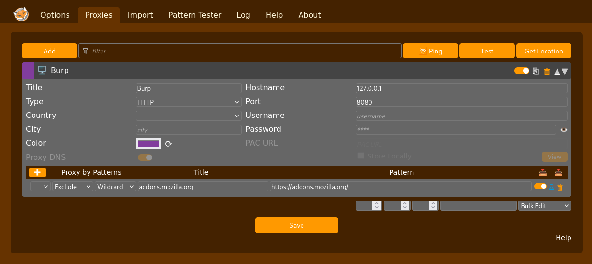
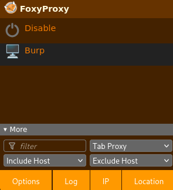
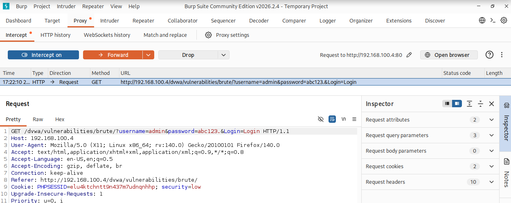
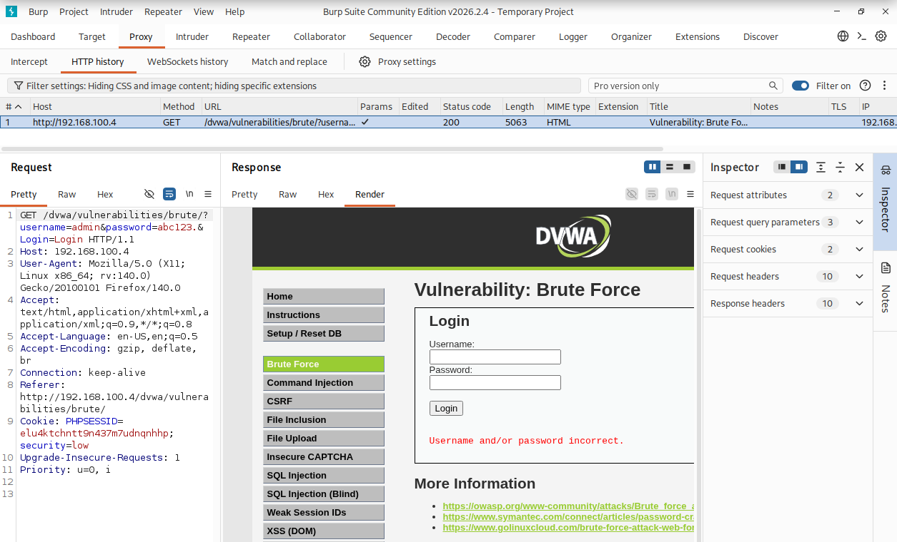
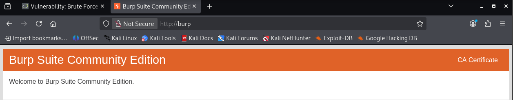
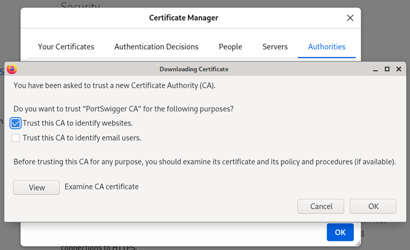
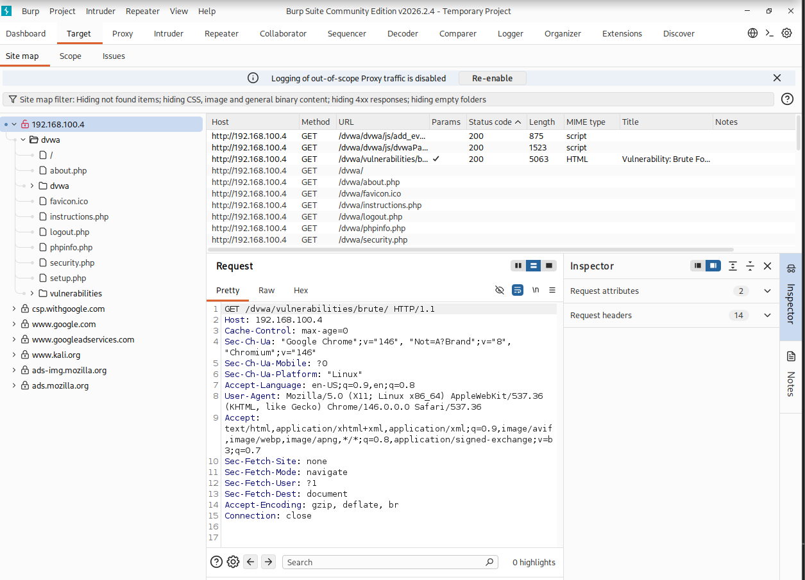
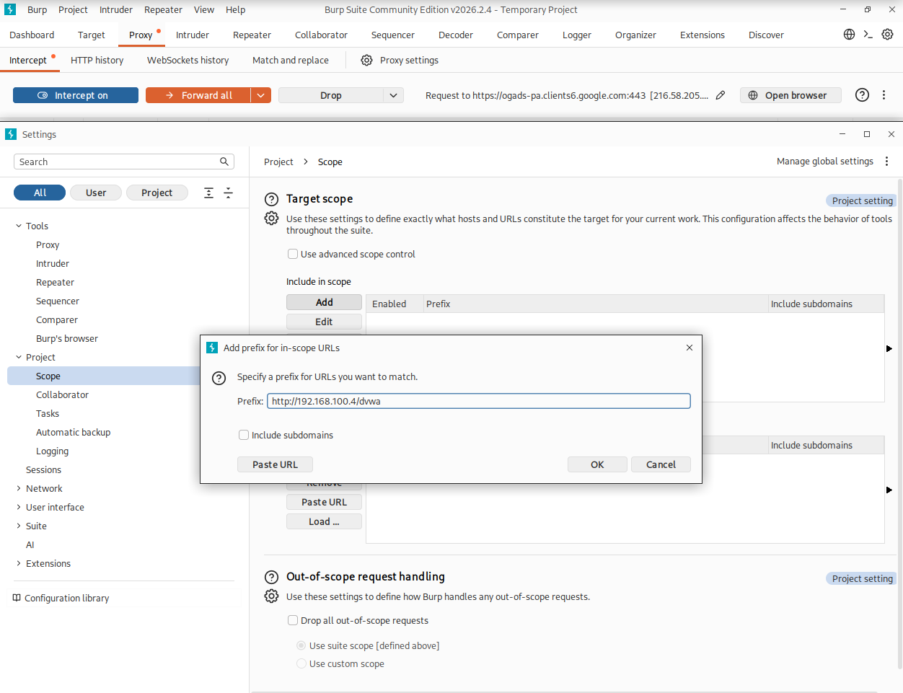
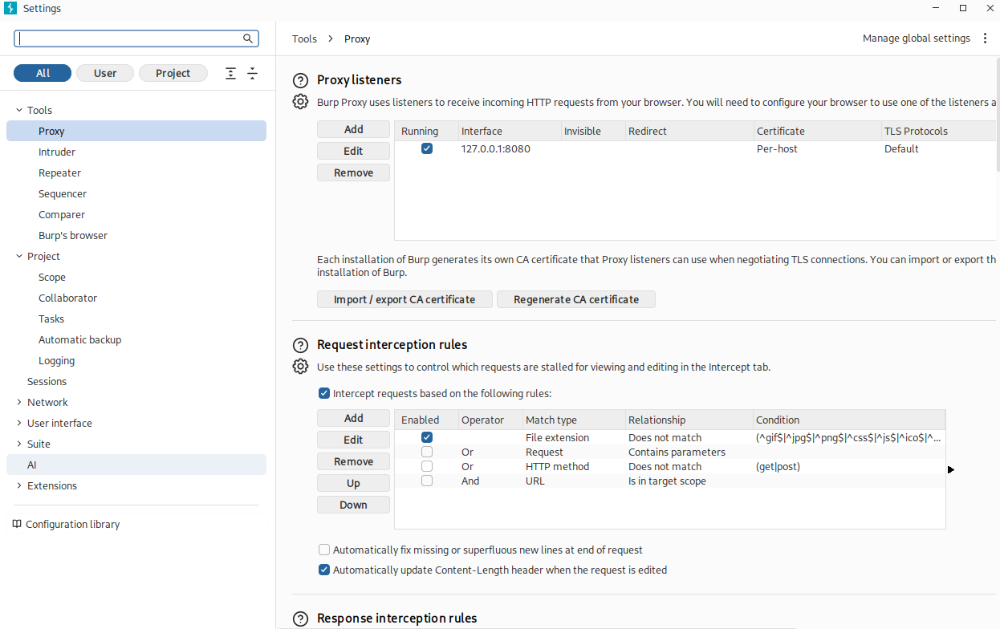

# Burp Suite

## Índice

1. [¿Qué es Burp Suite?](#1-qué-es-burp-suite)
2. [Escenario de laboratorio](#2-escenario-de-laboratorio)
3. [Configuración de FoxyProxy](#3-configuración-de-foxyproxy)
   - [Instalación](#instalación)
   - [Configurar el proxy hacia Burp Suite](#configurar-el-proxy-hacia-burp-suite)
4. [Interceptación de tráfico HTTP](#4-interceptación-de-tráfico-http)
   - [Sección Proxy](#sección-proxy)
   - [HTTP History](#http-history)
5. [Interceptación de tráfico HTTPS](#5-interceptación-de-tráfico-https)
6. [Sección Target](#6-sección-target)
   - [Target Scope](#target-scope)
7. [Intruder: modos de ataque](#7-intruder-modos-de-ataque)
   - [Sniper](#sniper)
   - [Battering Ram](#battering-ram)
   - [Pitchfork](#pitchfork)
   - [Cluster Bomb](#cluster-bomb)

---

## 1. ¿Qué es Burp Suite?

Burp Suite es una plataforma integrada para realizar auditorías de seguridad en aplicaciones web. Actúa principalmente como un **proxy HTTP/HTTPS interceptador** que se sitúa entre el navegador del auditor y el servidor web objetivo, permitiendo capturar, inspeccionar y modificar el tráfico en tiempo real antes de que llegue al servidor o de vuelta al cliente.

La versión instalada por defecto en Kali Linux es **Burp Suite Community Edition**, que, aunque no incluye todas las funcionalidades de la versión profesional (como el escáner automático de vulnerabilidades), sigue siendo una herramienta muy completa para auditorías web manuales.

Sus módulos principales son:

- **Proxy** — intercepta y modifica el tráfico entre el navegador y el servidor.
- **Target** — organiza los sitios visitados y sus peticiones en una estructura de árbol.
- **Intruder** — automatiza ataques de fuerza bruta y fuzzing sobre parámetros HTTP.
- **Repeater** — permite reenviar y modificar peticiones individuales de forma manual.
- **Decoder** — codifica y decodifica datos en formatos como Base64, URL, HTML, etc.
- **Comparer** — compara dos peticiones o respuestas para detectar diferencias.

---

## 2. Escenario de laboratorio

El entorno de trabajo utilizado en estos apuntes es una **red NAT** con dos máquinas virtuales:

| Máquina | Sistema operativo | Rol | IP |
|---|---|---|---|
| Atacante | Kali Linux | Auditor web (Burp Suite) | `192.168.100.250` |
| Objetivo | Ubuntu Server | Servidor con DVWA | `192.168.100.4` |

**DVWA** (Damn Vulnerable Web Application) es una aplicación web intencionadamente vulnerable que permite practicar ataques y técnicas de auditoría en un entorno controlado y legal. Está accesible desde Kali en `http://192.168.100.4/dvwa/`.

> **Importante:** Todo el tráfico generado durante la auditoría se realiza dentro de la red NAT, sin salida a Internet, lo que garantiza que las pruebas son completamente seguras y aisladas.

---

## 3. Configuración de FoxyProxy

Para que Burp Suite pueda interceptar el tráfico del navegador Firefox, es necesario redirigir las comunicaciones a través del proxy de Burp. La forma más cómoda de hacerlo es mediante la extensión **FoxyProxy**, que permite cambiar la configuración del proxy del navegador con un solo clic.

### Instalación

Acceder a la página de la extensión en Firefox y pulsar **Agregar a Firefox**. Una vez instalada, aparecerá el icono de FoxyProxy en la barra superior derecha del navegador.

### Configurar el proxy hacia Burp Suite

1. Abrir las opciones de FoxyProxy pulsando su icono.
2. Ir a la sección **Proxies → Add**.
3. Seleccionar la plantilla **Burp** o introducir los valores manualmente:

| Campo | Valor |
|---|---|
| Hostname | `127.0.0.1` |
| Puerto | `8080` |

4. Guardar la configuración.

A partir de ese momento, desde el menú desplegable de FoxyProxy se puede elegir entre navegar directamente o hacerlo a través de Burp Suite.

> **Nota:** Burp Suite escucha por defecto en `127.0.0.1:8080/tcp`. Si este puerto está ocupado por otro proceso, puede cambiarse desde **Proxy → Proxy settings → Proxy listeners**.




---

## 4. Interceptación de tráfico HTTP

### Sección Proxy

La interceptación del tráfico se controla desde la sección **Proxy** de Burp Suite. Existen dos estados posibles:

| Estado | Comportamiento |
|---|---|
| **Intercept is off** | Burp Suite captura el tráfico en segundo plano sin bloquearlo. Las peticiones fluyen libremente y pueden consultarse en *HTTP History*. |
| **Intercept is on** | Burp Suite detiene cada petición a la espera de que el auditor la autorice o la descarte manualmente. |

Cuando la interceptación está activa, el auditor dispone de dos opciones para cada petición retenida:

- **Forward** — autoriza la petición para que continúe hacia el servidor.
- **Drop** — descarta la petición; el servidor nunca la recibirá.

> **Advertencia:** Si el navegador parece no cargar ninguna página, comprobar el estado de la interceptación. Es frecuente que Burp Suite esté reteniendo peticiones en modo *Intercept is on* sin que el auditor se haya dado cuenta.



### HTTP History

En la subsección **Proxy → HTTP History** se puede consultar el historial completo de comunicaciones capturadas: tanto las peticiones enviadas por el navegador como las respuestas devueltas por el servidor.

Cada entrada del historial muestra información resumida: método HTTP (`GET`/`POST`), URL, código de estado, longitud de la respuesta y tipo MIME. Al seleccionar una entrada, se despliegan el detalle completo de la petición y la respuesta en los distintos modos de visualización disponibles:

- **Pretty** — formato con resaltado de sintaxis, más legible.
- **Raw** — texto plano tal como viaja por la red.
- **Hex** — representación hexadecimal, útil para analizar datos binarios.
- **Render** — renderiza la respuesta como si fuera un navegador, permitiendo ver la página visualmente.



---

## 5. Interceptación de tráfico HTTPS

Al interceptar tráfico HTTPS, el navegador detecta que el certificado digital recibido no es el del servidor web real sino el de Burp Suite, y genera un error de seguridad. Esto ocurre porque Burp realiza un **ataque man-in-the-middle** sobre la comunicación cifrada: descifra el tráfico, lo expone al auditor y vuelve a cifrarlo antes de reenviarlo.

Para evitar este error, es necesario instalar el certificado de Burp Suite como una **autoridad de certificación de confianza** en Firefox:

1. Con Burp activo y FoxyProxy redirigiendo el tráfico, acceder en el navegador a `http://burp`.
2. Descargar el certificado pulsando el botón **CA Certificate**.
3. En Firefox, ir a **Settings → Privacy & Security → Certificates → View Certificates → Authorities → Import**.
4. Seleccionar el certificado descargado y marcar la opción **Trust this CA to identify websites**.
5. Pulsar **OK**.

A partir de este momento, Burp Suite interceptará el tráfico HTTPS sin mostrar errores en el navegador, apareciendo **PortSwigger CA** como nueva autoridad de certificación en la lista de Firefox.

> **Importante:** Este certificado solo debe instalarse en el navegador del entorno de auditoría. Instalarlo en un navegador de uso cotidiano supone un riesgo de seguridad, ya que cualquier proxy con esa clave podría descifrar las comunicaciones cifradas del usuario.




---

## 6. Sección Target

La sección **Target** de Burp Suite proporciona una vista organizada de todos los sitios web visitados durante la sesión de auditoría. Muestra una **estructura en árbol** con las páginas y carpetas descubiertas, así como las peticiones HTTP asociadas a cada una.

Esta vista es especialmente útil para tener una visión global de la superficie de ataque de la aplicación objetivo.



### Target Scope

Para evitar capturar tráfico irrelevante (actualizaciones del navegador, telemetría, etc.) y centrarse únicamente en la aplicación objetivo, se recomienda configurar el **Target Scope**:

1. Ir a **Target → Scope** o al botón **Settings**.
2. En la sección **Include in scope**, pulsar **Add** e introducir la URL base de DVWA:

```bash
http://192.168.100.4/dvwa
```



3. En **Out-of-scope request handling**, seleccionar **Drop all out-of-scope requests** para que Burp descarte automáticamente el tráfico que no pertenezca al objetivo.

| Opción | Efecto |
|---|---|
| Include in scope | Solo se procesan las URLs que coincidan con el prefijo indicado |
| Drop all out-of-scope requests | El tráfico externo al scope es descartado sin mostrarse |

> **Nota:** Limitar el scope reduce el ruido en *HTTP History* y facilita la identificación de peticiones relevantes durante la auditoría.



---

## 7. Intruder: modos de ataque

El módulo **Intruder** de Burp Suite permite automatizar el envío masivo de peticiones HTTP modificando uno o varios parámetros con valores extraídos de listas (wordlists). Es la herramienta principal para llevar a cabo **ataques de fuerza bruta** contra formularios de autenticación.

Para configurar un ataque, primero se debe enviar una petición capturada al Intruder (clic derecho → *Send to Intruder*), marcar las posiciones de los parámetros a atacar y seleccionar el modo de ataque.

Burp Suite Community limita la velocidad de las peticiones del Intruder. Para ataques sin limitación de velocidad, se puede utilizar la herramienta **Hydra** desde la terminal de Kali.

Los cuatro modos de ataque disponibles son:

### Sniper

Ataca **una única posición** a la vez usando una sola wordlist. Es el modo más habitual para ataques de contraseña cuando el nombre de usuario es conocido.

Ejemplo con el usuario `admin` y una wordlist de 3 contraseñas:

| Nº petición | Prueba |
|---|---|
| 1 | `username=admin&password=abc123` |
| 2 | `username=admin&password=abc123.` |
| 3 | `username=admin&password=abc123..` |

### Battering Ram

Introduce **la misma palabra en todas las posiciones marcadas** simultáneamente. No es especialmente útil para formularios de autenticación, pero sí para casos en los que se quiere probar el mismo valor en varios parámetros a la vez.

Ejemplo con una wordlist de 3 palabras (`admin`, `manuel`, `monica`):

| Nº petición | Prueba |
|---|---|
| 1 | `username=admin&password=admin` |
| 2 | `username=manuel&password=manuel` |
| 3 | `username=monica&password=monica` |

### Pitchfork

Permite atacar **varias posiciones con wordlists distintas** de forma paralela, tomando un elemento de cada lista en cada petición. Es efectivo para ataques de tipo **credential stuffing**, donde se prueban combinaciones conocidas de usuario y contraseña.

> **Recuerda:** Las wordlists deben tener el mismo número de entradas para que las combinaciones sean coherentes.

Ejemplo con wordlist de usuarios (`admin`, `manuel`, `monica`) y wordlist de contraseñas (`abc123`, `password`, `toor`):

| Nº petición | Prueba |
|---|---|
| 1 | `username=admin&password=abc123` |
| 2 | `username=manuel&password=password` |
| 3 | `username=monica&password=toor` |

### Cluster Bomb

Itera a través de **todas las combinaciones posibles** entre las distintas wordlists, una posición a la vez. Genera el producto cartesiano de todas las listas. Útil cuando no se conocen ni los usuarios ni las contraseñas y se quieren probar todas las combinaciones posibles.

Con los mismos diccionarios del ejemplo anterior (3 usuarios × 3 contraseñas = **9 peticiones**):

| Nº petición | Prueba |
|---|---|
| 1 | `username=admin&password=abc123` |
| 2 | `username=admin&password=password` |
| 3 | `username=admin&password=toor` |
| 4 | `username=manuel&password=abc123` |
| 5 | `username=manuel&password=password` |
| 6 | `username=manuel&password=toor` |
| 7 | `username=monica&password=abc123` |
| 8 | `username=monica&password=password` |
| 9 | `username=monica&password=toor` |

> **Nota:** El número total de peticiones en Cluster Bomb es el producto del número de entradas de cada wordlist. Con listas grandes esto puede generar millones de peticiones, por lo que conviene usarlo con criterio.
